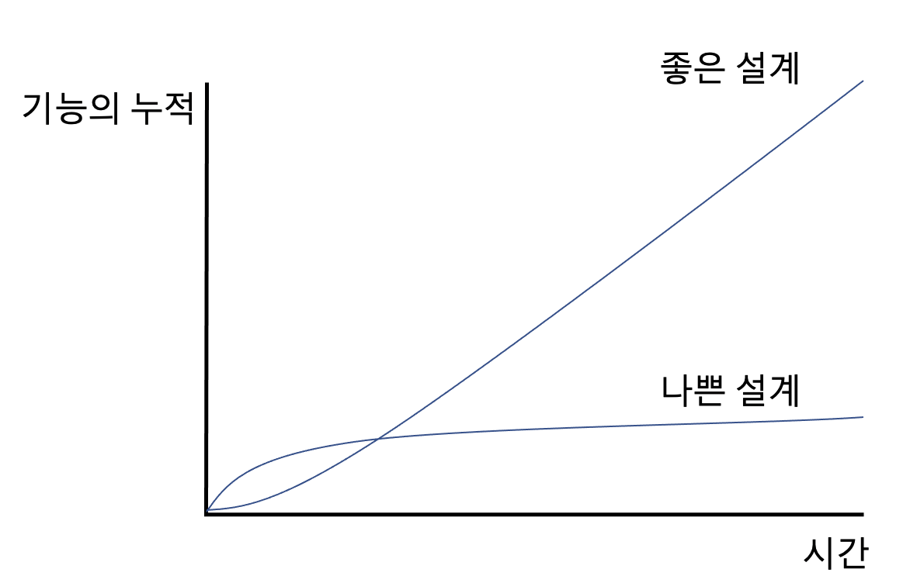

# :star: 2-3 리팩터링하는 이유

 

`리팩터링`이 소프트웨어의 모든 문제점을 해결하는 만병통치약은 절대 아니지만, 코드를 건강한 상태로 유지하는 데 도와주는 약임은 분명합니다. `리팩터링`은 다양한 용도로 활용할 수 있고, 또 반드시 그래야 하는 도구입니다.

 

### 리팩터링하면 소프트웨어 설계가 좋아집니다

 

`리팩터링`하지 않으면 소프트웨어의 내부 설계(아키텍처)가 썩기 쉽습니다. 코드만으로 설계를 파악하기 어려워질수록 설계를 유지하기 어려워지고, 설계가 부패되는 속도는 더욱 빨라집니다. 반면 규칙적인 `리팩터링`은 코드의 구조를 지탱해줄 것입니다.

 

같은 일을 하더라도 설계가 나쁘면 코드가 길어지기 십상입니다. 사실상 같은 일을 하는 코드가 여러 곳에 나타날 수 있기 때문입니다. 그래서 중복 코드 제거는 설계 개선 작업의 중요한 한 축을 차지합니다. 코드가 길수록 실수 없이 수정하기 어려워지고, 이해해야 할 코드량도 늘어납니다. 중복 코드를 제거하면 모든 코드가 언제나 고유한 일을 수행함을 보장할 수 있으며, 이는 바람직한 설계의 핵심입니다.

 

### 리팩터링하면 소프트웨어를 이해하기 쉬워집니다

 

내 소스 코드를 컴퓨터만 사용하는게 아닙니다. 예컨대 몇 달이 지나 누군가 내 코드를 수정하고자 읽게 될 수도 있습니다. 코드를 컴파일하는 데 시간이 살짝 더 걸린다고 누가 뭐라고 하진 않겠지만, 다른 프로그래머가 내 코드를 제대로 이해했다면 한 시간에 끝낼 수정을 일주일이나 걸린다면 사정이 달라집니다.

 

문제는 프로그래밍을 동작시키는 데만 신경 쓰다 보면 나중에 그 코드를 다룰 개발자를 배려하지 못한다는 데 있습니다. `리팩터링`은 코드가 더 잘 읽히게 도와줍니다. 잘 작동하지만 이상적인 구조는 아닌 코드가 있다면, 잠깐 시간을 내서 `리팩터링`해봅시다. 그러면 코드의 목적이 더 잘 드러나게, 다시 말해 자신의 의도를 더 명확하게 전달하도록 개선할 수 있습니다.

 

단지 다른 사람을 배려하기 위해서가 아닙니다. 사실 그 다른 사람이 바로 나 자신일 때가 많습니다. 그래서 더더욱 `리팩터링`이 중요합니다. 나중에 기억나지 않을 것을 대비해 기억할 필요가 있는 것들은 최대한 코드에 담으려고 하는 것이 좋습니다.

 

### 리팩터링하면 버그를 쉽게 찾을 수 있습니다

 

코드를 이해하기 쉽다는 말은 버그를 찾기 쉽다는 말이기도 합니다. `리팩터링`하면 코드가 하는 일을 깊이 파악하게 되면서 새로 깨달은 것을 곧바로 코드에 반영하게 됩니다. 프로그램의 구조를 명확하게 다듬으면 그냥 이럴 것이다라고 가정하던 점들이 분명히 드러나는데, 버그를 지나칠 수 없을 정도까지 명확해집니다. 이처럼 `리팩터링`은 견고한 코드를 작성하는 데 무척 효과적입니다.

 

### 리팩터링하면 프로그래밍 속도를 높일 수 있습니다

 

지금까지 제시한 장점을 한 마디로 정리하면, `리팩터링`하면 코드 개발 속도를 높일 수 있습니다.

 

얼핏 그 반대가 아닌가 생각할 수 있습니다. `리팩터링`하는 데 시간이 드니 전체 개발 속도는 떨어질까봐 걱정할 수도 있습니다. 하지만 새로운 기능을 추가할수록 기존 코드베이스에 잘 녹여낼 방법을 찾는 데 드는 시간이 늘어납니다.

 

기능을 추가하고 나면 버그가 발생하는 일이 잦고, 이를 해결하는 시간은 더 걸립니다. 코드베이스는 패치에 패치가 덧붙여지면서 프로그램의 동작을 파악하기가 거의 고대 유적 발굴만큼 어려워집니다. 이러한 부담이 기능 추가 속도를 계속 떨어뜨리면서, 차라리 새로 개발하는 편이 낫겠다고 생각하는 지경에 이릅니다.

 

 

하지만 어떤 팀은 기존에 작성한 코드를 최대한 활용할 수 있어서 새 기능을 더 빨리 추가합니다. 이렇게 차이 나는 원인은 소프트웨어의 내부 품질에 있습니다. 내부 설계가 잘 된 소프트웨어는 새로운 기능을 추가할 지점과 어떻게 고칠지를 쉽게 찾을 수 있습니다. 모듈화가 잘 되어 있으면 전체 코드베이스 중 작은 일부만 이해하면 됩니다.

 

내부 품질이 뛰어난 코드베이스는 새 기능 구축을 돕는 견고한 토대가 됩니다. 하지만 처음부터 좋은 설계를 마련하기란 매우 어렵습니다. 그래서 빠른 개발이라는 숭고한 목표를 달성하려면 `리팩터링`이 반드시 필요합니다.

 

 

## 다음 챕터

- [2.4 - 언제 리팩터링해야 할까?](https://github.com/Esoolgnah/Summary_of_Refactoring_2nd_Edition/blob/main/Notes/02_리팩터링_원칙/02_04_언제_리팩터링해야_할까.md)

 

## 이전 챕터

- [2.2 - 두 개의 모자](https://github.com/Esoolgnah/Summary_of_Refactoring_2nd_Edition/blob/main/Notes/02_리팩터링_원칙/02_02_두_개의_모자.md)

 

## 목록으로

- [목록](https://github.com/Esoolgnah/Summary_of_Refactoring_2nd_Edition/blob/main/Notes/02_리팩터링_원칙/02_00_리팩터링_원칙.md)
