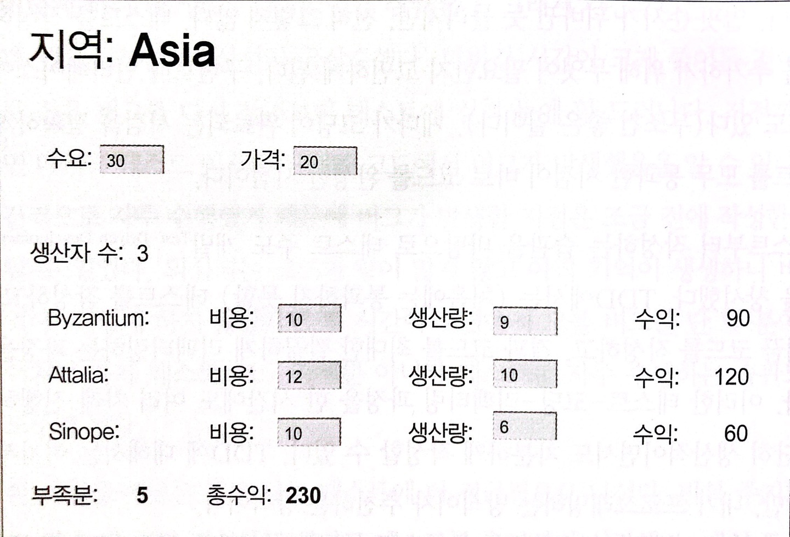

# :star: 4-2 테스트할 샘플 코드

<br>

우선 테스트 대상이 될 코드를 살펴봅시다. 이 코드는 사용자가 생산 계획을 검토하고 수정하도록 해주는 간단한 애플리케이션의 일부입니다. UI는 (좀 투박하지만) 다음과 같습니다.

<br>



<br>

생산 계획은 각 지역(province)의 수요(demand)와 가격(price)으로 구성됩니다. 지역에 위치한 생산자(producer)들은 각기 제품을 특정 가격으로 특정 수량만큼 생산할 수 있습니다. UI는 생산자별로 제품을 모두 판매했을 때 얻을 수 있는 수익(full revenue)도 보여줍니다. 화면 맨 아래에는 (수요에서 총생산량을 뺀) 생산 부족분(shortfall)과 현재 계획에서 거둘 수 있는 총 수익(profit)도 보여줍니다. 사용자는 UI에서 수요, 가격, 생산자별 생산량(production)과 비용(cost)을 조정해가며, 그에 따른 생산 부족분과 총수익을 확인할 수 있습니다. 사용자가 화면에서 숫자를 변경할 때마다 관련 값들이 즉각 갱신됩니다.

<br>

그림의 UI를 보면 이 소프트웨어의 전반적인 기능을 파악할 수 있는데, 여기서는 비즈니스 로직 부분만 집중해서 살펴봅니다. 다시 말해 수익과 생산 부족분을 계산하는 클래스들만 살펴보고, HTML을 생성하고 필드 값 변경에 반응하여 밑단의 비즈니스 로직을 적용하는 코드는 생략합니다. 이 장의 목적은 어디까지나 자가 테스트 코드 작성법을 파악하는 데 있습니다. 따라서 UI, 영속성, 외부 서비스 연동과는 관련 없는 가장 쉬운 코드부터 보는 게 합당할 것입니다. 참고로 코드는 항상 이렇게 성격에 따라 분리하는 것이 좋습니다. 만약 여기서 살펴볼 비즈니스 로직 코드도 아주 복잡해진다면, UI와 분리하여 코드를 파악하고 테스트하기 편하게 수정했을 것입니다.

<br>

비즈니스 로직 코드는 클래스 두 개로 구성됩니다. 하나는 생산자를 표현하는 `Producer`이고, 다른 하나는 지역 전체를 표현하는 `Province`입니다. Province의 생성자는 JSON 문서로부터 만들어진 자바스크립트 객체를 인수로 받습니다.

<br>

JSON 데이터로부터 지역 정보를 읽어오는 코드는 다음과 같습니다.

<br>

```js
// Province 클래스...
  constructor(doc) {
    this._name = doc.name;
    this._producers = [];
    this._totalProduction = 0;
    this._demand = doc.demand;
    this._price = doc.price;
    doc.producers.forEach(d => this.addProducer(new Producer(this, d)));
  }

  addProducer(arg) {
    this._producers.push(arg);
    this._totalProduction += arg.production;
  }
```

<br>

다음의 `sampleProvinceData()` 함수는 앞 생성자의 인수로 쓸 JSON 데이터를 생성합니다. 이 함수를 테스트하렴ㄴ 이 함수가 반환한 값을 인수로 넘겨서 `Province` 객체를 생성해보면 됩니다.

<br>

```js
// 최상위...
function sampleProvinceData() {
  return {
    name: 'Asia',
    producers: [
      { name: 'Byzantium', cost: 10, production: 9 },
      { name: 'Attalia', cost: 12, production: 10 },
      { name: 'Sinope', cost: 10, production: 6 },
    ],
    demand: 30,
    price: 20,
  };
}
```

<br>

Province 클래스에는 다양한 데이터에 대한 접근자들이 담겨 있습니다.

<br>

```js
// Province 클래스...
  get name()      {return this._name;}
  get producers() {return this._producers.slice();}
  get totalProduction()    {return this._totalProduction;}
  set totalProduction(arg) {this._totalProduction = arg;}
  get demand()    {return this._demand;}
  set demand(arg) {this._demand = parseInt(arg);} // 숫자로 파싱해서 저장
  get price()     {return this._price;}
  set price(arg)  {this._price = parseInt(arg);}  // 숫자로 파싱해서 저장
```

<br>

세터는 UI에서 입력한 숫자를 인수로 받는데, 이 값은 문자열로 전달됩니다. 그래서 계산에 활용하기 위해 숫자로 파싱합니다. `Producer` 클래스는 주로 단순한 데이터 저장소로 쓰입니다.

<br>

```js
// Producer 클래스...
  constructor(aProvince, data) {
    this._province = aProvince;
    this._cost = data.cost;
    this._name = data.name;
    this._production = data.production || 0;
  }
  get name()    {return this._name;}
  get cost()    {return this._cost;}
  set cost(arg) {this._cost = parseInt(arg);}

  get production() {return this._production;}
  set production(amountStr) {
    const amount = parseInt(amountStr);
    const newProduction = Number.isNaN(amount) ? 0 : amount;
    this._province.totalProduction += newProduction - this._production;
    this._production = newProduction;
  }
```

<br>

`set production()`이 계산 결과를 지역 데이터`(_province)`에 갱신하는 코드가 좀 지저분합니다. 이런 코드를 목격하면 제거하고 싶어지지만, 그러려면 먼저 테스트를 작성해야 합니다.

<br>

생산 부족분을 계산하는 코드는 간단합니다. 하지만

<br>

```js
// Province 클래스...
  get shortfall() {
    return this._demand - this.totalProduction;
  }
```

<br>

수익을 계산하는 코드는 살짝 복잡합니다.

<br>

```js
// Province 클래스...
  get profit() {
    return this.demandValue - this.demandCost;
  }

  get demandValue() {
    return this.satisfiedDemand * this.price;
  }

  get satisfiedDemand() {
    return Math.min(this._demand, this.totalProduction);
  }

  get demandCost(){
    let remainingDemand = this.demand;
    let result = 0;
    this.producers
      .sort((a,b) => a.cost - b.cost)
      .forEach(p => {
        const contribution = Math.min(remainingDemand, p.production);
          remainingDemand -= contribution;
          result += contribution * p.cost;
      });
    return result;
  }
```

<br>

<br>

## 다음 챕터

- [4.3 - 첫 번째 테스트](https://github.com/Esoolgnah/Summary_of_Refactoring_2nd_Edition/blob/main/Notes/04_테스트_구축하기/04_03_첫_번째_테스트.md)

<br>

## 이전 챕터

- [4.1 - 자가 테스트 코드의 가치](https://github.com/Esoolgnah/Summary_of_Refactoring_2nd_Edition/blob/main/Notes/04_테스트_구축하기/04_01_자가_테스트_코드의_가치.md)

<br>

## 목록으로

- [목록](https://github.com/Esoolgnah/Summary_of_Refactoring_2nd_Edition/blob/main/Notes/04_테스트_구축하기/04_00_테스트_구축하기.md)
