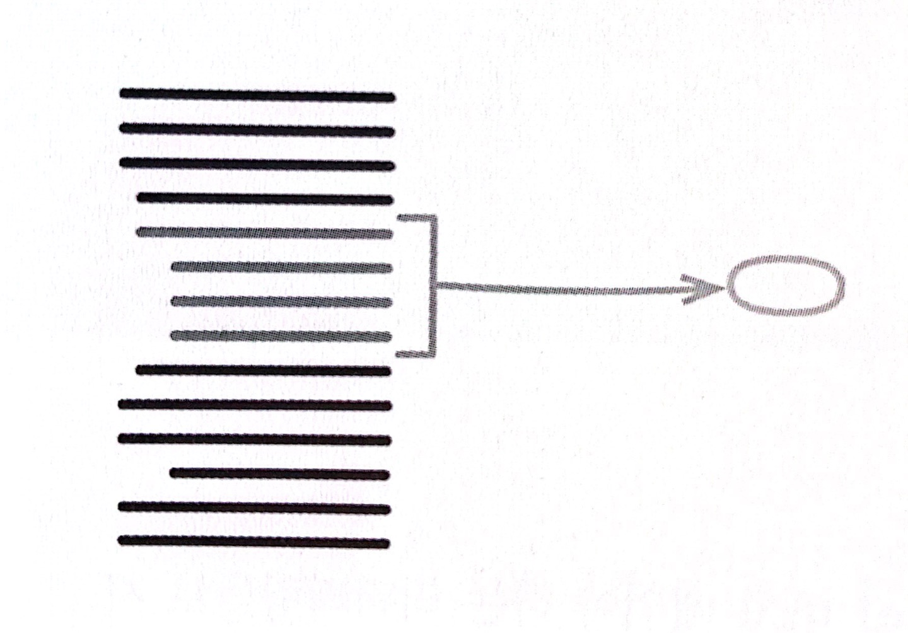

# :star: 6-1 함수 추출하기

<br>



- 반대 리팩터링: [`함수 인라인하기`](https://github.com/Esoolgnah/Summary_of_Refactoring_2nd_Edition/blob/main/Notes/06_기본적인_리팩터링/06_02_함수_인라인하기.md)
- 1판에서의 이름: 메서드 추출

<br>

```js
function printOwing(invoice) {
  printBanner();
  let outstanding = calculateOutstanding();

  //세부 사항 출력
  console.log(`고객명: ${invoice.custoimer}`);
  console.log(`채무액: ${outstanding}`);
}
```

<br>

```js
function printOwing(invoice) {
  printBanner();
  let outstanding = calculateOutstanding();
  printDetails(outstanding);

  function printDetails(outstanding) {
    console.log(`고객명: ${invoice.custoimer}`);
    console.log(`채무액: ${outstanding}`);
  }
}
```

<br>

### 배경

함수 추출하기는 제가 가장 많이 사용하는 리팩터링 중 하나입니다(여기서 '함수(function)이라고 표현했는데 객체 지향 언어의 메서드(method)나 절차형 언어의 프로시저(procedure)/서브루틴(subroutine)에도 똑같이 적용됩니다). 코드 조각을 찾아 무슨 일을 하는지 파악한 다음, 독립된 함수로 추출하고 목적에 맞는 이름을 붙입니다.

<br>

코드를 언제 독립된 함수로 묶어야 할지에 관한 의견은 수없이 많습니다. 먼저, 길이를 기준으로 삼을 수 있습니다. 가령 함수 하나가 한 화면을 넘어가면 안 된다는 규칙을 떠올릴 수 있습니다. 재사용성을 기준으로 할 수도 있습니다. 두 번 이상 사용될 코드는 함수로 만들고, 한 번만 쓰이는 코드는 인라인 상태로 놔두는 것입니다. 하지만 제 눈에는 '목적의 구현을 분리'하는 방식이 가장 합리적인 기준으로 보입니다. 코드를 보고 무슨 일을 하는지 파악하는 데 한참이 걸린다면 그 부분을 함수로 추출한 뒤 '무슨 일'에 걸맞는 이름을 짓습니다. 이렇게 해두면 나중에 코드를 다시 읽을 때 함수의 목적이 눈에 확 들어오고, 본문 코드(그 함수가 목적을 이루기 위해 구체적으로 수행하는 일)에 대해서는 더 이상 신경 쓸 일이 거의 없습니다.

<br>

이 원칙을 적용한 뒤로는 함수를 아주 짧게, 대체로 단 몇 줄만 담도록 작성하는 습관이 생겼습니다. 제 경험상 함수 안에 들어갈 코드가 대여섯 줄을 넘어갈 때부터 슬슬 냄새를 풍기기 시작했고, 단 한줄짜리 함수를 만드는 일도 적지 않았습니다. 길이가 그리 중요하지 않다는 사실을 깨닫게 된 계기는 켄트 백이 보여준 오리지널 스몰토크 시스템이었습니다. 당시 스몰토크는 흑백 시스템에서 실행됐습니다. 그래서 화면에서 텍스트나 그래픽을 강조하려면 해당 부분의 색상을 반전시켜야 했습니다. 스몰토크의 그래픽스 클래스에는 이 목적으로 쓰이는 `highlight()` 메서드가 있었는데, 구현 코드를 보니 단순히 `reverse()`라는 메서드만 호출하고 있었습니다. 메서드 이름이 구현 코드보다 길었지만, 그건 문제가 되지 않았습니다. 코드의 목적(강조)과 구현(반전) 사이의 차이가 그만큼 컸기 때문입니다.

<br>

함수를 짧게 만들면 함수 호출이 많아져서 성능이 느려질까 걱정하는 사람도 있습니다. 제가 젊던 시절에는 간혹 문제가 되긴 했지만 요즘은 그럴 일이 거의 없습니다. 함수가 짧으면 캐싱하기가 더 쉽기 때문에 컴파일러가 최적화하는 데 유리할 때가 많습니다. 성능 최적화에 대해서는 항상 일반 지침을 따르도록 합시다.

<br>

> 일반 지침: "최적화를 할 때는 다음 두 규칙을 따르기 바란다. 첫 번째. 하지마라. 두 번째(전문가 한정). 아직 하지 마라."

<br>

이러한 짧은 함수의 이점은 이름을 잘 지어야만 발휘되므로 이름 짓기에 특별히 신경 써야 합니다. 이름을 잘 짓기까지는 어느 정도 훈련이 필요합니다. 하지만 일단 요령을 터득한 후에는 별도 문서 없이 코드 자체만으로 내용을 충분히 설명되게 만들 수 있습니다.

<br>

긴 함수에는 각각의 코드 덩어리 첫머리에 그 목적을 설명하는 주석이 달려 있을 때가 많습니다. 해당 코드 덩어리를 추출한 함수의 이름을 지을 때 이 주석을 참고하면 도움이 될 것입니다.

<br>

### 절차

1️⃣ 함수를 새로 만들고 목적을 잘 드러내는 이름을 붙인다('어떻게'가 아닌 '무엇을' 하는지가 드러나야 한다).

- 대상 코드가 함수 호출문 하나처럼 매우 간단하더라도 함수로 뽑아서 목적이 더 잘 드러나는 일므을 붙일 수 있다면 추출합니다. 이런 이름이 떠오르지 않는다면 함수로 추출하면 안 된다는 신호입니다. 하지만 추출하는 과정에서 좋은 이름이 떠오를 수도 있으니 처음부터 최선의 이름부터 짓고 시작할 필요는 없습니다. 일단 함수로 추출해서 사용해보고 효과가 크지 않으면 다시 원래 상태로 인라인해도 됩니다. 그 과정에서 조금이라도 깨달은 게 있다면 시간 낭비는 아닙니다. 중첩 함수를 지원하는 언어를 사용한다면 추출한 함수를 원래 함수 안에 중첩시킵니다. 그러면 다음 단계에서 수행할 유효범위를 벗어난 변수를 처리하는 작업을 줄일 수 있습니다. 원래 함수의 바깥으로 꺼내야 할 때가 오면 언제든 `함수 옮기기`를 적용하면 됩니다.

<br>

2️⃣ 추출할 코드를 원본 함수에서 복사하여 새 함수에 붙여넣는다.

<br>

3️⃣ 추출한 코드 중 원본 함수의 지역 변수를 참조하거나 추출한 함수의 유효범위를 벗어나는 변수는 없는지 검사한다. 있다면 매개변수로 전달한다.

- 원본 함수의 중첩함수로 추출할 때는 이런 문제가 생기지 않습니다.
- 일반적으로 함수에는 지역 변수와 매개변수가 있기 마련입니다. 가장 일반적인 처리 방법은 이런 변수 모두를 인수로 전달하는 것입니다. 사용은 하지만 값이 바뀌지 않는 변수는 대체로 이렇게 쉽게 처리할 수 있습니다.
- 추출한 코드에서만 사용하는 변수가 추출한 함수 밖에 선언되어 있다면 추출한 함수 안에서 선언하도록 수정합니다.
- 추출한 코드 안에서 값이 바뀌는 변수 중에서 값으로 전달되는 것들은 주의해서 처리합니다. 이런 변수가 하나뿐이라면 추출한 코드를 질의 함수로 취급해서 그 결과(반환 값)를 해당 변수에 대입합니다.
- 때로는 추출한 코드에서 값을 수정하는 지역 변수가 너무 많을 수 있습니다. 이럴 때는 함수 추출을 멈추고, 변수 쪼개기나 임시 변수를 질의 함수로 바꾸기와 같은 다른 리팩터링을 적용해서 변수를 사용하는 코드를 단순하게 바꿔봅니다. 그런 다음 함수 추출을 다시 시도합니다.

<br>

4️⃣ 변수를 다 처리했다면 컴파일한다.

- 컴파일되는 언어로 개발 중이라면 변수를 모두 처리하고 나서 한번 컴파일해봅시다. 제대로 처리하지 못한 변수를 찾는 데 도움될 때가 많습니다.

<br>

5️⃣ 원본 함수에서 추출한 코드 부분을 새로 만든 함수를 호출하는 문장으로 바꾼다(즉, 추출한 함수로 일을 위임한다).

<br>

6️⃣ 테스트한다.

<br>

7️⃣ 다른 코드에 방금 추출한 것과 똑같거나 비슷한 코드가 없는지 살핀다. 있다면 방금 추출한 새 함수를 호출하도록 바꿀지 검토한다(`인라인 코드를 함수 호출로 바꾸기`).

- 중복 혹은 비슷한 코드를 찾아주는 리팩터링 도구도 있습니다. 이런 도구가 없다면 검색 기능을 이용하여 다른 곳에 중복된 코드가 없는지 확인해보는 것이 좋습니다.

<br>

### 예시: 유효범위를 벗어나는 변수가 없을 때

아주 간단한 코드에서는 함수 추출하기가 굉장히 쉽습니다.

<br>

```js
function printOwing(invoice) {
  let outstanding = 0;

  console.log("****************");
  console.log("**** 고객 채무 ****");
  console.log("****************");

  // 미해결 채무(outstanding)을 계산한다.
  for (const o of invoice.orders) {
    outstanding += o.amount;
  }

  // 마감일(dueDate)을 기록한다.
  const today = Clock.today;
  invoice.dueDate = new Date(
    today.getFullYear(),
    today.getMonth(),
    today.getDate() + 30
  );

  // 세부 사항을 출력한다.
  console.log(`고객명: ${invoice.customer}`);
  console.log(`채무액: ${outstanding}`);
  console.log(`마감일: ${invoice.dueDate.toLocaleDateString()}`);
}
```

<br>

여기서 Clock.today는 제가 `Clock Wrapper`라고 부르는 것으로, 시스템 시계를 감싸는 객체입니다. 저는 Date.now()처럼 시스템 시간을 알려주는 함수는 직접 호출하지 않습니다. 직접 호출하면 테스트할 때마다 결과가 달라져서 오류 상황을 재현하기가 어렵기 때문입니다.

<br>

배너(banner)를 출력하는 코드는 다음과 같이 간단히 추출할 수 있습니다. 그냥 해당 코드를 잘라내서 새 함수에 붙이고, 원래 자리에 새 함수 호출문을 넣으면 됩니다.

<br>

```js
function printOwing(invoice) {
  let outstanding = 0;

  printBanner(); // 배너 출력 로직을 함수로 추출

  // 미해결 채무(outstanding)를 계산한다.
  for (const o of invoice.orders) {
    outstanding += o.amount;
  }

  // 마감일(dueDate)을 기록한다.
  const today = Clock.today;
  invoice.dueDate = new Date(
    today.getFullYear(),
    today.getMonth(),
    today.getDat() + 30
  );

  // 세부 사항을 출력한다.
  console.log(`고객명: ${invoice.customer}`);
  console.log(`채무액: ${outstanding}`);
  console.log(`마감일: ${invoice.dueDate.toLocaleDateString()}`);
}

function printBanner() {
  console.log("****************");
  console.log("**** 고객 채무 ****");
  console.log("****************");
}
```

<br>

마찬가지로 세부 사항을 출력하는 코드도 간단히 추출할 수 있습니다.

<br>

```js
function printOwing(invoice) {
  let outstanding = 0;

  printBanner();

  // 미해결 채무(outstanding)를 계산한다.
  for (const o of invoice.orders) {
    outstanding += o.amount;
  }

  // 마감일(dueDate)을 기록한다.
  const today = Clock.today;
  invoice.dueDate = newDate(
    today.getFullYear(),
    today.getMonth(),
    today.getDate() + 30
  );

  printDetails(); // 세부 사항 출력 로직을 함수로 추출

  function printDetails() {
    //
    console.log(`고객명: ${invoice.customer}`);
    console.log(`채무액: ${outstanding}`);
    console.log(`마감일: ${invoice.dueDate.toLocaleDateString()}`);
  }
}
```

<br>

---

> 여기까지만 보면 함수 추출 리팩터링이 너무 간단하다고 여길 수 있습니다. 하지만 더 까다로울 때가 많습니다. 여기서 `printDetails()`가 `printOwing()`에 중첩되도록 정의했습니다. 이렇게 하면 추출한 함수에서 `printOwing()`에 정의 된 모든 변수에 접근할 수 있습니다. 하지만 중첩 함수를 지원하지 않는 언어에서는 불가능한 방법입니다. 그럴 때는 함수를 최상위 수준으로 추출하는 문제로 볼 수 있습니다. 따라서 원본 함수에 접근할 수 있는 변수들에 특별히 신경 써야 합니다. 원본 함수의 인수나 그 함수 안에서 정의된 임시 변수가 여기 해당합니다.

---

<br>

### 예시: 지역 변수를 사용할 때

지역 변수와 관련하여 가장 간단한 경우는 변수를 사용하지만 다른 값을 다시 대입하지는 않을 때입니다. 이 경우에는 지역 변수들을 그냥 매개변수로 넘기면 됩니다. 다음 코드를 봅시다.

<br>

```js
function printOwing(invoice) {
  let outstanding = 0;

  printBanner();

  // 미해결 채무(outstanding)를 계산한다.
  for (const o of invoice.orders) {
    outstanding += o.amount;
  }

  // 마감일(dueDate)을 기록한다.
  const today = Clock.today;
  invoice.dueDate = new Date(
    today.getFullYear(),
    today.getMonth(),
    today.getDate() + 30
  );

  // 세부 사항을 출력한다.
  console.log(`고객명: ${invoice.customer}`);
  console.log(`채무액: ${outstanding}`);
  console.log(`마감일: ${invoice.dueDate.toLocaleDateString()}`);
}
```

<br>

세부 사항을 출력하는 코드를 다음과 같이 지역 변수 두 개를 매개변수로 받는 함수로 추출합니다.

<br>

```js
function printOwing(invoice) {
  let outstanding = 0;

  printBanner();

  // 미해결 채무(outstanding)를 계산한다.
  for (const o of invoice.orders) {
    outstanding += o.amount;
  }

  // 마감일(dueDate)을 기록한다.
  const today = Clock.today;
  invoice.dueDate = new Date(
    today.getFullYear(),
    today.getMonth(),
    today.getDate() + 30
  );

  printDetails(invoice, outstanding); // 앞의 예와 달리 지역 변수를 매개변수로 전달
}

function printDetails(invoice, outstanding) {
  //
  console.log(`고객명: ${invoice.customer}`);
  console.log(`채무액: ${outstanding}`);
  console.log(`마감일: ${invoice.dueDate.toLocaleDateString()}`);
}
```

<br>

지역 변수가 (배열, 레코드, 객체와 같은) 데이터 구조라면 똑같이 매개변수로 넘긴 후 필드 값을 수정할 수 있습니다. 가령 마감일을 설정하는 코드는 다음과 같이 추출합니다.

<br>

```js
function printOwing(invoice) {
  let outstanding = 0;

  printBanner();

  // 미해결 채무(outstanding)를 계산한다.
  for (const o of invoice.orders) {
    outstanding += o.amount;
  }

  recordDueDate(invoice); // 마감일 설정 로직을 함수로 추출
  printDetails(invoice, outstanding);
}

function recordDueDate(invoice) {
  //
  const today = Clock.today;
  invoice.dueDate = new Date(
    today.getFullYear(),
    today.getMonth(),
    today.getDate() + 30
  );
}
```

<br>

### 예시: 지역 변수의 값을 변경할 때

지역 변수에 값을 대입하게 되면 문제가 복잡해집니다. 지금은 임시 변수만을 취급하겠습니다. 만약 매개변수에 값을 대입하는 코드를 발견하면 곧바로 그 `변수 쪼개기`를 사용하여 임시 변수를 새로 하나 만들어 그 변수에 대입하게 합니다.

<br>

대입 대상이 되는 임시 변수는 크게 두 가지로 나눌 수 있습니다. 먼저 간단한 경우는 변수가 추출된 코드 안에서만 상요될 때입니다. 즉, 이 변수는 추출된 코드 안에서만 존재합니다. 만약 변수가 초기화되는 지점과 실제로 사용되는 지점이 떨어져 있다면 `문장 슬라이드하기`를 활용하여 변수 조작을 모두 한곳에 처리하도록 모아두면 편합니다.

<br>

이보다 특이한 경우는 변수가 추출한 함수 밖에서 사용될 때입니다. 이럴 때는 변수에 대입된 새 값을 반환해야 합니다. 앞에서 본 코드를 다시 살펴봅시다.

<br>

```js
function printOwing(invoice) {
  let outstanding = 0;

  printBanner();

  // 미해결 채무(outstanding)를 계산한다.
  for (const o of invoice.orders) {
    outstanding += o.amount;
  }

  recordDueDate(invoice);
  printDetails(invoice, outstanding);
}
```

<br>

앞 예시에서 수행한 리팩터링들은 모두 간단해서 단번에 처리했지만, 이번에는 단계를 나눠서 진행해봅시다.

<br>

먼저 선언문을 변수가 사용되는 코드 근처로 슬라이드합니다.

<br>

```js
function printOwing(invoice) {
  printBanner();

  // 미해결 채무(outstanding)를 계산한다.
  let outstanding = 0; // 맨 위에 있던 선언문을 이 위치로 이동
  for (const o of invoice.orders) {
    outstanding += o.amount;
  }

  recordDueDate(invoice);
  printDetails(invoice, outstanding);
}
```

<br>

2️⃣ 그런 다음 추출할 부분을 새로운 함수로 복사합니다.

<br>

```js
function printOwing(invoice) {
  printBanner();

  // 미해결 채무(outstanding)를 계산한다.
  let outstanding = 0;
  for (const o of invoice.orders) {
    outstanding += o.amount;
  }

  recordDueDate(invoice);
  printDetails(invoice, outstanding);
}

function calculateOutstanding(invoice) {
  let outstanding = 0; // 추출할 코드 복사
  for (const o of invoice.orders) {
    outstanding += o.amount;
  }
  return outstanding; // 수정된 값 반환
}
```

<br>

3️⃣ outstanding의 선언문을 추출할 코드 앞으로 옮겼기 때문에 매개변수로 전달하지 않아도 됩니다. 추출한 코드에서 값이 변경된 변수는 outstanding뿐입니다. 따라서 이 값을 반환합니다.

<br>

4️⃣ 제 자바스크립트 환경은 컴파일해도 아무런 값을 출력하지 않습니다(사실 편집기의 구문 분석 기능보다 못합니다). 따라서 이 단계에서는 더 이상 할 일이 없습니다.

<br>

5️⃣ 다음으로 넘어가서 추출한 코드의 원래 자리를 새로 뽑아낸 함수를 호출하는 문장으로 교체합니다. 추출한 함수에서 새 값을 반환하니, 이 값을 원래 변수에 저장합니다.

<br>

```js
function printOwing(invoice) {
  printBanner();
  let outstanding = calculateOutstanding(invoice); // 함수 추출 완료. 추출한 함수가 반환한 값을 원래 변수에 저장한다.

  recordDueDate(invoice);
  printDetails(invoice, outstanding);
}

function calculateOutstanding(invoice) {
  let outstanding = 0;
  for (const o of invoice.orders) {
    outstanding += o.amount;
  }
  return outstanding;
}
```

<br>

마지막으로 반환 값의 이름을 제 코딩 스타일에 맞게 바꿉니다.

<br>

```js
function printOwing(invoice) {
  printBanner();
  const outstanding = calculateOutstanding(invoice); //

  recordDueDate(invoice);
  printDetails(invoice, outstanding);
}

function calculateOutstanding(invoice) {
  let result = 0; // 변수 이름 변경
  for (const o of invoice.orders) {
    result += o.amount;
  }
  return result;
}
```

<br>

이때 원본 변수인 outstanding에 const를 붙여 불변으로 만들었습니다.

<br>

---

> ### 값을 반환할 변수가 여러 개라면?
>
> 방법이 몇 가지 있습니다. 저는 주로 추출할 코드를 다르게 재구성하는 방향으로 처리합니다. 개인적으로 함수가 값 하나만 반환하는 방식을 선호하기 때문에 각각을 반환하는 함수 여러 개로 만듭니다. 굳이 한 함수에서 여러 값을 반환해야 한다면 값들을 레코드로 묶어서 반환해도 되지만, 임시 변수 추출 작업을 다른 방식으로 처리하는 것이 나을 때가 많습니다. 여기서는 `임시 변수를 질의 함수로 바꾸기`나 `변수 쪼개기` 식으로 처리하면 좋습니다. 그렇다면 이렇게 추출한 함수를 최상위 수준 같은 다른 문맥(context)으로 이동하려면 어떻게 해야 할까요? 저는 단계를 작게 쪼개는 걸 좋아하기 때문에 제 본능은 먼저 중첩 함수로 추출하고 나서 새로운 문맥으로 옮기라고 말합니다. 하지만 이렇게 하면 변수를 처리하기가 까다로울 수 있는데, 실제로 문맥을 옮겨보기 전에는 알지 못합니다. 따라서 중첩 함수로 추출할 수 있더라도 최소한 원본 함수와 같은 수준의 문맥으로 먼저 추출해봅시다. 그러면 코드를 제대로 추출했는지 즉각 판별할 수 있습니다.

---

<br>

<br>

## 다음 챕터

- [6.2 - 함수 인라인하기](https://github.com/Esoolgnah/Summary_of_Refactoring_2nd_Edition/blob/main/Notes/06_기본적인_리팩터링/06_02_함수_인라인하기.md)

<br>

## 목록으로

- [목록](https://github.com/Esoolgnah/Summary_of_Refactoring_2nd_Edition/blob/main/Notes/06_기본적인_리팩터링/06_00_기본적인_리팩터링.md)
