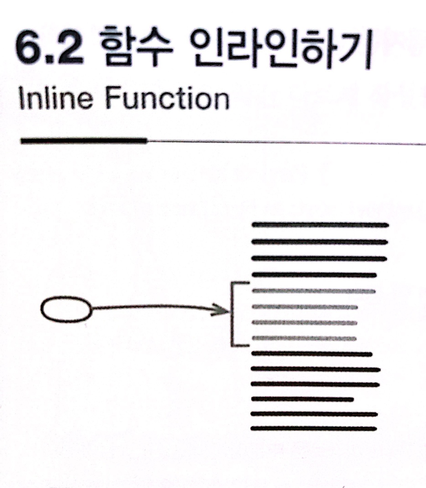

# :star: 6-2 함수 인라인하기

<br>



- 반대 리팩터링: [`함수 추출하기`](https://github.com/Esoolgnah/Summary_of_Refactoring_2nd_Edition/blob/main/Notes/06_기본적인_리팩터링/06_01_함수_추출하기.md)
- 1판에서의 이름: 메서드 내용 직접 삽입

<br>

```js
function getRating(driver) {
  return moreThanFiveLateDeliveries(driver) ? 2 : 1;
}

function moreThanFiveLateDeliveries(driver) {
  return driver.numberOfLateDeliveries > 5;
}
```

<br>

```js
function getRating(driver) {
  return driver.numberOfDeliveries > 5 ? 2 : 1;
}
```

<br>

### 배경

이 책은 목적이 분명히 드러나는 이름의 짤막한 함수를 이용하기를 권합니다. 그래야 코드가 명료해지고 이해하기 쉬워지기 때문입니다. 하지만 때로는 함수 본문이 이름만큼 명확한 경우도 있습니다. 또는 함수 본문 코드를 이름만큼 깔끔하게 리팩터링할 때도 있습니다. 이럴 때는 그 함수를 제거합니다. 간접 호출은 유용할 수도 있지만 쓸데없는 간접 호출은 거슬릴 뿐입니다.

<br>

리팩터링 과정에서 잘못 추출된 함수들도 다시 인라인합니다. 잘못 추출된 함수들을 원래 함수로 합친 다음, 필요하면 원하는 형태로 다시 추출하는 것입니다.

<br>

간접 호출을 너무 과하게 쓰는 코드도 흔한 인라인 대상입니다. 가령 다른 함수로 단순히 위임하기만 하는 함수들이 너무 많아서 위임 관계가 복잡하게 얽혀 있으면 인라인해버립니다. 그중 간접 호출을 유지하는 편이 나은 경우도 있겠지만, 모두 그렇지는 않을 것입니다. 함수 인라인하기를 활용하면 유용한 것만 남기고 나머지는 제거할 수 있습니다.

<br>

### 절차

1️⃣ 다형 메서드(polymorphic method)인지 확인한다.

- 서브클래스에서 오버라이드하는 메서드는 인라인하면 안 됩니다.

<br>

2️⃣ 인라인할 함수를 호출하는 곳을 모두 찾는다.

<br>

3️⃣ 각 호출문을 함수 본문으로 교체한다.

<br>

4️⃣ 하나씩 교체할 때마다 테스트한다.

<br>

- 인라인 작업을 한 번에 처리할 필요는 없습니다. 인라인하기 까다로운 부분이 있다면 일단 남겨두고 여유가 생길 때마다 틈틈이 처리합니다.

<br>

5️⃣ 함수 정의(원래 함수)를 삭제한다.

<br>

말로는 간단해 보이지만 실제로는 그렇지 않을 때가 많습니다. 재귀 호출, 반환문이 여러 개인 함수, 접근자가 없는 다른 객체에 메서드를 인라인하는 방법 등을 일일이 설명하자면 몇 쪽은 필요할 것입니다. 각각의 경우를 다 설명하지 않는 이유는, 상황이 그 정도로 복잡하다면 함수 인라인하기를 적용하면 안 되기 때문입니다.

<br>

### 예시

가장 간단한 경우를 살펴봅시다. 너무 간단해서 따로 설명할 필요가 없을 정도입니다.

<br>

```js
function rating(aDriver) {
  return moreThanFiveLateDeliveries(aDriver) ? 2 : 1;
}

function moreThanFiveLateDeliveries(aDriver) {
  return aDriver.numberOfLateDeliveries > 5;
}
```

<br>

호출되는 함수의 반환문을 그대로 복사해서 호출하는 함수의 호출문을 덮어쓰면 끝입니다.

<br>

```js
function rating(aDriver) {
  return aDriver.numberOfLateDeliveries > 5 ? 2 : 1;
}
```

<br>

그런데 복사한 코드가 새로운 위치에 잘 들어맞도록 손봐줘야 하는 경우도 있습니다. 예컨데 앞의 코드가 다음과 같이 약간 다르게 작성되어 있다고 해봅시다.

<br>

```js
function rating(aDriver) {
  return moreThanFiveLateDeliveries(aDriver) ? 2 : 1;
}

function moreThanFiveLateDeliveries(dvr) {
  //
  return dvr.numberOfLateDeliveries > 5; //
}
```

<br>

거의 비슷하지만 `moreThanFiveLateDeliveries()`를 호출할 때 전달하는 인수 이름이 함수 정의에 쓰인 이름과 다릅니다. 따라서 인라인 후 코드를 살짝 만져줘야 합니다.

<br>

```js
function rating(aDriver) {
  //
  return aDriver.numberOfLateDeliveries > 5 ? 2 : 1; //
}
```

<br>

이보다 일이 더 많은 경우도 있습니다. 다음 코드를 봅시다.

<br>

```js
function reportLines(aCustomer) {
  const lines = [];
  gatherCustomerData(lines, aCustomer);
  return lines;
}

function gatherCustomerData(out, aCustomer) {
  out.push(['name', aCustomer.name]);
  out.push(['location', aCustomer.location]);
}
```

<br>

단순히 잘라 붙이는 식으로는 gatherCustomerData()를 reportLines()로 인라인할 수 없습니다. 아주 복잡하지 않고 여전히 단번에 옮기고 약간 수정해주면 될 때도 많지만, 실수하지 않으려면 한 번에 한 문장씩 옮기는 것이 좋습니다. 그러니 먼저 여러 `문장을 호출한 곳으로 옮기기`를 적용해서 첫 문장부터 시작해봅시다(잘라내서, 붙이고, 다듬는 방식으로 간단히 처리합니다).

<br>

```js
function reportLines(aCustomer) {
  const lines = [];
  lines.push(['name', aCustomer.name]); //
  gatherCustomerData(lines, aCustomer);
  return lines;
}

function gatherCustomerData(out, aCustomer) {
  // out.push(["name", aCustomer.name]);
  out.push(['location', aCustomer.location]);
}
```

<br>

나머지 문장도 같은 식으로 처리합니다.

<br>

```js
function reportLines(aCustomer) {
  const lines = [];
  lines.push(['name', aCustomer.name]);
  lines.push(['location', aCustomer.location]); //
  return lines;
}
```

<br>

여기서 핵심은 항상 단계를 잘게 나눠서 처리하는 데 있습니다. 평소 제 스타일대로 함수를 작게 만들어뒀다면 인라인을 단번에 처리할 수 있을 때가 많습니다(물론 약간 다듬어야 할 수 있습니다). 그러다 상황이 복잡해지면 다시 한 번에 한 문장씩 처리합니다. 한 문장을 처리하는 데도 얼마든지 복잡해질 수 있습니다. 이럴 때는 더 정교한 리팩터링인 `문장을 호출한 곳으로 옮기기`로 작업을 더 잘게 나눕니다. 어느 정도 자신감이 붙으면 다시 작업을 크게 묶어서 처리합니다. 그러다 테스트가 실패하면 가장 최근의 정상 코드로 돌아온 다음, 아쉬운 마음을 달래며 단계를 잘게 나눠서 다시 리팩터링합니다.

<br>

<br>

## 다음 챕터

- [6.3 - 변수 추출하기](https://github.com/Esoolgnah/Summary_of_Refactoring_2nd_Edition/blob/main/Notes/06_기본적인_리팩터링/06_03_변수_추출하기.md)

<br>

## 이전 챕터

- [6.1 - 함수 추출하기](https://github.com/Esoolgnah/Summary_of_Refactoring_2nd_Edition/blob/main/Notes/06_기본적인_리팩터링/06_01_함수_추출하기.md)

<br>

## 목록으로

- [목록](https://github.com/Esoolgnah/Summary_of_Refactoring_2nd_Edition/blob/main/Notes/06_기본적인_리팩터링/06_00_기본적인_리팩터링.md)
