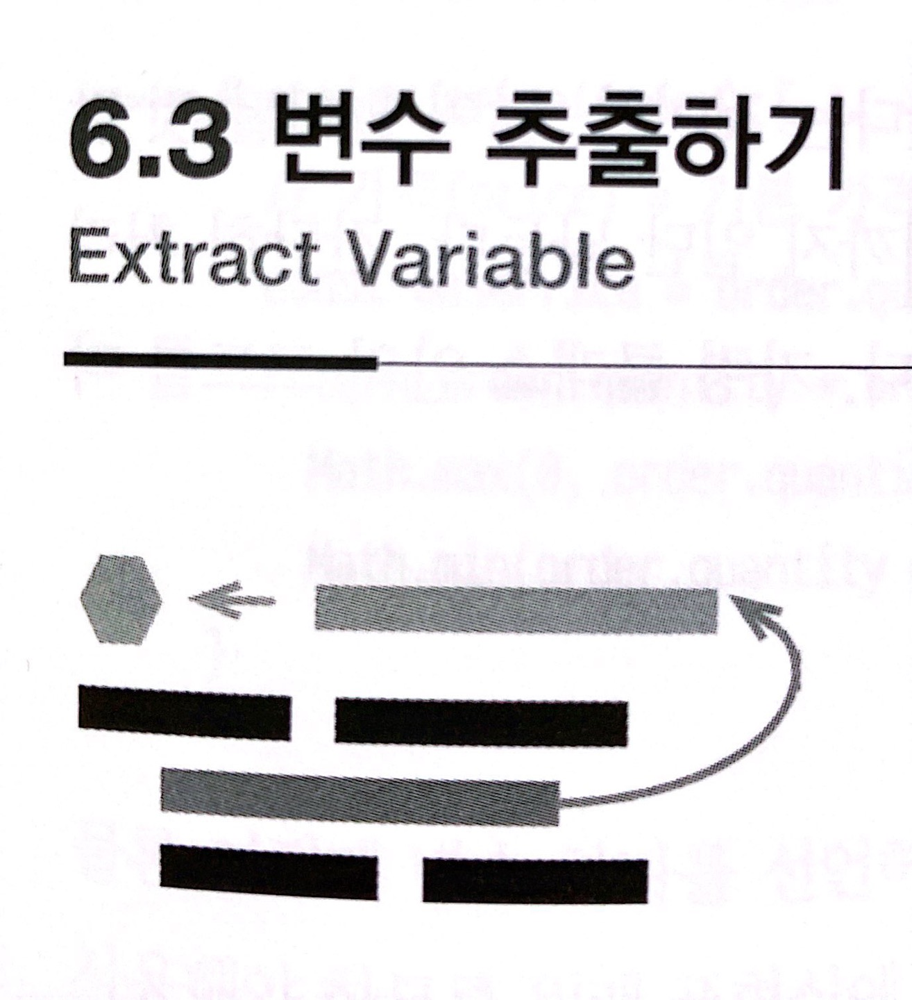

# :star: 6-3

 

 

 

## 다음 챕터

- [6.4 - 변수 인라인하기](https://github.com/Esoolgnah/Summary_of_Refactoring_2nd_Edition/blob/main/Notes/06_기본적인_리팩터링/06_04_변수_인라인하기.md)

 

## 이전 챕터

- [6.2 - 함수 인라인하기](https://github.com/Esoolgnah/Summary_of_Refactoring_2nd_Edition/blob/main/Notes/06_기본적인_리팩터링/06_02_함수_인라인하기.md)

 

## 목록으로

- [목록](https://github.com/Esoolgnah/Summary_of_Refactoring_2nd_Edition/blob/main/Notes/06_기본적인_리팩터링/06_00_기본적인_리팩터링.md)
