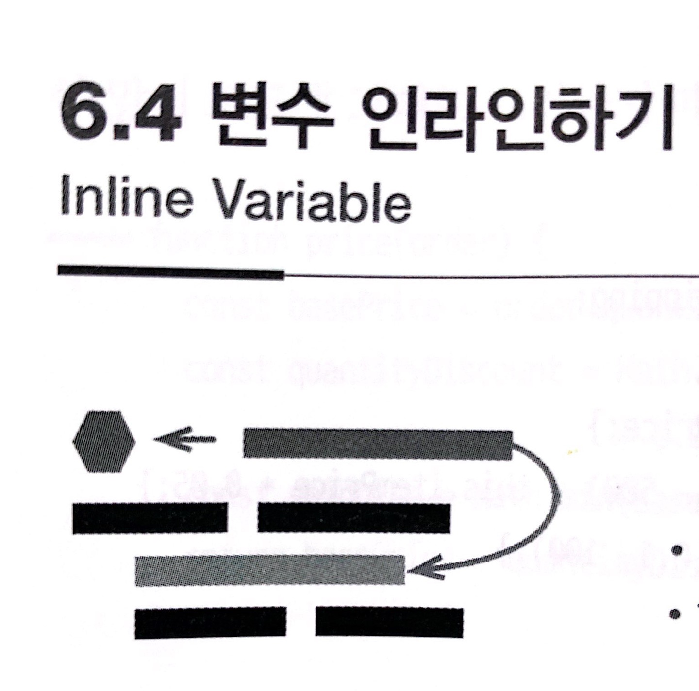

# :star: 6-4 변수 인라인하기

<br>



- 반대 리팩터링: [`변수 추출하기`](https://github.com/Esoolgnah/Summary_of_Refactoring_2nd_Edition/blob/main/Notes/06_기본적인_리팩터링/06_03_변수_추출하기.md)
- 1판에서의 이름: 임시변수 내용 직접 삽입

<br>

```js
let basPrice = anOrder.basePrice;
return basePrice > 1000;
```

<br>

⬇️

<br>

```js
return anOrder.basePrice > 1000;
```

<br>

### 배경

변수는 함수 안에서 표현식을 가리키는 이름으로 쓰이며, 대체로 긍정적인 효과를 줍니다. 하지만 그 이름이 원래 표현식과 다를 바 없을 때도 있습니다. 또 변수가 주변 코드를 리팩터링하는 데 방해가 되기도 합니다. 이럴 때는 그 변수를 인라인하는 것이 좋습니다.

<br>

### 절차

1️⃣ 대입문의 우변(표현식)에서 부작용이 생기지는 않는지 확인한다.

<br>

2️⃣ 변수가 불변으로 선언되지 않았다면 불변으로 만든 후 테스트한다.

- 이렇게 하면 변수에 값이 단 한 번만 대입되는지 확인할 수 있습니다.

<br>

3️⃣ 이 변수를 가장 처음 사용하는 코드를 찾아서 대입문 우변의 코드로 바꾼다.

<br>

4️⃣ 테스트한다.

<br>

5️⃣ 변수를 사용하는 부분을 모두 교체할 때까지 이 과정을 반복한다.

<br>

6️⃣ 변수 선언문과 대입문을 지운다.

<br>

7️⃣ 테스트한다.

<br>

<br>

## 다음 챕터

- [6.5 - 함수 선언 바꾸기](https://github.com/Esoolgnah/Summary_of_Refactoring_2nd_Edition/blob/main/Notes/06_기본적인_리팩터링/06_05_함수_선언_바꾸기.md)

<br>

## 이전 챕터

- [6.3 - 변수 추출하기](https://github.com/Esoolgnah/Summary_of_Refactoring_2nd_Edition/blob/main/Notes/06_기본적인_리팩터링/06_03_변수_추출하기.md)

<br>

## 목록으로

- [목록](https://github.com/Esoolgnah/Summary_of_Refactoring_2nd_Edition/blob/main/Notes/06_기본적인_리팩터링/06_00_기본적인_리팩터링.md)
