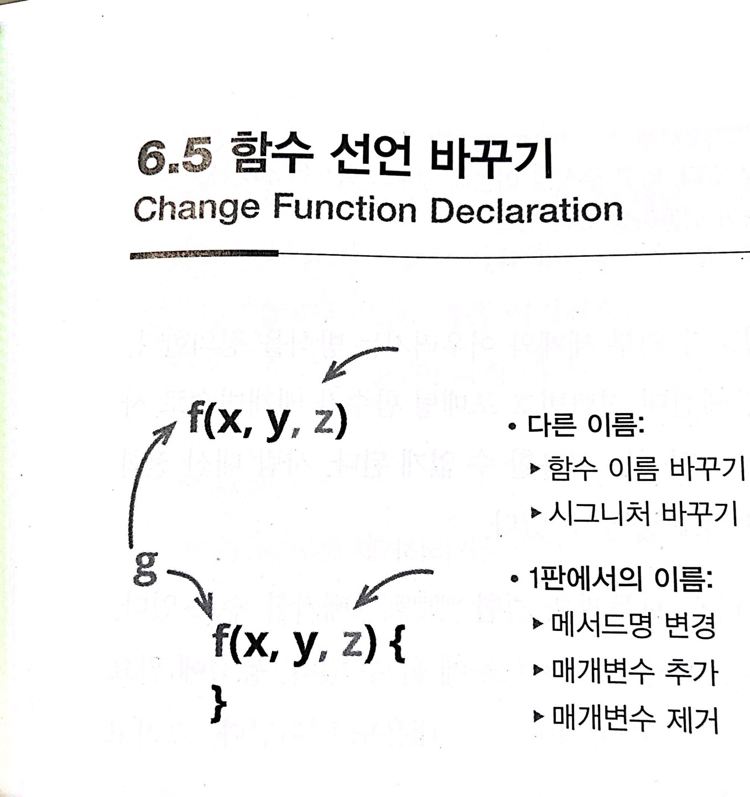

# :star: 6-5 함수 선언 바꾸기

<br>



- 다른 이름:
  - `함수 이름 바꾸기`
  - `시그니처 바꾸기`
- 1판에서의 이름:
  - 메서드명 변경
  - 매개변수 추가
  - 매개변수 제거

<br>

```js
function circum(radius){...}
```

<br>

⬇️

<br>

```js
function circumference(radius) {...}
```

<br>

### 배경

함수는 프로그램을 작은 부분으로 나누는 주된 수단입니다. 함수 선언은 각 부분이 서로 맞물리는 방식을 표현하며, 실질적으로 소프트웨어 시스템의 구성 요소를 조립하는 연결부 역할을 합니다. 건축과 마찬가지로 소프트웨어도 이러한 연결부에 상당히 의존합니다. 연결부를 잘 정의하면 시스템에 새로운 부분을 추가하기가 쉬워지는 반면, 잘못 정의하면 지속적인 방해 요인으로 작용하여 소프트웨어 동작을 파악하기 어려워지고 요구사항이 바뀔 때 적절히 수정하기 어렵게 합니다. 다행히 소프트웨어는 소프트하기 때문에 연결부를 수정할 수 있습니다. 단 주의해서 해야 합니다.

<br>

이러한 연결부에서 가장 중요한 요소는 함수의 이름입니다. 이름이 좋으면 함수의 구현 코드를 살펴볼 필요 없이 호출문만 보고도 무슨 일을 하는지 파악할 수 있습니다. 하지만 좋은 이름을 떠올리기란 쉽지 않습니다. 저도 적합한 이름을 단번에 지은 적이 거의 없습니다. 코드를 읽다가 의미가 와닿지 않는 이름을 발견해도 그대로 놔두고 싶은 유혹에 빠집니다. 고작 이름일 뿐이지 않은가요? 하지만 이는 '혼란'이라는 악마의 유혹입니다. 프로그램의 영혼을 위해서라도 이러한 달콤한 속삭임에 절대 넘어가면 안 됩니다. 그래서 저는 이름이 잘못된 함수를 발견하면 더 나은 이름이 떠오르는 즉시 바꾸라는 명령으로 받아들입니다. 그래야 나중에 그 코드를 다시 볼 때 무슨 일을 하는지 '또' 고민하지 않게 됩니다.

<br>

---

> 좋은 이름을 떠올리는 데 효과적인 방법이 하나 있습니다. 바로 주석을 이용해 함수의 목적을 설명해보는 것입니다. 그러다 보며 주석이 멋진 이름으로 바뀌어 되돌아올 때가 있습니다.

---

<br>

함수의 매개변수도 마찬가지입니다. 매개변수는 함수가 외부 세계와 어우러지는 방식을 정의합니다. 매개변수는 함수를 사용하는 문맥을 설정합니다. 예컨대 전화번호 포매팅 함수가 매개변수로 사람을 받는다고 해봅시다. 그러면 회사 전화번호 포매팅에는 사용할 수 없게 됩니다. 사람 대신 전화번호 자체를 받도록 정의하면 이 함수의 활용 범위를 넓힐 수 있습니다.

<br>

이렇게 하면 활용 범위가 넓어질 뿐만 아니라, 다른 모듈과의 결합(coupling)을 제거할 수도 있습니다. 예컨대 전화번호 포매팅 로직을 사람 관련 정보를 전혀 모르는 모듈에 둘 수 있습니다. 동작에 필요한 모듈 수가 줄어들수록 무언가를 수정할 때 머리에 담아둬야 하는 내용도 적어집니다.

<br>

매개변수를 올바르게 선택하기란 단순히 규칙 몇 개로 표현할 수 없습니다. 예컨대 대여한 지 30일이 지났는지를 기준으로 지불 기한이 넘었는지 판단하는 간단한 함수가 있다고 해봅시다. 이 함수의 매개변수는 지불 객체가 적절할까요, 아니면 마감일로 해야 할까요? 지불 객체로 정하면 이 함수는 지불 객체의 인터페이스와 결합돼버립니다. 대신 지불이 제공하는 여러 속성에 쉽게 접근할 수 있어서 내부 로직이 복잡해지더라도 이 함수를 호출하는 코드를 일일이 찾아서 변경할 필요가 없습니다. 실질적으로 함수의 캡슐화 수준이 높아지는 것입니다.

<br>

이 문제의 정답은 바로 정답이 없다는 것입니다. 특히 시간이 흐를수록 더욱더 그렇습니다. 따라서 어떻게 연결하는 것이 더 나은지 더 잘 이해하게 될 때마다 그에 맞게 코드를 개선할 수 있도록 함수 선언 바꾸기 리팩터링과 친숙해져야만 합니다.

<br>

저는 다른 리팩터링을 지칭할 때 대체로 대표 명칭만 사용합니다. 하지만 함수 선언 바꾸기에서 '이름 바꾸기'가 차지하는 비중이 상당히 높기 때문에, 단순히 이름만 바꿀 떄는 '함수 이름 바꾸기'라고 표현해서 확실히 구분할 것입니다. 이름을 바꿀 때든 매개변수를 변경할 때든 절차는 똑같습니다.

<br>

<br>

## 다음 챕터

- [6.6 - 변수 캡슐화하기](https://github.com/Esoolgnah/Summary_of_Refactoring_2nd_Edition/blob/main/Notes/06_기본적인_리팩터링/06_06_변수_캡슐화하기.md)

<br>

## 이전 챕터

- [6.4 - 변수 인라인하기](https://github.com/Esoolgnah/Summary_of_Refactoring_2nd_Edition/blob/main/Notes/06_기본적인_리팩터링/06_04_변수_인라인하기.md)

<br>

## 목록으로

- [목록](https://github.com/Esoolgnah/Summary_of_Refactoring_2nd_Edition/blob/main/Notes/06_기본적인_리팩터링/06_00_기본적인_리팩터링.md)
