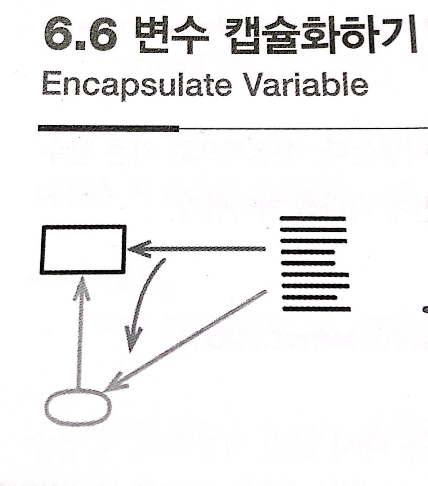

# :star: 6-6 변수 캡슐화하기

<br>



- 1판에서의 이름:
  - 필드 자체 캡슐화
  - 필드 캡슐화
  - 매개변수 제거

<br>

```js

```

<br>

⬇️

<br>

```js

```

<br>

### 배경

<br>

<br>

## 다음 챕터

- [6.7 - 변수 이름 바꾸기](https://github.com/Esoolgnah/Summary_of_Refactoring_2nd_Edition/blob/main/Notes/06_기본적인_리팩터링/06_07_변수_이름_바꾸기.md)

<br>

## 이전 챕터

- [6.5 - 함수 선언 바꾸기](https://github.com/Esoolgnah/Summary_of_Refactoring_2nd_Edition/blob/main/Notes/06_기본적인_리팩터링/06_05_함수_선언_바꾸기.md)

<br>

## 목록으로

- [목록](https://github.com/Esoolgnah/Summary_of_Refactoring_2nd_Edition/blob/main/Notes/06_기본적인_리팩터링/06_00_기본적인_리팩터링.md)
