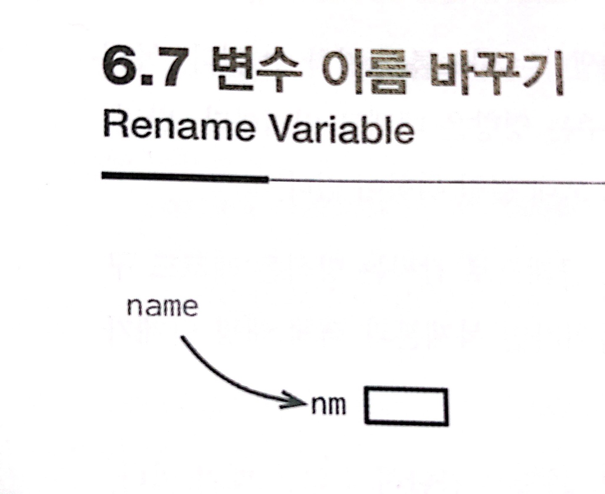

# :star: 6-7 변수 이름 바꾸기

<br>



<br>

```js

```

<br>

⬇️

<br>

```js

```

<br>

### 배경

<br>

<br>

## 다음 챕터

- [6.8 - 매개변수 객체 만들기](https://github.com/Esoolgnah/Summary_of_Refactoring_2nd_Edition/blob/main/Notes/06_기본적인_리팩터링/06_08_매개변수_객체_만들기.md)

<br>

## 이전 챕터

- [6.6 - 변수 캡슐화하기](https://github.com/Esoolgnah/Summary_of_Refactoring_2nd_Edition/blob/main/Notes/06_기본적인_리팩터링/06_06_변수_캡슐화하기.md)

<br>

## 목록으로

- [목록](https://github.com/Esoolgnah/Summary_of_Refactoring_2nd_Edition/blob/main/Notes/06_기본적인_리팩터링/06_00_기본적인_리팩터링.md)
