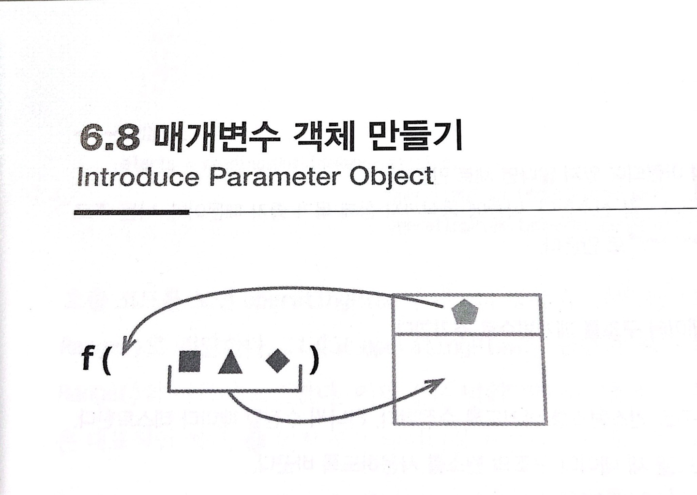

# :star: 6-8 매개변수 객체 만들기

<br>



<br>

```js
function amountInvoiced(startData,endData) {...}
function amountReceived(startData,endData) {...}
function amountOverdue(startData,endData) {...}
```

<br>

⬇️

<br>

```js
function amountInvoiced(aDateRange) {...}
function amountReceived(aDateRange) {...}
function amountOverdue(aDateRange) {...}
```

<br>

### 배경

데이터 항목 여러 개가 이 함수에서 저 함수로 함께 몰려다니는 경우를 자주 봅니다. 저는 이런 데이터 무리를 발견하면 데이터 구조 하나로 모아주곤 합니다.

<br>

데이터 뭉치를 데이터 구조로 묶으면 데이터 사이의 관계가 명확해진다는 이점을 얻습니다. 게다가 함수가 이 데이터 구조를 받게 하면 매개변수 수가 줄어듭니다. 같은 데이터 구조를 사용하는 모든 함수가 원소를 참조할 때 항상 똑같은 이름을 사용하기 때문에 일관성도 높여줍니다.

<br>

하지만 이 리팩터링의 진정한 힘은 코드를 더 근본적으로 바꿔준다는 데 있습니다. 저는 이런 데이터 구조를 새로 발견하면 이 데이터 구조를 활용하는 형태로 프로그램 동작을 재구성합니다. 데이터 구조에 담길 데이터에 공통으로 적용되는 동작을 추출해서 함수로 만드는 것입니다(공용 함수를 나열하는 식으로 작성할 수도 있고, 이 함수들과 데이터를 합쳐 클래스로 만들 수도 있습니다). 이 과정에서 새로 만든 데이터 구조가 문제 영역을 훨씬 간결하게 표현하는 새로운 추상 개념으로 격상되면서, 코드의 개념적인 그림을 다시 그릴 수도 있습니다. 그러면 놀라울 정도로 강력한 효과를 냅니다. 하지만 이 모든 것의 시작은 매개변수 객체 만들기부터입니다.

<br>

### 절차

1️⃣ 적당한 데이터 구조가 아직 마련되어 있지 않다면 새로 만든다.

- 개인적으로 클래스로 만드는 걸 선호합니다. 나중에 동작까지 함께 묶기 좋기 때문입니다. 저는 주로 데이터 구조를 값 객체(Value Object)로 만듭니다.

<br>

2️⃣ 테스트한다.

<br>

3️⃣ [`함수 선언 바꾸기`](https://github.com/Esoolgnah/Summary_of_Refactoring_2nd_Edition/blob/main/Notes/06_기본적인_리팩터링/06_05_함수_선언_바꾸기.md)로 새 데이터 구조를 매개변수로 추가한다.

<br>

4️⃣ 테스트한다.

<br>

5️⃣ 함수 호출 시 새로운 데이터 구조 인스턴스를 넘기도록 수정한다. 하나씩 수정할 때마다 테스트한다.

<br>

6️⃣ 기존 매개변수를 사용하던 코드를 새 데이터 구조의 원소를 사용하도록 바꾼다.

<br>

7️⃣ 다 바꿨다면 기존 매개변수를 제거하고 테스트한다.

<br>

### 예시

온도 측정값(reading) 배열에서 정상 작동 범위를 벗어난 것이 있는지 검사하는 코드를 살펴봅시다. 온도 측정값을 표현하는 데이터는 다음과 같습니다.

<br>

```js
const station = {
  name: "ZB1",
  readings: [
    { temp: 47, time: "2016-11-10 09:10" },
    { temp: 53, time: "2016-11-10 09:20" },
    { temp: 58, time: "2016-11-10 09:30" },
    { temp: 53, time: "2016-11-10 09:40" },
    { temp: 51, time: "2016-11-10 09:50" },
  ],
};
```

<br>

다음은 정상 범위를 벗어난 측정값을 찾는 함수입니다.

<br>

```js
function readingsOutsideRange(station, min, max) {
  return station.readings.filter((r) => r.temp < min || r.temp > max);
}
```

<br>

이 함수는 다음과 같이 호출될 수 있습니다.

<br>

```js
alerts = readingsOutSideRange(
  station,
  operatingPlan.temperatureFloor, // 최저 온도
  operatingPlan.temperatureCeiling
); // 최고 온도
```

<br>

호출 코드를 보면 `operatingPlan`의 데이터 항목 두 개를 쌍으로 가져와서 `readingsOutSideRange()`로 전달합니다. 그리고 `operatingPlan`은 범위의 시작과 끝 이름을 `readingsOutsideRange()`와 다르게 표현합니다. 이와 같은 범위(range)라는 개념은 객체 하나로 묶어 표현하는 게 나은 대표적인 예입니다. 1️⃣ 먼저 묶은 데이터를 표현하는 클래스부터 선언합시다.

<br>

```js
class NumberRange {
  constructor(min, max) {
    this._data = { min: min, max: max };
  }
  get min() {
    return this._data.min;
  }
  get max() {
    return this._data.max;
  }
}
```

<br>

여기서는 기본 자바스크립트 객체가 아닌 클래스로 선언했는데, 이 리팩터링은 새로 생성한 객체로 동작까지 옮기는 더 큰 작업의 첫 단계로 수행될 때가 많기 때문입니다. 이 시나리오에는 클래스가 적합하므로 곧바로 클래스를 사용했습니다. 한편 값 객체로 만들 가능성이 높기 때문에 세터는 만들지 않습니다. 제가 이 리팩터링을 할 때는 대부분 값 객체를 만들게 됩니다.

<br>

3️⃣ 그런 다음 새로 만든 객체를 readingsOutsideRange()의 매개변수로 추가하도록 [`함수 선언을 바꿉니다.`](https://github.com/Esoolgnah/Summary_of_Refactoring_2nd_Edition/blob/main/Notes/06_기본적인_리팩터링/06_05_함수_선언_바꾸기.md)

<br>

```js
function readingsOutsideRange(station, min, max, range) {
  return station.readings.filter((r) => r.temp < min || r.temp > max);
}
```

<br>

자바스크립트라면 호출문을 예전 상태로 둬도 되지만, 다른 언어를 사용할 때는 다음과 같이 새 매개변수 자리에 널(null)을 적어둡니다.

<br>

```js
// 호출문...
alerts = readingsOutsideRange(
  station,
  operatingPlan.temperatureFloor,
  operatingPlan.temperatureCeiling,
  null
);
```

<br>

4️⃣ 아직까지 동작은 하나도 바꾸지 않았으니 테스트는 문제없이 통과할 것입니다. 5️⃣ 이제 온도범위를 객체 형태로 전달하도록 호출문을 하나씩 바꿉니다.

<br>

```js
// 호출문...
const range = new NumberRange(
  operatingPlan.temperatureFloor,
  operatingPlan.temperatureCeiling
);
alerts = readingsOutsideRange(
  station,
  operatingPlan.temperatureFloor,
  operatingPlan.temperatureCeiling,
  range
);
```

<br>

여기서도 동작은 바뀌지 않았습니다. 새로 건넨 매개변수를 아직 사용하지 않기 때문입니다. 따라서 이번에도 모든 테스트를 무난히 통과합니다.

<br>

6️⃣ 이제 기존 매개변수를 사용하는 부분을 변경합니다. 최댓값부터 바꿔봅시다.

<br>

```js
function readingOutsideRange(station, min, range) {
  // max ❌
  return station.readings.filter((r) => r.temp < min || r.temp > range.max); //
}
```

<br>

```js
// 호출문
const range = new NumberRange(
  operatingPlan.temperatureFloor,
  operatingPlan.temperatureCeiling
);
alerts = readingsOutsideRange(
  station,
  operatingPlan.temperatureFloor,
  // operatingPlan.temperatureCeiling, ❌
  range
);
```

<br>

여기서 한 번 테스트한 뒤, 다음 매개변수도 제거합니다.

<br>

```js
function readingsOutsideRange(station, min, range) {
  // min ❌
  return station.readings.filter(
    (r) => r.temp < range.min || r.temp > range.max
  ); //
}
```

<br>

```js
// 호출문
const range = new NumberRange(
  operatingPlan.temperatureFloor,
  operatingPlan.temperatureCeiling
);
alerts = readingsOutsideRange(
  station,
  // operatingPlan.temperatureFloor, ❌
  range
);
```

<br>

이상으로 매개변수 객체 만들기가 끝났습니다.

<br>

---

> ### 진정한 값 객체로 거듭나기
>
> 앞서 운을 띄웠듯이 매개변수 그룹을 객체로 교체하는 일은 진짜 값진 작업의 준비단계일 뿐입니다. 앞에서처럼 클래스로 만들어두면 관련 동작들을 이 클래스로 옮길 수 있다는 이점이 생깁니다. 이 예에서는 온도가 허용 범위 안에 있는지 검사하는 메서드를 클래스에 추가할 수 있습니다.
>
> ```js
> function readingsOutsideRange(station, range) {
>   return station.readings.filter((r) => !range.contains(r.temp));
> }
> ```
>
> ```js
> contains(arg) {return (arg >= this.min && arg <= this.max);}
> ```
>
> 지금까지 한 작업은 여러 가지 유용한 동작을 갖춘 범위(Range) 클래스를 생성하기 위한 첫 단계입니다. 코드에 범위 개념이 필요함을 깨달았다면 최댓값과 최솟값 쌍을 사용하는 코드를 발견할 때마다 범위 객체로 바꿉시다(당장 operatingPlan의 temperatureFloor와 temperatureCeiling을 temperatureRange로 교체할 수 있습니다). 이러한 값 쌍이 어떻게 사용되는지 살펴보면 다른 유용한 동작도 범위 클래스로 옮겨서 코드베이스 전반에서 값을 활용하는 방식을 간소화할 수 있습니다. 저라면 진정한 값 객체로 만들기 위해 값에 기반한 동치성 검사 메서드(equality method)부터 추가할 것입니다.

---

<br>

<br>

## 다음 챕터

- [6.9 - 여러 함수를 클래스로 묶기](https://github.com/Esoolgnah/Summary_of_Refactoring_2nd_Edition/blob/main/Notes/06_기본적인_리팩터링/06_09_여러_함수를_클래스로_묶기.md)

<br>

## 이전 챕터

- [6.7 - 변수 이름 바꾸기](https://github.com/Esoolgnah/Summary_of_Refactoring_2nd_Edition/blob/main/Notes/06_기본적인_리팩터링/06_07_변수_이름_바꾸기.md)

<br>

## 목록으로

- [목록](https://github.com/Esoolgnah/Summary_of_Refactoring_2nd_Edition/blob/main/Notes/06_기본적인_리팩터링/06_00_기본적인_리팩터링.md)
