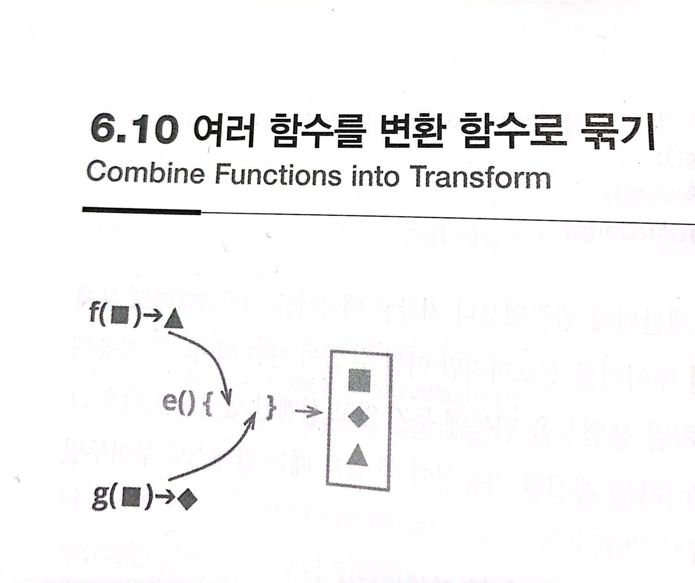

# :star: 6-10 여러 함수를 변환 함수로 묶기

<br>



<br>

```js
function base(aReading) {...}
function taxableCharge(aReading) {...}
```

<br>

⬇️

<br>

```js
function enrichReading(argReading) {
  const aReading = _.cloneDeep(argReading);
  aReading.baseCharge = base(aReading);
  aReading.taxableCharge = taxableCharge(aReading);
  return aReading;
}
```

<br>

### 배경

소프트웨어는 데이터를 입력받아서 여러 가 정보를 도출하곤 합니다. 이렇게 도출된 정보는 여러 곳에서 사용될 수 있는데, 그러다 보면 이 정보가 사용되는 곳마다 같은 도출 로직이 반복되기도 합니다. 저는 이런 도출 작업들을 한데로 모아두길 좋아합니다. 모아두면 검색과 갱신을 일관된 장소에서 처리할 수 있고 로직 중복도 막을 수 있습니다.

<br>

이렇게 하기 위한 방법으로 변환 함수(transform)를 사용할 수 있습니다. 변환 함수는 원본 데이터를 입력받아서 필요한 정보를 모두 도출한 뒤, 각각을 출력 데이터의 필드에 넣어 반환합니다. 이렇게 해두면 도출 과정을 검토할 일이 생겼을 때 변환 함수만 살펴보면 됩니다.

<br>

이 리팩터링 대신 [`여러 함수를 클래스로 묶기`](https://github.com/Esoolgnah/Summary_of_Refactoring_2nd_Edition/blob/main/Notes/06_기본적인_리팩터링/06_09_여러_함수를_클래스로_묶기.md)로 처리해도 됩니다. 둘 중 어느 것을 적용해도 좋으며, 저는 대체로 소프트웨어에 이미 반영된 프로그래밍 스타일을 따르는 편입니다. 그런데 둘 사이에는 중요한 차이가 있습니다. 원본 데이터가 코드 안에서 갱신될 때는 클래스로 묶는 편이 훨씬 낫습니다. 변환 함수로 묶으면 가공한 데이터를 새로운 레코드에 저장하므로, 원본 데이터가 수정되면 일관성이 꺠질 수 있기 때문입니다.

<br>

여러 함수를 한데 묶는 이유 하나는 도출 로직이 중복되는 것을 피하기 위해서입니다. 이 로직을 [`함수로 추출`](https://github.com/Esoolgnah/Summary_of_Refactoring_2nd_Edition/blob/main/Notes/06_기본적인_리팩터링/06_01_함수_추출하기.md)하는 것만으로도 같은 효과를 볼 수 있지만, 데이터 구조와 이를 사용하는 함수가 근처에 있지 않으면 함수를 발견하기 어려울 때가 많습니다. 변환 함수(또는 클래스)로 묶으면 이런 함수들을 쉽게 찾아 쓸 수 있습니다.

<br>

### 절차

1️⃣ 변환할 레코드를 입력받아서 값을 그대로 반환하는 변환 함수를 만든다.

- 이 작업은 대체로 깊은 복사로 처리해야 합니다. 변환 함수가 원본 레코드를 바꾸지 않는지 검사하는 테스트를 마련해두면 도움될 때가 많습니다.

<br>

2️⃣ 묶을 함수 중 함수 하나를 골라서 본문 코드를 변환 함수로 옮기고, 처리 결과를 레코드에 새 필드로 기록합니다. 그런 다음 클라이언트 코드가 이 필드를 사용하도록 수정합니다.

- 로직이 복잡하면 [`함수 추출하기`](https://github.com/Esoolgnah/Summary_of_Refactoring_2nd_Edition/blob/main/Notes/06_기본적인_리팩터링/06_01_함수_추출하기.md)부터 합니다.

<br>

3️⃣ 테스트한다.

<br>

4️⃣ 나머지 관련 함수도 위 과정에 따라 처리한다.

<br>

### 예시

제가 자란 영국에서는 차(tea)가 차지하는 비중이 상당히 큰 나머지, 저는 서민에게 차를 수돗물처럼 제공하는 서비스를 상상하게 됐습니다. 이런 서비스가 있다면 매달 사용자가 마신 차의 양을 측정(reading)해야 합니다.

<br>

```js
reading = { customer: "ivan", quantity: 10, month: 5, year: 2017 };
```

<br>

코드 곳곳에서 다양한 방식으로 차 소비량을 계산한다고 해봅시다. 그중 사용자에게 요금을 부과하기 위해 기본요금을 계산하는 코드도 있습니다.

<br>

```js
// 클라이언트 1...
const aReading = acquireReading();
const baseCharge = baseRate(aReading.month, aReading.year) * aReading.quantity;
```

<br>

세금을 부과할 소비량을 계산하는 코드도 필요합니다. 모든 시민이 차 세금을 일부 면제받을 수 있도록 정부가 사려깊게 설계하여 이 값은 기본 소비량보다 적습니다.

<br>

```js
// 클라이언트 2...
const aReading = acquireReading();
const base = baseRate(aReading.month, aReading.year) * aReading.quantity;
const taxableCharge = Math.max(0, base - taxThreshold(aReading.year));
```

<br>

이 코드에는 이와 같은 계산 코드가 여러곳에 반복된다고 해봅시다. 중복 코드는 나중에 로직을 수정할 때 골치를 썩입니다(장담하건대 반드시 수정할 일이 생깁니다). 중복 코드라면 [`함수 추출하기`](https://github.com/Esoolgnah/Summary_of_Refactoring_2nd_Edition/blob/main/Notes/06_기본적인_리팩터링/06_01_함수_추출하기.md)로 처리할 수도 있지만, 추출한 함수들이 프로그램 곳곳에 흩어져서 나중에 프로그래머가 그런 함수가 있는지조차 모르게 될 가능성이 있습니다. 실제로도 다른 곳에서 함수로 만들어 둔 것을 발견했습니다.

<br>

```js
// 클라이언트 3...
const aReading = acquireReading();
const basicChargeAmount = calculateBaseCharge(aReading);

function calculateBaseCharge(aReading) {
  // 다른 곳에서 이미 함수로 만들어둠
  return baseRate(aReading.month, aReading.year) * aReading.quantity;
}
```

<br>

이를 해결하는 방법으로, 다양한 파생 정보 계산 로직을 모두 하나의 변환 단계로 모을 수 있습니다. 변환 단계에서 미가공 측정값을 입력받아서 다양한 가공 정보를 덧붙여 반환하는 것입니다.

<br>

1️⃣ 우선 입력 객체를 그대로 복사해 반환하는 함수를 만듭니다.

<br>

```js
function enrichReading(original) {
  const result = _.cloneDeep(original);
  return result;
}
```

<br>

깊은 복사는 lodash 라이브러리가 제공하는 cloneDeep()로 처리했습니다.

<br>

---

> 참고로 저는 본질은 같고 부가 정보만 덧붙이는 변환 함수의 이름을 "enrich"라 하고, 형태가 변할 때만 "transform"이라는 이름을 씁니다.

---

<br>

2️⃣ 이제 변경하려는 계산 로직 중 하나를 고릅니다. 먼저 이 계산 로직에 측정값을 전달하기 전에 부가 정보를 덧붙이도록 수정합니다.

<br>

```js
// 클라이언트 3...
const rawReading = acquireReading(); // 미가공 측정값
const aReading = enrichReading(rawReading); //
const basicChargeAmount = calculateBaseCharge(aReading);
```

<br>

`calculateBaseCharge()`를 부가 정보를 덧붙이는 코드 근처로 옮깁니다([`함수 옮기기`](https://github.com/Esoolgnah/Summary_of_Refactoring_2nd_Edition/blob/main/Notes/08_기능_이동/08_01_함수_옮기기.md)).

<br>

```js
function enrichReading(original) {
  const result = _.cloneDeep(original);
  result.baseCharge = calculateBaseCharge(result); // 미가공 측정값에 기본 소비량을 부가 정보로 덧붙임
  return result;
}
```

<br>

변환 함수 안에서는 결과 객체를 매번 복제할 필요 없이 마음껏 변경해도 됩니다. 저는 불변 데이터를 선호하지만 널리 사용되는 언어는 대부분 불변 데이터를 다루기 어렵게 돼 있습니다. 데이터가 모듈 경계를 넘나든다면 어려움을 기꺼이 감내하며 불변으로 만들어 사용하겠지만, 데이터의 유효범위가 좁을 때는 마음껏 변경합니다. 또한 저는 변환 함수로 옮기기 쉬운 이름을 붙입니다(여기서는 보강된 값을 담는 변수의 이름을 aReading이라고 지었습니다).

<br>

이어서 이 함수를 사용하던 클라이언트가 부가 정보를 담은 필드를 사용하도록 수정합니다.

<br>

```js
// 클라이언트 3...
const rawReading = acquireReading();
const aReading = enrichReading(rawReading);
const basicChargeAmount = aReading.baseCharge;
```

<br>

`calculateBaseCharge()`를 호출하는 코드를 모두 수정했다면, 이 함수를 `enrichReading()`안에 중첩시킬 수 있습니다. 그러면 '기본요금을 이용하는 클라이언트는 변환된 레코드를 사용해야 한다'는 의도를 명확히 표현할 수 있습니다.

<br>

여기서 주의할 점이 있습니다. `enrichReading()`처럼 정보를 추가해 반환할 때 원본 측정값 레코드는 변경하지 않아야 한다는 것입니다. 따라서 이를 확인하는 테스트를 작성해두는 것이 좋습니다.

<br>

```js
it("check reading unchaged", function () {
  const baseReading = { customer: "ivan", quantity: 15, month: 5, year: 2017 };
  const oracle = _.cloneDeep(baseReading);
  enrichReading(baseReading);
  assert.deepEqual(baseReading, oracle);
});
```

<br>

그런 다음 클라이언트 1도 이 필드를 사용하도록 수정합니다.

<br>

```js
// 클라이언트 1...
const rawReading = acquireReading();
const aReading = enrichReading(rawReading);
const baseCharge = aReading.baseCharge;
```

<br>

이때 baseCharge [`변수도 인라인`](https://github.com/Esoolgnah/Summary_of_Refactoring_2nd_Edition/blob/main/Notes/06_기본적인_리팩터링/06_04_변수_인라인하기.md)하면 좋습니다.

<br>

```js
const rawReading = acquireReading();
const aReading = enrichReading(rawReading);
const taxableCharge = Math.max(
  0,
  aReading.baseCharge - taxThreshold(aReading.year)
);
```

<br>

그런 다음 계산 코드를 변환 함수로 옮깁니다.

<br>

```js
function enrichReading(original) {
  const result = _.cloneDeep(original);
  result.baseCharge = calculateBaseCharge(result);
  result.taxableCharge = Math.max(
    0,
    result.baseCharge - taxThreshold(result.year)
  );
  return result;
}
```

<br>

이제 새로 만든 필드를 사용하도록 원본 코드를 수정합니다.

<br>

```js
const rawReading = acquireReading();
const aReading = enrichReading(rawReading);
const taxableCharge = aReading.taxableCharge;
```

<br>

테스트에 성공하면 taxableCharge [`변수를 인라인`](https://github.com/Esoolgnah/Summary_of_Refactoring_2nd_Edition/blob/main/Notes/06_기본적인_리팩터링/06_04_변수_인라인하기.md)합니다.

<br>

---

> 측정값에 부가 정보를 추가하는 지금 방식에서 클라이언트가 데이터를 변경하면 심각한 문제가 생길 수 잇습니다. 예컨대 사용량 필드를 변경하면 데이터의 일관성이 깨집니다. 제 생각에 자바스크립트에서 이 문제를 방지하기 가장 좋은 방법은 [`여러 함수를 클래스로 묶기`](https://github.com/Esoolgnah/Summary_of_Refactoring_2nd_Edition/blob/main/Notes/06_기본적인_리팩터링/06_09_여러_함수를_클래스로_묶기.md)입니다. 불변 데이터 구조를 지원하는 언어라면 이런 문제가 생길 일이 없습니다. 따라서 이런 언어로 프로그래밍할 때는 (그렇지 않은 언어를 쓸 때보다) [`여러 함수를 변환 함수로 묶기`](https://github.com/Esoolgnah/Summary_of_Refactoring_2nd_Edition/blob/main/Notes/06_기본적인_리팩터링/06_10_여러_함수를_변환_함수로_묶기.md)를 사용하는 비중이 높아집니다. 하지만 불변성을 제공하지 않는 언어라도, 웹 페이지에 출력할 부가 데이터를 도출할 때처럼 데이터가 읽기전용 문맥에서 사용될 때는 변환 방식을 활용할 수 있습니다.

---

<br>

<br>

## 다음 챕터

- [6.11 - 단계 쪼개기](https://github.com/Esoolgnah/Summary_of_Refactoring_2nd_Edition/blob/main/Notes/06_기본적인_리팩터링/06_11_단계_쪼개기.md)

<br>

## 이전 챕터

- [6.9 - 여러 함수를 클래스로 묶기](https://github.com/Esoolgnah/Summary_of_Refactoring_2nd_Edition/blob/main/Notes/06_기본적인_리팩터링/06_09_여러_함수를_클래스로_묶기.md)

<br>

## 목록으로

- [목록](https://github.com/Esoolgnah/Summary_of_Refactoring_2nd_Edition/blob/main/Notes/06_기본적인_리팩터링/06_00_기본적인_리팩터링.md)
