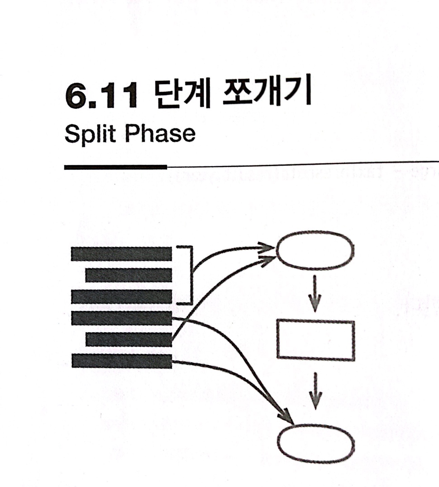

# :star: 6-11 단계 쪼개기

<br>



<br>

```js
const orderData = orderString.split(/\s+/);
const productPrice = priceList[orderData[0].split("-")[1]];
const orderPrice = parseInt(orderData[1]) * productPrice;
```

<br>

⬇️

<br>

```js
const orderRecord = parseOrder(order);
const orderPrice = price(orderRecord, priceList);

function parseOrder(aString) {
  const values = aString.split(/\s+/);
  return {
    productID: values[0].split("-")[1],
    quantity: parseInt(values[1]),
  };
}
function price(order, priceList) {
  return order.quantity * priceList[order.productID];
}
```

<br>

### 배경

저는 서로 다른 두 대상을 한꺼번에 다루는 코드를 발견하면 각각을 별개 모듈로 나누는 방법을 모색합니다. 코드를 수정할 때 두 대상을 동시에 생각할 필요 없이 하나에만 집중하기 위해서입니다. 모듈이 잘 분리되어 있다면 다른 모듈은 상세 내용은 전혀 기억하지 못해도 원하는 대로 수정을 끝마칠 수도 있습니다.

<br>

이렇게 분리하는 가장 간편한 방법 하나는 동작을 연이은 두 단계로 쪼개는 것입니다. 입력이 처리 로직에 적합하지 않은 형태로 들어오는 경우를 예로 생각해봅시다. 이럴 때는 본 작업에 들어가기 전에 입력값을 다루기 편한 형태로 가공합니다. 아니면 로직을 순차적인 단계들로 분리해도 됩니다. 이때 각 단계는 서로 확연히 다른 일을 수행해야 합니다.

<br>

가장 대표적인 예는 컴파일러입니다. 컴파일러는 기본적으로 어떤 텍스트(프로그래밍 언어로 작성된 코드)를 입력받아서 실행 가능한 형태(예컨대 특정 하드웨어에 맞는 목적 코드(object code))로 변환합니다. 컴파일러의 역사가 오래되다 보니 사람들은 컴파일 작업을 여러 단계가 순차적으로 연결된 형태로 분리하면 좋다는 사실을 깨달았습니다. 즉, 텍스트를 토큰화하고, 토큰을 파싱해서 구문 트리를 만들고, (최적화 등) 구문 트리를 변환하는 다양한 단계를 거친 다음, 마지막으로 목적 코드를 생성하는 식입니다. 각 단계는 자신만의 문제에 집중하기 때문에 나머지 단계에 관해서는 자세히 몰라도 이해할 수 있습니다.

<br>

이렇게 단계를 쪼개는 기법은 주로 덩치 큰 소프트웨어에 적용됩니다. 가령 컴파일러의 매 단계는 다수의 함수와 클래스로 구성됩니다. 하지만 저는 규모에 관게없이 여러 단계로 분리하면 좋을만한 코드를 발견할 때마다 기본적인 단계 쪼개기 리팩터링을 합니다. 다른 단계로 볼 수 있는 코드 영역들이 마침 서로 다른 데이터와 함수를 사용한다면 단계 쪼개기에 적합하다는 뜻입니다. 이 코드 영역들을 별도 모듈로 분리하면 그 차이를 코드에서 훨씬 분명하게 드러낼 수 있습니다.

<br>

### 절차

1️⃣ 두 번째 단계에 해당하는 코드를 독립 함수로 추출한다.

<br>

2️⃣ 테스트한다.

<br>

3️⃣ 중간 데이터 구조를 만들어서 앞에서 추출한 함수의 인수로 추가한다.

<br>

4️⃣ 테스트한다.

<br>

5️⃣ 추출한 두 번째 단계 함수의 매개변수를 하나씩 검토한다. 그중 첫 번째 단계에서 사용되는 것은 중간 데이터 구조로 옮긴다. 하나씩 옮길 때마다 테스트한다.

- 간혹 두 번째 단계에서 사용하면 안 되는 매개변수가 있습니다. 이럴 때는 각 매개변수를 사용한 결과를 중간 데이터 구조의 필드로 추출하고, 이 필드의 값을 설정하는 `문장을 호출한 곳으로 옮깁니다.`

<br>

6️⃣ 첫 번째 단계 코드를 [`함수로 추출`](https://github.com/Esoolgnah/Summary_of_Refactoring_2nd_Edition/blob/main/Notes/06_기본적인_리팩터링/06_01_함수_추출하기.md)하면서 중간 데이터 구조를 반환하도록 만든다.

- 이때 첫 번째 단계를 변환기(transformer) 객체로 추출해도 좋습니다.

### 예시

상품의 결제 금액을 계산하는 코드로 시작해봅시다.

```js
function priceOrder(product, quantity, shippingMethod) {
  const basePrice = product.basePrice * quantity;
  const discount =
    Math.max(quantity - product.discountThreshold, 0) *
    product.basePrice *
    product.discountRate;
  const shippingCase = basePrice > shippingMethod.discountThreshold;
  const shippingCost = quantity * shippingPerCase;
  const price = basePrice - discount + shippingCost;
  return price;
}
```

<br>

간단한 예지만, 가만 보면 계산이 두 단계로 이루어짐을 알 수 있습니다. 앞의 몇 줄은 상품 정보를 이용해서 결제 금액 중 상품 가격을 계산합니다. 반면 뒤으 코드는 배송 정보를 이용하여 결제 금액 중 배송비를 계산합니다. 나중에 상품 가격과 배송비 계산을 더 복잡하게 만드는 변경이 생긴다면 (비교적 서로 독립적으로 처리할 수 있으므로) 이 코드는 두 단계로 나누는 것이 좋습니다.

<br>

```js
function priceOrder(product, quantity, shippingMethod) {
  const basePrice = product.basePrice * quantity;
  const discount =
    Math.max(quantity - product.discountThreshold, 0) *
    product.basePrice *
    product.discountRate;
  const price = applyShipping(basePrice, shippingMethod, quantity, discount); //
  return price;
}

function applyShipping(basePrice, shippingMethod, quantity, discount) {
  // 두 번째 단계를 처리하는 함수
  const shippingPerCase =
    basePrice > shippingMethod.discountThreshold
      ? shippingMethod.discountedFee
      : shippingMethod.feePerCase;
  const shippingCost = quantity * shippingPerCase;
  const price = basePrice - discount + shippingCost;
  return price;
}
```

<br>

두 번째 단계에 필요한 데이터를 모두 개별 매개변수로 전달했습니다. 실전에서는 이런 데이터가 상당히 많을 수 있는데, 어차피 나중에 걸러내기 때문에 걱정할 필요가 없습니다.

<br>

3️⃣ 다음으로 첫 번째 단게와 두 번째 단게가 주고받을 중간 데이터 구조를 만듭니다.

<br>

```js
function priceOrder(product, quantity, shippingMethod) {
  const basePrice = product.basePrice * quantity;
  const discount = Math.max(quantity - product.discountThreshold, 0)
        * product.basePrice * product.discountRate;
  const priceData = {}; // 중간 데이터 구조
  const price = = applyShipping(priceData, basePrice, shippingMethod, quantity, discount);
  return price;
}

function applyShipping(priceData, basePrice, shippingMethod, quantity, discount) { //
  const shippingPerCase = (basePrice > shippingMethod.discountThreshold)
        ? shippingMethod.discountedFee : shippingMethod.feePerCase;
  const shippingCost = quantity * shippingPerCase;
  const price = basePrice - discount + shippingCost;
  return price;
}
```

<br>

5️⃣ 이제 `applyShipping()`에 전달되는 다양한 매개변수를 살펴봅시다. 이중 `basePrice`는 첫 번째 단계를 수행하는 코드에서 생성됩니다. 따라서 중간 데이터 구조로 옮기고 매개변수 목록에서 제거합니다.

<br>

```js
function priceOrder(product, quantity, shippingMethod) {
  const basePrice = product.basePrice * quantity;
  const discount = Math.max(quantity - product.discountThreshold, 0)
        * product.basePrice * product.discountRate;
  const priceData = {basePrice: basePrice}; //
  const price = = applyShipping(priceData, shippingMethod, quantity, discount); // basePrice ❌
  return price;
}

function applyShipping(priceData, shippingMethod, quantity, discount) { // basePrice ❌
  const shippingPerCase = (priceData.basePrice > shippingMethod.discountThreshold) //
        ? shippingMethod.discountedFee : shippingMethod.feePerCase;
  const shippingCost = quantity * shippingPerCase;
  const price = priceData.basePrice - discount + shippingCost;
  return price;
}
```

<br>

다음으로 `shippingMethod`를 봅시다. 이 매개변수는 첫 번째 단계에서는 사용하지 않으니 그대로 둡니다.

<br>

그다음 나오는 `quantity`는 첫 번째 단계에서 사용하지만 거기서 생성된 것은 아닙니다. 그래서 그냥 매개변수로 놔둬도 됩니다. 하지만 저는 중간 데이터 구조에 담는 걸 선호하기 때문에 이 매개변수도 옮깁니다.

<br>

```js
function priceOrder(product, quantity, shippingMethod) {
  const basePrice = product.basePrice * quantity;
  const discount = Math.max(quantity - product.discountThreshold, 0)
        * product.basePrice * product.discountRate;
  const priceData = {basePrice: basePrice, quantity: quantity}; //
  const price = = applyShipping(priceData, shippingMethod, discount); // quantity ❌
  return price;
}

function applyShipping(priceData, shippingMethod, discount) { // quantity ❌
  const shippingPerCase = (priceData.basePrice > shippingMethod.discountThreshold) //
        ? shippingMethod.discountedFee : shippingMethod.feePerCase;
  const shippingCost = priceData.quantity * shippingPerCase; //
  const price = priceData.basePrice - discount + shippingCost;
  return price;
}
```

<br>

`discount`도 같은 방법으로 처리합니다.

<br>

```js
function priceOrder(product, quantity, shippingMethod) {
  const basePrice = product.basePrice * quantity;
  const discount = Math.max(quantity - product.discountThreshold, 0)
        * product.basePrice * product.discountRate;
  const priceData = {basePrice: basePrice, quantity: quantity, discount: discount}; //
  const price = = applyShipping(priceData, shippingMethod, discount); // discount ❌
  return price;
}

function applyShipping(priceData, shippingMethod) { // discount ❌
  const shippingPerCase = (priceData.basePrice > shippingMethod.discountThreshold) //
        ? shippingMethod.discountedFee : shippingMethod.feePerCase;
  const shippingCost = priceData.quantity * shippingPerCase;
  const price = priceData.basePrice - priceData.discount + shippingCost; //
  return price;
}
```

<br>

매개변수들을 모두 처리하면 중간 데이터 구조가 완성됩니다. 6️⃣ 이제 첫 번째 단계 코드를 함수로 추출하고 이 데이터 구조를 반환하게 합니다.

<br>

```js
function priceOrder(product, quantity, shippingMethod) {
  const pirceData = calculatePricingData(product, quantity); //
  const price = applyShipping(priceData, shippingMethod);
  return price;
}

function calculatePricingData(product, quantity) {
  // 첫 번째 단계를 처리하는 함수
  const basePrice = product.basePrice * quantity;
  const discount =
    Math.max(quantity - product.discountThreshold, 0) *
    product.basePrice *
    product.discountRate;
  return { basePrice: basePrice, quantity: quantity, discount: discount };
}

function applyShipping(priceData, shippingMethod) {
  // 두 번째 단계를 처리하는 함수
  const shippingPerCase =
    priceData.basePrice > shippingMethod.discountThreshold
      ? shippingMethod.discountedFee
      : shippingMethod.feePerCase;
  const shippingCost = priceData.quantity * shippingPerCase;
  const price = priceData.basePrice - priceData.discount + shippingCost;
  return price;
}
```

<br>

저는 최종 결과를 담은 상수들(`price`)도 깔끔하게 정리해야 속이 시원합니다.

```js
function priceOrder(product, quantity, shippingMethod) {
  const pirceData = calculatePricingData(product, quantity);
  // const price = applyShipping(priceData, shippingMethod);
  return applyShipping(priceData, shippingMethod); //
}

function calculatePricingData(product, quantity) {
  const basePrice = product.basePrice * quantity;
  const discount =
    Math.max(quantity - product.discountThreshold, 0) *
    product.basePrice *
    product.discountRate;
  return { basePrice: basePrice, quantity: quantity, discount: discount };
}

function applyShipping(priceData, shippingMethod) {
  // 두 번째 단계를 처리하는 함수
  const shippingPerCase =
    priceData.basePrice > shippingMethod.discountThreshold
      ? shippingMethod.discountedFee
      : shippingMethod.feePerCase;
  const shippingCost = priceData.quantity * shippingPerCase;
  // const price = priceData.basePrice - priceData.discount + shippingCost;
  return priceData.basePrice - priceData.discount + shippingCost; //
}
```

<br>

### 예시: 명령줄 프로그램 쪼개기(자바)

JSON 파일에 담긴 주문의 개수를 세는 자바 프로그램을 살펴봅시다.

<br>

```java
public static void man(String[] args) {
  try {
    if (args.length === 0) throw new RuntimeException("파일명을 입력하세요.");
    String filename = args[args.length - 1];
    File input = Paths.get(filename).toFile();
    ObjectMapper mapper = new ObjectMapper();
    Order[] orders = mapper.readValue(input, Order[].class);
    if (Stream.of(args).anyMatch(arg -> "-r".equals(arg)))
      System.out.println(Stream.of(orders)
                                .filter(o -> "ready".equals(o.status))
                                .count());
    else
      System.out.println(orders.length);
  } catch (Exception e) {
    System.err.println(e);
    System.exit(1);
  }
}
```

<br>

이 프로그램은 명령줄에서 실행할 때 주문이 담긴 파일 이름을 인수로 받습니다. 이때 옵션인 -r 플래그를 지정하면 "ready" 상태인 주문만 셉니다.

<br>

---

> 주문을 읽는 부분은 잭슨(Jackson) 라이브러리를 이용했습니다. `ObjectMapper`는 각 JSON 레코드를 간단히 public 데이터 필드로 구성된 자바 객체로 매핑합니다. JSON 레코드의 status 필드는 Order 클래스의 public 필드인 `status`에 매핑되는 식입니다. 잭슨 라이브러리는 이보다 정교한 JSON 매핑도 제공하지만, 이 예시와 관련이 없으므로 따로 설명하지 않겠습니다.

---

<br>

이 코드는 두 가지 일을 합니다. 하나는 주문 목록을 읽어서 개수를 세고, 다른 하나는 명령줄 인수를 담은 배열을 읽어서 프로그램의 동작을 결정합니다. 따라서 단계 쪼개기 리팩터링의 대상으로 적합합니다. 첫 번째 단계는 명령줄 인수의 구문을 분석해서 의미를 추출합니다. 두 번째 단계는 이렇게 추출된 정보를 이용하여 데이터를 적절히 가공합니다. 이렇게 분리해두면, 프로그램에서 지정할 수 있는 옵션이나 스위치가 늘어나더라도 코드를 수정하기 쉽습니다.

<br>

그런데 단계 쪼개기와 상관없는 작업부터 할 것입니다. 리팩터링할 때는 테스트를 작성하고 자주 수행해야 하지만, 자바로 작성된 명령줄 프로그램은 테스트하기가 고통스럽습니다. 매번 JVM을 구동해야 하는데 그 과정이 느리고 복잡하기 때문입니다. 특히 메이븐(Maven)의 단점을 싫어한다면 고통이 배가 됩니다. 이 문제를 개선하려면 일반적인 JUnit 호출로 자바 프로세스 하나에서 테스트할 수 있는 상태로 만들면 됩니다. 이를 위해 먼저 핵심 작업을 수행하는 코드 전부를 [`함수로 추출`](https://github.com/Esoolgnah/Summary_of_Refactoring_2nd_Edition/blob/main/Notes/06_기본적인_리팩터링/06_01_함수_추출하기.md)합니다.

<br>

```java
public static void man(String[] args) {
  try {
    run(args);
  } catch (Exception e) {
    System.err.println(e);
    System.exit(1);
  }
}

static void run(String[] args) throws IOException {
  if (args.length === 0) throw new RuntimeException("파일명을 입력하세요.");
  String filename = args[args.length - 1];
  File input = Paths.get(filename).toFile();
  ObjectMapper mapper = new ObjectMapper();
  Order[] orders = mapper.readValue(input, Order[].class);
  if (Stream.of(args).anyMatch(arg -> "-r".equals(arg)))
    System.out.println(Stream.of(orders)
                              .filter(o -> "ready".equals(o.status))
                              .count());
  else
    System.out.println(orders.length);
}
```

<br>

`run()` 메서드를 테스트 코드에서 쉽게 호출할 수 있도록 접근 범위를 패키지로 설정했습니다. 이로써 이 메서드를 자바 프로세스 안에서 호출할 수 있지만, 결과를 받아보려면 표준 출력으로 보내는 방식을 수정해야 합니다. 이 문제는 System.out을 호출하는 `문장을 호출한 곳으로 옮겨` 해결합니다.

<br>

```java
public static void man(String[] args) {
  try {
    System.out.println(run(args)); //
  } catch (Exception e) {
    System.err.println(e);
    System.exit(1);
  }
}

static void run(String[] args) throws IOException {
  if (args.length === 0) throw new RuntimeException("파일명을 입력하세요.");
  String filename = args[args.length - 1];
  File input = Paths.get(filename).toFile();
  ObjectMapper mapper = new ObjectMapper();
  Order[] orders = mapper.readValue(input, Order[].class);
  if (Stream.of(args).anyMatch(arg -> "-r".equals(arg)))
    return Stream.of(orders).filter(o -> "ready".equals(o.status)).count(); //
  else
    return orders.length;
}
```

<br>

이렇게 하면 기존 동작을 망치지 않으면서 `run()` 메서드를 검사하는 JUnit 테스트를 작성할 수 있습니다. 이로써 명령줄에서 매번 자바 프로세스를 새로 띄울 때보다 훨씬 빨라졌습니다. 지금까지의 단계는 리팩터링 시 중요합니다. 테스트가 느리거나 불편하면 리팩터링 속도가 느려지고 오류가 생길 가능성도 커집니다. 따라서 먼저 테스트를 쉽게 수행할 수 있도록 수정한 다음에 리팩터링하는 게 좋습니다.

<br>

이번 예에서는 명령줄 호출과 표준 출력에 쓰는 느리고 불편한 작업과 자주 테스트해야 할 복잡한 동작을 분리함으로써 테스트를 더 쉽게 수행하게 만들었습니다. 이 원칙을 흔히 험블 객체 패턴(Humble Obejct Pattern)이라 합니다. 단, 여기서는 객체가 아니라 `main()` 메서드에 적용했습니다. `main()`에 담긴 로직을 최대한 간소하게 만들어서 문제가 생길 여지를 줄인 것입니다.

<br>

이제 단계를 쪼갤 준비가 끝났습니다. 1️⃣ 가장 먼저 할 일은 두 번째 단계에 해당하는 코드를 독립된 메서드로 추출하는 것입니다. 그래서 다음과 같이 수정합니다.

<br>

```java
static long run(String[] args) throws IOException {
  if (args.length === 0) throw new RuntimeException("파일명을 입력하세요.");
  String filename = args[args.length - 1];
  return countOrders(arg, filename); //
}

private static long countOrders(String[] args, String filename) throws IOException { //
  File input = Paths.get(filename).toFile();
  ObjectMapper mapper = new ObjectMapper();
  Order[] orders = mapper.readValue(input, Order[].class);
  if (Stream.of(args.anyMatch(arg -> "-r".equals(arg))))
    return Stream.of(orders).filter(o -> "ready".equals(o.status)).count();
  else
    return orders.length;
}
```

<br>

3️⃣ 다음으로 중간 데이터 구조를 추가합니다. 레코드는 단순한 게 좋은데, 자바이므로 클래스로 구현합니다.

<br>

```java
static long run(String[] args) throws IOException {
  if (args.length === 0) throw new RuntimeException("파일명을 입력하세요.");
  CommandLine commandLine = new CommandLine(); //
  String filename = args[args.length - 1];
  return countOrders(commandLine, arg, filename); //
}

private static long countOrders(CommandLine commandLine, String[] args, String filename) throws IOException { //
  File input = Paths.get(filename).toFile();
  ObjectMapper mapper = new ObjectMapper();
  Order[] orders = mapper.readValue(input, Order[].class);
  if (Stream.of(args.anyMatch(arg -> "-r".equals(arg))))
    return Stream.of(orders).filter(o -> "ready".equals(o.status)).count();
  else
    return orders.length;
}

private static class CommandLine {}
```

<br>

5️⃣ 이제 두 번째 단계 메서드인 `countOrders()`로 전달되는 다른 인수들을 살펴봅니다. `args`부터 봅시다. `args`는 첫 번째 단계에서 사용하는데, 이를 두 번째 단계에까지 노출하는 건 적절치 않습니다. 지금 단계를 쪼개는 목적이 `args`를 사용하는 부분을 모두 첫 번째 단계로 분리하는 것이기 때문입니다.

<br>

`args`를 처리하기 위해 가장 먼저 할 일은 이 값을 사용하는 부분을 찾아서 그 결과를 추출하는 것입니다. 여기서는 단 한번, 개수를 세는 코드가 "ready" 상태인 주문만 세는지 확인하는 데 이용하므로 이 조건식을 [`변수로 추출`](https://github.com/Esoolgnah/Summary_of_Refactoring_2nd_Edition/blob/main/Notes/06_기본적인_리팩터링/06_03_변수_추출하기.md)합니다.

<br>

```java
static long run(String[] args) throws IOException {
  if (args.length === 0) throw new RuntimeException("파일명을 입력하세요.");
  CommandLine commandLine = new CommandLine();
  String filename = args[args.length - 1];
  return countOrders(commandLine, arg, filename);
}

private static long countOrders(CommandLine commandLine, String[] args, String filename) throws IOException { //
  File input = Paths.get(filename).toFile();
  ObjectMapper mapper = new ObjectMapper();
  Order[] orders = mapper.readValue(input, Order[].class);
  boolean onlyCountReady = Stream.of(args).anyMatch(arg -> "-r".equals(arg)); //
  if (onlyCountReady) //
    return Stream.of(orders).filter(o -> "ready".equals(o.status)).count();
  else
    return orders.length;
}

private static class CommandLine {}
```

<br>

그런 다음 이 값을 중간 데이터 구조로 옮깁니다.

<br>

```java
static long run(String[] args) throws IOException {
  if (args.length === 0) throw new RuntimeException("파일명을 입력하세요.");
  CommandLine commandLine = new CommandLine();
  String filename = args[args.length - 1];
  return countOrders(commandLine, arg, filename);
}

private static long countOrders(CommandLine commandLine, String[] args, String filename) throws IOException { //
  File input = Paths.get(filename).toFile();
  ObjectMapper mapper = new ObjectMapper();
  Order[] orders = mapper.readValue(input, Order[].class);
commandLine.onlyCountReady = Stream.of(args).anyMatch(arg -> "-r".equals(arg)); //
  if (commandLine.onlyCountReady) //
    return Stream.of(orders).filter(o -> "ready".equals(o.status)).count();
  else
    return orders.length;
}

private static class CommandLine {
  boolean onlyCountReady;
}
```

<br>

---

> 여기서는 `commandLine`에 public 필드로 두는 방식을 택했습니다. 평소에는 꺼리는 방식이지만 이 예에서는 사용되는 범위가 좁기 때문에 문제가 없습니다.

---

<br>

다음으로 `onlyCountReady`에 값을 설정하는 `문장을 호출한 곳으로 옮깁니다.`

<br>

```java
static long run(String[] args) throws IOException {
  if (args.length === 0) throw new RuntimeException("파일명을 입력하세요.");
  CommandLine commandLine = new CommandLine();
  String filename = args[args.length - 1];
  commandLine.onlyCountReady = Stream.of(args).anyMatch(arg -> "-r".equals(arg)); //
  return countOrders(commandLine, arg, filename);
}

private static long countOrders(CommandLine commandLine, String[] args, String filename) throws IOException { //
  File input = Paths.get(filename).toFile();
  ObjectMapper mapper = new ObjectMapper();
  Order[] orders = mapper.readValue(input, Order[].class);
commandLine.onlyCountReady = Stream.of(args).anyMatch(arg -> "-r".equals(arg)); //
  if (commandLine.onlyCountReady) //
    return Stream.of(orders).filter(o -> "ready".equals(o.status)).count();
  else
    return orders.length;
}

private static class CommandLine {
  boolean onlyCountReady;
}
```

<br>

이어서 `filename` 매개변수를 중간 데이터 구조인 `CommandLine` 객체로 옮깁니다.

<br>

```java
static long run(String[] args) throws IOException {
  if (args.length === 0) throw new RuntimeException("파일명을 입력하세요.");
  CommandLine commandLine = new CommandLine();
  commandLine.filename = args[args.length - 1]; //
  commandLine.onlyCountReady = Stream.of(args).anyMatch(arg -> "-r".equals(arg)); //
  return countOrders(commandLine); // filename ❌
}

private static long countOrders(CommandLine commandLine) throws IOException { // String filename ❌
  File input = Paths.get(filename).toFile();
  ObjectMapper mapper = new ObjectMapper();
  Order[] orders = mapper.readValue(input, Order[].class);
commandLine.onlyCountReady = Stream.of(args).anyMatch(arg -> "-r".equals(arg));
  if (commandLine.onlyCountReady)
    return Stream.of(orders).filter(o -> "ready".equals(o.status)).count();
  else
    return orders.length;
}

private static class CommandLine {
  boolean onlyCountReady;
  String filename; //
}
```

<br>

매개변수 처리가 다 끝났습니다. 6️⃣ 이제 첫 번째 단계의 코드를 메서드로 추출합니다.

<br>

```java
static long run(String[] args) throws IOException {
  CommandLine commandLine = parseCommandLine(args); //
  return countOrders(commandLine);
}

private static CommandLine parseCommandLine(String[] args) { //
  if (args.length == 0) throw new RuntimeException("파일명을 입력하세요.");
  CommandLine commandLine = new CommandLine();
  commandLine.filename = args[args.length - 1];
  commandLine.onlyCountReady = Stream.of(args).anyMatch(arg -> "-r".equals(arg));
  return commandLine;
}

private static long countOrders(CommandLine commandLine) throws IOException {
  File input = Paths.get(filename).toFile();
  ObjectMapper mapper = new ObjectMapper();
  Order[] orders = mapper.readValue(input, Order[].class);
commandLine.onlyCountReady = Stream.of(args).anyMatch(arg -> "-r".equals(arg));
  if (commandLine.onlyCountReady)
    return Stream.of(orders).filter(o -> "ready".equals(o.status)).count();
  else
    return orders.length;
}

private static class CommandLine {
  boolean onlyCountReady;
  String filename; //
}
```

<br>

단계 쪼개기 리팩터링의 핵심은 이 정도로 끝났습니다. 그런데 저라면 이름 바구기와 인라인하기로 조금 더 정리해야 적성이 풀립니다.

<br>

```java
static long run(String[] args) throws IOException {
  return countOrders(parseCommandLine(commandLine)); //
}

private static CommandLine parseCommandLine(String[] args) { //
  if (args.length == 0) throw new RuntimeException("파일명을 입력하세요.");
  CommandLine result = new CommandLine(); //
  result.filename = args[args.length - 1];
  result.onlyCountReady = Stream.of(args).anyMatch(arg -> "-r".equals(arg)); //
  return result; //
}

private static long countOrders(CommandLine commandLine) throws IOException {
  File input = Paths.get(filename).toFile();
  ObjectMapper mapper = new ObjectMapper();
  Order[] orders = mapper.readValue(input, Order[].class);
commandLine.onlyCountReady = Stream.of(args).anyMatch(arg -> "-r".equals(arg));
  if (commandLine.onlyCountReady)
    return Stream.of(orders).filter(o -> "ready".equals(o.status)).count();
  else
    return orders.length;
}

private static class CommandLine {
  boolean onlyCountReady;
  String filename;
}
```

<br>

이제 두 단계가 명확하게 분리됐습니다. `parseCommandLine()`은 오로지 명령줄 관련 작업만 처리하고 `countOrders()`는 실제로 처리할 작업만 수행합니다. 이제 두 메서들르 독립적으로 테스트하기 쉬워졌습니다. 여기서 로직이 더 복잡해진다면 아마도 `parseCommandLine()`을 더 전문화된 라이브러리로 대체할 것입니다.

<br>

### 예시: 첫 번째 단계에 변환기 사용하기(자바)

앞의 명령줄 예시에서는 첫 번째 단계에서 간단한 데이터 구조를 만들어서 두 번째 단계로 전달했습니다. 이렇게 하지 않고 명령줄 인수를 담은 문자열 배열을 두 번째 단계에 적합한 인터페이스로 바꿔주는 변환기(transformer)객체를 만들어도 됩니다.

<br>

이 방식을 설명하기 위해 앞 예시에서 두 번째 단계에 데이터를 전달할 `commandLine` 객체를 생성하는 부분으로 돌아가봅시다.

<br>

```java
static long run(String[] args) throws IOException {
  if (args.length === 0) throw new RuntimeException("파일명을 입력하세요.");
  CommandLine commandLine = new CommandLine();
  String filename = args[args.length - 1];
  return countOrders(commandLine, arg, filename);
}

private static long countOrders(CommandLine commandLine, String[] args, String filename) throws IOException {
  File input = Paths.get(filename).toFile();
  ObjectMapper mapper = new ObjectMapper();
  Order[] orders = mapper.readValue(input, Order[].class);
  if (Stream.of(args).anyMatch(arg -> "-r".equals(arg)))
    return Stream.of(orders).filter(o -> "ready".equals(o.status)).count();
  else
    return orders.length;
}

private static class CommandLine {}
```

<br>

앞 예시에서는 동작을 포함할 수 있는 객체 대신 레코드 구조를 만들었기 때문에, 내부 클래스를 만들고 나중에 public 데이터 멤버로 채웟습니다. 하지만 다음고 같이 동작까지 포함하는 최상위 클래스로 빼내는 방법도 있습니다.

<br>

```java
// App 클래스...
static long run(String[] args) throws IOException {
  if (args.length === 0) throw new RuntimeException("파일명을 입력하세요.");
  CommandLine commandLine = new CommandLine();
  String filename = args[args.length - 1];
  return countOrders(commandLine, arg, filename);
}

private static long countOrders(CommandLine commandLine, String[] args, String filename) throws IOException {
  File input = Paths.get(filename).toFile();
  ObjectMapper mapper = new ObjectMapper();
  Order[] orders = mapper.readValue(input, Order[].class);
  if (Stream.of(args).anyMatch(arg -> "-r".equals(arg)))
    return Stream.of(orders).filter(o -> "ready".equals(o.status)).count();
  else
    return orders.length;
}

// CommandLine 클래스...
public class CommandLine {
  String[] args;

  public CommandLine(String[] args) {
    this.args = args;
  }
}
```

<br>

이 클래스는 생성자에게 인수 배열을 받아서 첫 단계 로직이 할 일을 수행합니다. 즉, 입력받은 데이터를 두 번째 단계에 맞게 변환하는 메서드들을 제공할 것입니다.

<br>

처리 과정을 확실히 이해하기 위해 `countOrders()`의 인수를 뒤에서부터 살펴봅시다. 먼저 `filename`입니다. 이 인수에는 `임시 변수를 질의 함수로 바꾸기`를 적용합니다.

<br>

```java
// App 클래스...
static long run(String[] args) throws IOException {
  if (args.length === 0) throw new RuntimeException("파일명을 입력하세요.");
  CommandLine commandLine = new CommandLine();
  String filename = args[args.length - 1];
  return countOrders(commandLine, arg, filename(args)); //
}

private static String filename(String[] args) { //
  return args[args.length - 1];
}

private static long countOrders(CommandLine commandLine, String[] args, String filename) throws IOException {
  File input = Paths.get(filename).toFile();
  ObjectMapper mapper = new ObjectMapper();
  Order[] orders = mapper.readValue(input, Order[].class);
  if (Stream.of(args).anyMatch(arg -> "-r".equals(arg)))
    return Stream.of(orders).filter(o -> "ready".equals(o.status)).count();
  else
    return orders.length;
}
```

<br>

바로 이어서 이 질의 메서드를 `CommandLine` 클래스로 옮깁니다(`함수 옮기기`).

<br>

```java
// App 클래스...
static long run(String[] args) throws IOException {
  if (args.length === 0) throw new RuntimeException("파일명을 입력하세요.");
  CommandLine commandLine = new CommandLine();
  String filename = args[args.length - 1];
  return countOrders(commandLine, arg, commandLine.filename()); //
}

private static long countOrders(CommandLine commandLine, String[] args, String filename) throws IOException {
  File input = Paths.get(filename).toFile();
  ObjectMapper mapper = new ObjectMapper();
  Order[] orders = mapper.readValue(input, Order[].class);
  if (Stream.of(args).anyMatch(arg -> "-r".equals(arg)))
    return Stream.of(orders).filter(o -> "ready".equals(o.status)).count();
  else
    return orders.length;
}

// CommandLine 클래스...
public class CommandLine {
  String[] args;

  public CommandLine(String[] args) {
    this.args = args;
  }
  String filename() { //
    return args[args.length - 1];
  }
}
```

<br>

이제 [`함수 선언 바꾸기`](https://github.com/Esoolgnah/Summary_of_Refactoring_2nd_Edition/blob/main/Notes/06_기본적인_리팩터링/06_05_함수_선언_바꾸기.md)로 `countOrders()`가 새로 만든 메서드를 사용하도록 고칩니다.

<br>

```java
// App 클래스...
static long run(String[] args) throws IOException {
  if (args.length === 0) throw new RuntimeException("파일명을 입력하세요.");
  CommandLine commandLine = new CommandLine();
  String filename = args[args.length - 1];
  return countOrders(commandLine, arg); // commandLine.filename ❌
}

private static long countOrders(CommandLine commandLine, String[] args) throws IOException { // String filename ❌
  File input = Paths.get(commandLine.filename()).toFile(); //
  ObjectMapper mapper = new ObjectMapper();
  Order[] orders = mapper.readValue(input, Order[].class);
  if (Stream.of(args).anyMatch(arg -> "-r".equals(arg)))
    return Stream.of(orders).filter(o -> "ready".equals(o.status)).count();
  else
    return orders.length;
}
```

<br>

아직 `args`는 제거하면 안 됩니다. 조건문에서 사용하고 있기 때문입니다. `args`를 삭제하려면 먼저 이 조건식부터 추출해야 합니다.

<br>

```java
// App 클래스...
static long run(String[] args) throws IOException {
  if (args.length === 0) throw new RuntimeException("파일명을 입력하세요.");
  CommandLine commandLine = new CommandLine();
  String filename = args[args.length - 1];
  return countOrders(commandLine, arg);
}

private static long countOrders(CommandLine commandLine, String[] args) throws IOException {
  File input = Paths.get(commandLine.filename()).toFile(); //
  ObjectMapper mapper = new ObjectMapper();
  Order[] orders = mapper.readValue(input, Order[].class);
  if (onlyCountReady(args))
    return Stream.of(orders).filter(o -> "ready".equals(o.status)).count();
  else
    return orders.length;
}

private static boolean onlyCountReady(String[] args) {
  return Stream.of(args).anyMatch(arg -> "-r".equals(arg));
}
```

<br>

그런 다음 이 메서드를 `CommandLine` 클래스로 옮기고 `args` 매개변수를 삭제합니다.

<br>

```java
// App 클래스...
static long run(String[] args) throws IOException {
  if (args.length === 0) throw new RuntimeException("파일명을 입력하세요.");
  CommandLine commandLine = new CommandLine();
  String filename = args[args.length - 1];
  return countOrders(commandLine); // arg ❌
}

private static long countOrders(CommandLine commandLine) throws IOException { // String[] args ❌
  File input = Paths.get(commandLine.filename()).toFile();
  ObjectMapper mapper = new ObjectMapper();
  Order[] orders = mapper.readValue(input, Order[].class);
  if (commandLine.onlyCountReady()) //
    return Stream.of(orders).filter(o -> "ready".equals(o.status)).count();
  else
    return orders.length;
}

// CommandLine 클래스...
public class CommandLine {
  String[] args;

  public CommandLine(String[] args) {
    this.args = args;
  }
  String filename() {
    return args[args.length - 1];
  }
  boolean onlyCountReady() { //
    return Stream.of(args).anyMatch(arg -> "-r".equals(arg));
  }
}
```

<br>

지금까지는 변환 로직을 새 클래스로 옮기는 방식으로 리팩터링했습니다. 추가로, 명령줄 인수가 존재하는지 검사하는 부분도 옮겨줍니다(`문장을 함수로 옮기기`).

<br>

```java
// App 클래스...
static long run(String[] args) throws IOException {
  // if (args.length === 0) throw new RuntimeException("파일명을 입력하세요.");
  CommandLine commandLine = new CommandLine();
  String filename = args[args.length - 1];
  return countOrders(commandLine);
}

private static long countOrders(CommandLine commandLine) throws IOException {
  File input = Paths.get(commandLine.filename()).toFile();
  ObjectMapper mapper = new ObjectMapper();
  Order[] orders = mapper.readValue(input, Order[].class);
  if (commandLine.onlyCountReady()) //
    return Stream.of(orders).filter(o -> "ready".equals(o.status)).count();
  else
    return orders.length;
}

// CommandLine 클래스...
public class CommandLine {
  String[] args;

  public CommandLine(String[] args) {
    this.args = args;
    if (args.length == 0) throw new RuntimeException("파일명을 입력하세요."); //
  }
  String filename() {
    return args[args.length - 1];
  }
  boolean onlyCountReady() { //
    return Stream.of(args).anyMatch(arg -> "-r".equals(arg));
  }
}
```

<br>

저는 이렇게 단순한 데이터 구조는 사용하기 꺼리는 편입니다. 하지만 이 예시처럼 순차적으로 실행되는 두 함수 사이에서 단순 통신용으로 사용하는 것처럼 제한된 문맥에서만 사용할 때는 개의치 않습니다. 이렇게 객체를 변환기로 바꾸는 방식도 나름 장점이 있습니다. 저는 두 방식 중 어느 하나를 특별히 선호하지는 않습니다. 핵심은 어디까지나 단계를 명확히 분리하는 데 있기 때문입니다.

<br>

<br>

## 다음 챕터

- [7장 목록](https://github.com/Esoolgnah/Summary_of_Refactoring_2nd_Edition/blob/main/Notes/07_캡슐화/07_00_캡슐화.md)

<br>

## 이전 챕터

- [6.9 - 여러 함수를 클래스로 묶기](https://github.com/Esoolgnah/Summary_of_Refactoring_2nd_Edition/blob/main/Notes/06_기본적인_리팩터링/06_09_여러_함수를_클래스로_묶기.md)

<br>

## 목록으로

- [목록](https://github.com/Esoolgnah/Summary_of_Refactoring_2nd_Edition/blob/main/Notes/06_기본적인_리팩터링/06_00_기본적인_리팩터링.md)
