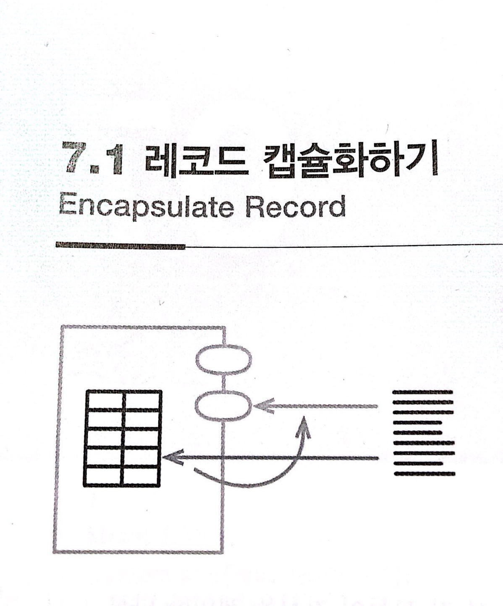

# :star: 7-1 레코드 캡슐화하기

<br>



- 1판에서의 이름: 레코드를 데이터 클래스로 전환

<br>

```js
organization = { name: "애크미 구스베리", country: "GB" };
```

<br>

```js
class Organization {
  constructor(data) {
    this._name = data.name;
    this._country = data.country;
  }
  get name() {return this._name;}
  get name(arg) {this._name = arg;}
  get country() {return this._country;}
  set country(arg) {this._country = arg;}
}
```

<br>

### 배경

대부분의 프로그래밍 언어는 데이터 레코드를 표현하는 구조를 제공합니다. 레코드는 연관된 여러 데이터를 직관적인 방식으로 묶을 수 있어서 각각을 따로 취급할 때보다 훨씬 의미 있는 단위로 전달할 수 있게 해줍니다. 하지만 단순한 레코드에는 단점이 있습니다. 특히, 계산해서 얻을 수 있는 값과 그렇지 않은 값을 명확히 구분해 저장해야 하는 점이 번거롭습니다. 가령 값의 범위(range)를 표현하려면 {start: 1, end: 5}나 {start: 1, length: 5} (또는 제 스타일을 고집한다면 {end: 5, length: 5}) 등의 방식으로 저장할 수 있습니다. 어떤 식으로 저장하든 '시작'과 '끝'과 '길이'를 알 수 있어야 합니다.

<br>

바로 이 때문에 저는 가변 데이터를 저장하는 용도로는 레코드보다 객체를 선호하는 편입니다. 객체를 사용하면 어떻게 저장했는지를 숨긴 채 세 가지 값을 각각의 메서드로 제공할 수 있습니다. 사용자는 무엇이 저장된 값이고 무엇이 계산된 값인지 알 필요가 없습니다. 캡슐화하면 이름을 바꿀 때도 좋습니다. 필드 이름을 바꿔도 기존 이름과 새 이름 모두를 각각의 메서드로 제공할 수 있어서 사용자 모두가 새로운 메서드로 옮겨갈 때까지 점진적으로 수정할 수 있습니다.

<br>

저는 '가변' 데이터일 때 객체를 선호한다고 했습니다. 값이 불변이면 단순히 '시작'과 '끝'과 '길이'를 모두 구해서 레코드에 저장합니다. 이름을 바꿀 때는 그저 필드를 복제합니다. 그러면 앞서 객체를 활용해 수정 전후의 두 메서드를 동시에 제공한 방식과 비슷하게 점진적으로 수정할 수 있습니다.

<br>

레코드 구조는 두 가지로 구분할 수 있습니다. 하나는 필드 이름을 노출하는 형태고, 다른 하나는 (필드를 외부로부터 숨겨서) 원하는 이름을 쓸 수 있는 형태입니다. 후자는 주로 라이브러리에서 해시(hash), 맵(map), 해시맵(hashmap), 딕셔너리(dictionary: 사전), 연관 배열(associative array) 등의 이름으로 제공합니다. 많은 프로그래밍 언어가 해시맵을 쉽게 만드는 문법을 제공합니다. 해시맵은 다양한 프로그래밍 작업에 유용하지만, 필드를 명확히 알려주지 않는다는 게 단점이 될 수도 있습니다. 범위를 [시작, 끝] 혹은 [시작, 길이] 중 어떤 방식으로 표현하는지 알아내는 유일한 길은 해시맵을 생성하고 사용하는 코드를 직접 확인하는 방법뿐입니다. 프로그램에서 해시맵을 쓰는 부분이 적다면 문제되지 않지만 사용하는 곳이 많을수록 불분명함으로 인해 발생하는 문제가 커집니다. 이러한 불투명한 레코드를 명시적인 레코드로 리팩터링해도 되지만, 그럴 바에는 레코드 대신 클래스를 사용하는 편이 낫습니다.

<br>

코드를 작성하다 보면 중첩된 리스트나 해시맵을 받아서 JSON이나 XML 같은 포맷으로 직렬화(serialize)할 때가 많습니다. 이런 구조 역시 캡슐화할 수 있는데, 그러면 나중에 포맷을 바꾸거나 추적하기 어려운 데이터를 수정하기가 수월해집니다.

<br>

### 절차

1️⃣ 레코드를 담은 [`변수를 캡슐화`](https://github.com/Esoolgnah/Summary_of_Refactoring_2nd_Edition/blob/main/Notes/06_기본적인_리팩터링/06_06_변수_캡슐화하기.md)합니다.

- 레코드를 캡슐화하는 함수의 이름은 검색하기 쉽게 지어줍니다.

<br>

2️⃣ 레코드를 감싼 단순한 클래스로 해당 변수의 내용을 교체한다. 이 클래스에 원본 레코드를 반환하는 접근자도 정의하고, 변수를 캡슐화하는 함수들이 이 접근자를 사용하도록 수정한다.

<br>

3️⃣ 테스트한다.

<br>

4️⃣ 원본 레코드 대신 새로 정의한 클래스 타입의 객체를 반환하는 함수들을 새로 만든다.

<br>

5️⃣ 레코드를 반환하는 예전 함수를 사용하는 코드를 4️⃣에서 만든 새 함수를 사용하도록 바꾼다. 필드에 접근할 때는 객체의 접근지를 사용한다. 접근할 때는 객체의 접근자를 사용한다. 적절한 접근자가 없다면 추가한다. 한 부분을 바꿀 때마다 테스트한다.

- 중첩된 구조처럼 복잡한 레코드라면, 먼저 데이터를 갱신하는 클라이언트들에 주의해서 살펴봅니다. 클라이언트가 데이터를 읽기만 한다면 데이터의 복제본이나 읽기전용 프락시를 반환할지 고려해보자.

<br>

6️⃣ 클래스에서 원본 데이터를 반환하는 접근자와 (1️⃣에서 검색하기 쉬운 이름을 붙여둔) 원본 레코드를 반환하는 함수들을 제거한다.

<br>

7️⃣ 테스트한다.

<br>

8️⃣ 레코드의 필드도 데이터 구조인 중첩 구조라면 레코드 캡슐화하기와 [`컬렉션 캡슐화하기`](https://github.com/Esoolgnah/Summary_of_Refactoring_2nd_Edition/blob/main/Notes/07_캡슐화/07_02_컬렉션_캡슐화하기.md)를 재귀적으로 적용한다.

<br>

### 예시: 간단한 레코드 캡슐화하기

프로그램 전체에서 널리 사용되는 상수를 예로 살펴봅시다.

<br>

```js
const organization = { name: "애크미 구스베리", country: "GB" };
```

<br>

이 상수는 프로그램 곳곳에서 레코드 구조로 사용하는 자바스크립트 객체로서, 다음과 같이 읽고 씁니다.

<br>

```js
result += `<h1>${organization.name}</h1>`; // 읽기 예
organization.name = newName; // 쓰기 예
```

<br>

1️⃣ 가장 먼저 이 상수를 캡슐화해봅시다([`변수 캡슐화하기`](https://github.com/Esoolgnah/Summary_of_Refactoring_2nd_Edition/blob/main/Notes/06_기본적인_리팩터링/06_06_변수_캡슐화하기.md))

<br>

```js
function getRawDataOforganization() {
  return organization;
}
```

<br>

그러면 읽고 쓰는 코드는 다음처럼 바뀝니다.

<br>

```js
result += `<h1>${getRawDataOfOrganization().name}</h1>`; // 읽기 예
getRawDataOfOrganization().name = newName; // 쓰기 예
```

<br>

그런데 방금 [`변수 캡슐화하기`](https://github.com/Esoolgnah/Summary_of_Refactoring_2nd_Edition/blob/main/Notes/06_기본적인_리팩터링/06_06_변수_캡슐화하기.md)를 정식으로 따르지 않고, 게터를 찾기 쉽도록 의도적으로 이상한 이름을 붙였습니다. 이 게터는 임시로만 사용할 것이기 때문입니다.

<br>

레코드를 캡슐화하는 목적은 변수 자체는 물론 그 내용을 조작하는 방식도 통제하기 위해서입니다. 2️⃣ 이렇게 하려면 레코드를 클래스로 바꾸고, 4️⃣ 새 클래스의 인스턴스를 반환하는 함수를 새로 만듭니다.

<br>

```js
// Organization 클래스...
class Organization {
  constructor(data) {
    this._data = data;
  }
}
```

<br>

```js
// 최상위...
const organization = new Organization({
  name: "애크미 구스베리",
  country: "GB",
});
function getRawDataOfOrganization() {
  return organization._data;
}
function getOrganization() {
  return organization;
}
```

<br>

객체로 만드는 작업이 끝났으니 5️⃣ 레코드를 사용하던 코드를 살펴봅시다. 레코드를 갱신하던 코드는 모두 세터를 사용하도록 고칩니다.

<br>

```js
// Organization 클래스...
set name(aString) {this._data.name = aString;}
```

<br>

```js
// 클라이언트...
getOrganization().name = newName;
```

<br>

마찬가지로, 레코드를 읽는 코드는 모두 게터를 사용하게 바꿉니다.

<br>

```js
// Organization 클래스...
get name() {return this._data.name;}
```

<br>

```js
// 클라이언트...
result += `<h1>${getOrganization().name}</h1>`;
```

<br>

6️⃣ 다 바꿨다면 앞에서 이상한 이름으로 지었던 임시 함수를 제거합니다.

<br>

```js
function getOrganization() {
  return organization;
}
```

<br>

마지막으로 \_data의 필드들을 객체 안에 바로 펼쳐놓으면 더 깔끔할 것 같습니다.

<br>

```js
class Organization {
  constructor(data) {
    this._name = data.name;
    this._country = data.country;
  }
  get name() {
    return this._name;
  }
  set name(aString) {
    this._name = aString;
  }
  get country() {
    return this._country;
  }
  set country(aCountryCode) {
    this._country = aCountryCode;
  }
}
```

<br>

이렇게 하면 입력 데이터 레코드와의 연결을 끊어준다는 이점이 생깁니다. 특히 이 레코드를 참조하여 캡슐화를 깰 우려가 있는 코드가 많을 때 좋습니다. 데이터를 개별 필드로 펼치지 않았다면 \_data를 대입할 때 복제하는 식으로 처리했을 것입니다.

<br>

### 예시: 중첩된 레코드 캡슐화하기

앞에서는 단순한 레코드를 캡슐화하는 방법을 살펴봤습니다. 그런데 JSON 문서처럼 여러 겹 중첩된 레코드라면 어떻게 해야 할까요? 리팩터링의 기본 절차는 똑같고 갱신하는 코드에 주의해야 한다는 점도 같지만, 읽는 코드를 다룰 때는 선택지가 몇 가지 더 생깁니다.

<br>

다음과 같이 살짝 중첩된 경우를 봅시다. 이 데이터는 고객 정보를 저장한 해시맵으로, 고객 ID를 키로 사용합니다.

<br>

```json
"1920": {
  "name": "마틴 파울러",
  id: "1920",
  usages: {
    "2016": {
      "1": 50,
      "2": 55,
      // 나머지 달(month)은 생략
    },
    "2015": {
      "1": 70,
      "2": 63,
      // 나머지 달은 생략
    }
  }
},
"3673": {
  name: "닐 포드",
  id: "38673",
  // 다른 고객 정보도 같은 형식으로 저장됩니다.
```

<br>

중첩 정도가 심할수록 읽거나 쓸 때 데이터 구조 안으로 더 깊숙히 들어가야 합니다.

<br>

```js
// 쓰기 예...
customerData[customerID].usage[year][month] = amount;
```

<br>

```js
// 읽기 예...
function compareUsage(customerID, laterYear, month) {
  const later = customerData[customerID].usages[laterYear][month];
  const earLier = customerData[cusomerID].usages[laterYear - 1][month];
  return { laterAmount: later, change: later - earlier };
}
```

<br>

이번 캡슐화도 앞에서와 마찬가지로 [`변수 캡슐화`](https://github.com/Esoolgnah/Summary_of_Refactoring_2nd_Edition/blob/main/Notes/06_기본적인_리팩터링/06_06_변수_캡슐화하기.md)부터 시작합니다.

<br>

```js
function getRawDataOfCustomers() {
  return customerData;
}
function setRawDataOfCustomers(arg) {
  customerData = arg;
}
```

<br>

```js
// 쓰기 예...
getRawDataOfCustomers()[customerID].usages[year][month] = amount;
```

<br>

```js
// 읽기 예...
function compareUsage(customerID, laterYear, month) {
  const later = getRawDataCustomers()[customerID].usages[laterYear][month];
  const earlier =
    getRawDataOfCustomers()[customerID].usages[laterYear - 1][month];
  return { laterAmount: later, change: later - earlier };
}
```

<br>

그런 다음 전체 구조를 표현하는 클래스를 정의하고, 이를 반환하는 함수를 새로 만듭니다.

<br>

<br>

<br>

## 다음 챕터

- [7.2 - 컬렉션 캡슐화하기](https://github.com/Esoolgnah/Summary_of_Refactoring_2nd_Edition/blob/main/Notes/07_캡슐화/07_02_컬렉션_캡슐화하기.md)

<br>

## 목록으로

- [목록](https://github.com/Esoolgnah/Summary_of_Refactoring_2nd_Edition/blob/main/Notes/07_캡슐화/07_00_캡슐화.md)
