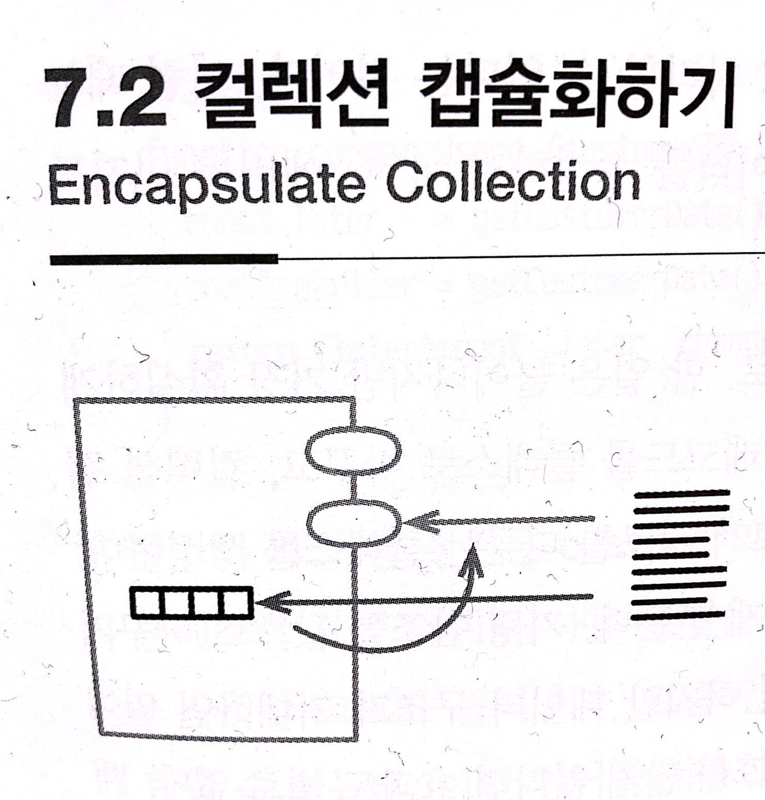

# :star: 7-2 컬렉션 캡슐화하기

<br>



<br>

```js
class Person {
  get courses() {return this._courses;}
  get courses(aList) {this._courses = aList;}
}
```

<br>

```js
class Person {
  get courses() {return this._courses.slice();}
  addCourse(aCourse) { ... }
  removeCourse(aCourse) { ... }
}
```

<br>

### 배경

저는 가변 데이터를 모두 캡슐화하는 편입니다. 그러면 데이터 구조가 언제 어떻게 수정되는지 파악하기 쉬워서 필요한 시점에 데이터 구조를 변경햐기도 쉬워지기 때문입니다. 특히 객체 지향 개발자들은 캡슐화를 적극 권장하는데 컬렉션을 다룰 때는 곧잘 실수를 저지르곤 합니다. 예컨대 컬렉션 변수로의 접근을 캡슐화하면서 게터가 컬렉션 자체를 반환하도록 한다면, 그 컬렉션을 감싼 클래스가 눈치채지 못하는 상태에서 컬렉션의 원소들이 바뀌어버릴 수 있습니다.

<br>

저는 이런 문제를 방지하기 위해 컬렉션을 감싼 클래스에 흔히 add()와 remove()라는 이름의 컬렉션 변경자 메서드를 만듭니다. 이렇게 항상 컬렉션을 소유한 클래스를 통해서만 원소를 변경하도록 하면 프로그램을 개선하면서 컬렉션 변경방식도 원하는 대로 수정할 수 있습니다.

<br>

모든 팀원이 원본 모듈 밖에서는 컬렉션을 수정하지 않는 습관을 갖고 있다면 이런 메서드를 제공하는 것만으로 충분할 수 있습니다. 하지만 실수 한 번이 굉장히 찾기 어려운 버그로 이어질 수 있으니 의존하는 방식은 바람직하지 않습니다. 이보다는 컬렉션 게터가 원본 컬렉션을 변환하지 않게 만들어서 클라이언트가 실수로 컬렉션을 바꿀 가능성을 차단하는 게 낫습니다.

<br>

내부 컬렉션을 직접 수정하지 못하게 막는 방법 중 하나로, 절대로 컬렉션 값을 반환하지 않게 할 수 있습니다. 컬렉션에 접근하려면 컬렉션이 소속된 클래스의 적절한 메서드를 반드시 거치게 하는 것입니다. 예컨대 `aCustomer.orders.size()`처럼 접근하는 코드를 `aCustomer.numberOfOrders()`로 바꾸는 것입니다. 저는 이 방식에 동의하지 않스비다. 최신 언어는 다양한 컬렉션 클래스들을 표준화된 인터페이스로 제공하며, 컬렉션 파이프라인([`Collection Pipeline`](https://martinfowler.com/articles/collection-pipeline/))과 같은 패턴을 적용하여 다채롭게 조합할 수 있습니다. 표준 인터페이스 대신 전용 메서드들을 사용하게 하면 부가적인 코드가 상당히 늘어나며 컬렉션 연산들을 조합해 쓰기도 어려워집니다.

<br>

또 다른 방법은 컬렉션을 읽기전용으로 제공할 수 있습니다. 예컨대 자바에서는 컬렉션의 읽기전용 프락시를 반환하게 만들기가 쉽습니다. 프락시가 내부 컬렉션을 읽는 연산은 그대로 전달하고, 쓰기는 (예외를 던지는 식으로) 모두 막는 것입니다. 이터레이터(iterator: 반복자)나 열거형 객체를 기반으로 컬렉션을 조합하는 라이브러리들도 빗스한 방식을 씁니다. 가령 이터레이터에서 내부 컬렉션을 수정할 수 없게 합니다.

<br>

가장 흔히 사용하는 방식은 아마도 컬렉션 게터를 제공하되 내부 컬렉션의 복제본을 반환하는 것입니다. 복제본을 수정해도 캡슐화된 원본 컬렉션에는 아무런 영향을 주지 않습니다. 반환된 컬렉션을 수정하면 원본도 수정될 거라 기대한 프로그래머는 좀 당황할 수 있지만, 이미 여러 코드베이스에서 많은 프로그래머가 널리 사용하는 방식이라 크게 문제되지는 않을 것입니다. 컬렉션이 상당히 크다면 성능 문제가 발생할 수 있습니다. 하지만 성능에 지장을 줄만큼 컬렉션이 큰 경우는 별로 없으니 성능에 대한 [`일반 규칙`](https://memberservices.informit.com/my_account/webdition/9780135425664/html/principles.html#performance)을 따르도록 합시다.

<br>

한편, 프락시 방식에서는 우너본 데이터를 수정하는 과정이 겉으로 드러나지만 복제 방식에서는 그렇지 않다는 차이도 있스비다. 하지만 이 사실이 문제가 될 일은 별로 없습니다. 이런 식으로 접근하는 컬렉션은 대체로 짧은 시간동안만 사용되기 때문입니다.

<br>

여기서 중요한 점은 코드베이스에서 일관성을 주는 것입니다. 앞에 나온 방식 중에서 한 가지만 적용해서 컬렉션 접근 함수의 동작 방식을 통일해야 합니다.

<br>

### 절차

1️⃣ 아직 컬렉션을 캡슐화하지 않았다면 [`변수 캡슐화하기`](https://github.com/Esoolgnah/Summary_of_Refactoring_2nd_Edition/blob/main/Notes/06_기본적인_리팩터링/06_06_변수_캡슐화하기.md)부터 한다.

<br>

2️⃣ 컬렉션에 원소를 추가/제거하는 함수를 추가한다.

- 컬렉션 자체를 통째로 바꾸는 `세터는 제거`한다. 세터를 제거할 수 없다면 인수를 받은 컬렉션을 복제해 저장하도록 만든다.

<br>

3️⃣ 정적 검사를 수행한다.

<br>

4️⃣ 컬렉션을 참조하는 부분을 모두 찾는다. 컬렉션의 변경자를 호출하는 코드가 모두 앞에서 추가한 추가/제거 함수를 호출하도록 수정한다. 하나씩 수정할 때마다 테스트한다.

<br>

5️⃣ 컬렉션 게터를 수정해서 원본 내용을 수정할 수 없는 읽기전용 프락시나 복제본을 반환하게 한다.

<br>

6️⃣ 테스트한다.

<br>

### 예시

수업(course) 목록을 필드로 지니고 있는 Person 클래스를 예로 살펴봅시다.

<br>

```js
// Person 클래스...
constructor(name) {
  this._name = name;
  this._courses = [];
}
get name() {return this._name;}
get courses() {return this._courses;}
set courses(aList) {this._courses = aList;}
```

<br>

```js
// Course 클래스...
constructor(name, isAdvanced) {
  this._name = name;
  this._isAdvanced = isAdvanced;
}
get name() {return this._name;}
get isAdvanced() {return this._isAdvanced;}
```

<br>

클라이언트는 Person이 제공하는 수업 컬렉션에서 수업 정보를 얻습니다.

<br>

```js
numAdvancedCourses = aPerson.courses.filter((c) => c.isAdvanced).length;
```

<br>

모든 필드가 접근자 메서드로 보호받고 있으니 안이한 개발자는 이렇게만 해도 데이터를 제대로 캡슐화했다고 생각하기 쉽습니다. 하지만 허점이 있습니다. 세터를 이용해 수업 컬렉션을 통째로 설정한 클라이언트는 누구든 이 컬렉션을 마음대로 수정할 수 있기 때문입니다.

<br>

```js
// 클라이언트...
const basicCourseNames = readBasicCourseNames(filename);
aPerson.courses = basicCourseNames.map((name) => new Course(name, false));
```

<br>

클라이언트 입장에서는 다음처러 수업 목록을 직접 수정하는 것이 훨씬 편할 수 있습니다.

<br>

```js
// 클라이언트...
for (const name of readBasicCourseNames(filename)) {
  aPerson.courses.push(new Course(name, false));
}
```

<br>

하지만 이런 식으로 목록을 갱신하면 Person 클래스가 더는 컬렉션을 제어할 수 없으니 캡슐화가 깨집니다. 필드를 참조하는 과정만 캡슐화했을 뿐 필드에 담긴 내용은 캡슐화하지 않은 게 원인입니다.

<br>

2️⃣ 제대로 캡슐화하기 위해 먼저 클라이언트가 수업을 하나씩 추가하고 제거하는 메서드를 Person에 추가해봅시다.

<br>

```js
// Person 클래스...
addCourse (aCourse) {
  this._courses.push(aCourse);
}
removeCourse(aCourse, fnIfAbsent = () => throw enw RangeError();) {
  const index = this._courses.indexOf(aCourse);
  if (index === -1) fnIfAbsent();
  else this._courses.splice(index, 1);
}
```

<br>

제거 메서드에서는 클라이언트가 컬렉션에 없는 원소를 제거하려 할 때의 대응 방식을 정해야 합니다. 그냥 무시하거나 에러를 던질 수도 있습니다. 여기서는 기본적으로 에러를 던지되, 호출자가 원하는 방식으로 처리할 여지도 남겨뒀습니다.

<br>

4️⃣ 그런 다음 컬렉션의 변경자를 직접 호출하던 코드를 모두 찾아서 방금 추가한 메서드를 사용하도록 바꿉니다.

<br>

```js
// 클라이언트...
for (const name of readBasicCourseNames(filename)) {
  aPerson.addCourse(new Course(name, false)); //
}
```

2️⃣ 이렇게 개별 원소를 추가하고 제거하는 메서드를 제공하기 때문에 `setCourses()`를 사용할 일이 없어졌으니 제거합니다(`세터 제거하기`). 세터를 제공해야 할 특별한 이유가 있다면 인수로 받은 컬렉션의 복제본을 필드에 저장하게 합니다.

<br>

```js
// Person 클래스...
set courses(aList) {this._courses = aList.slice();} //
```

<br>

이렇게 하면 클라이언트는 용도에 맞는 변경 메서드를 사용하도록 할 수 있습니다. 5️⃣ 하지만 나는 이 메서드들을 사용하지 않고서는 아무도 목록을 변경할 수 없게 만드는 방식을 선호합니다. 다음과 같이 복제본을 제공하면 됩니다.

<br>

```js
// Person 클래스...
get courses() {return this._courses.slice();} //
```

<br>

내 경험에 따르면 컬렉션에 대해서는 어느 정도 강박증을 갖고 불필요한 복제본을 만드는 편이, 예상치 못한 수정이 촉발한 오류를 디버깅하는 것보다 낫습니다. 때론 명확히 드러나지 않는 수정도 일어날 수 있습니다. 가령 다른 언어들은 컬렉션을 수정하는 연산들이 기본적으로 복제본을 만들어 처리하지만, 자바스크립트에서는 배열을 정렬할 때 원본을 수정합니다. 컬렉션 관리를 책임지는 클래스라면 항상 복제본을 제공해야 합니다. 그리고 저는 컬렉션을 변경할 가능성이 있는 작업을 할 때도 습관적으로 복제본을 만듭니다.

<br>

<br>

## 다음 챕터

- [7.3 - 기본형을 객체로 바꾸기](https://github.com/Esoolgnah/Summary_of_Refactoring_2nd_Edition/blob/main/Notes/07_캡슐화/07_03_기본형을_객체로_바꾸기.md)

<br>

## 이전 챕터

- [7.1 - 레코드 캡슐화하기](https://github.com/Esoolgnah/Summary_of_Refactoring_2nd_Edition/blob/main/Notes/07_캡슐화/07_01_레코드_캡슐화하기.md)

<br>

## 목록으로

- [목록](https://github.com/Esoolgnah/Summary_of_Refactoring_2nd_Edition/blob/main/Notes/07_캡슐화/07_00_캡슐화.md)
