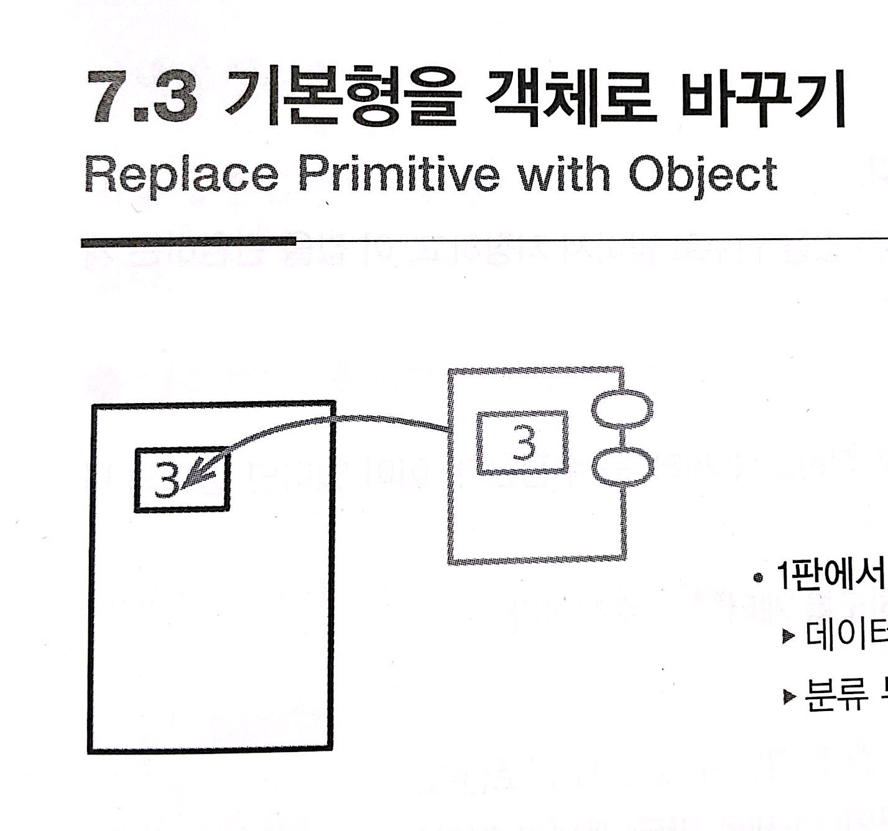

# :star: 7-3 기본형을 객체로 바꾸기

<br>



<br>

- 1판에서의 이름
  - 데이터 값을 객체로 전환
  - 분류 부호를 클래스로 전환

<br>

```js

```

<br>

```js

```

<br>

### 배경

<br>

<br>

## 다음 챕터

- [7.4 - 임시 변수를 질의 함수로 바꾸기](https://github.com/Esoolgnah/Summary_of_Refactoring_2nd_Edition/blob/main/Notes/07_캡슐화/07_04_임시_변수를_질의_함수로_바꾸기.md)

<br>

## 이전 챕터

- [7.2 - 컬렉션 캡슐화하기](https://github.com/Esoolgnah/Summary_of_Refactoring_2nd_Edition/blob/main/Notes/07_캡슐화/07_02_컬렉션_캡슐화하기.md)

<br>

## 목록으로

- [목록](https://github.com/Esoolgnah/Summary_of_Refactoring_2nd_Edition/blob/main/Notes/07_캡슐화/07_00_캡슐화.md)
