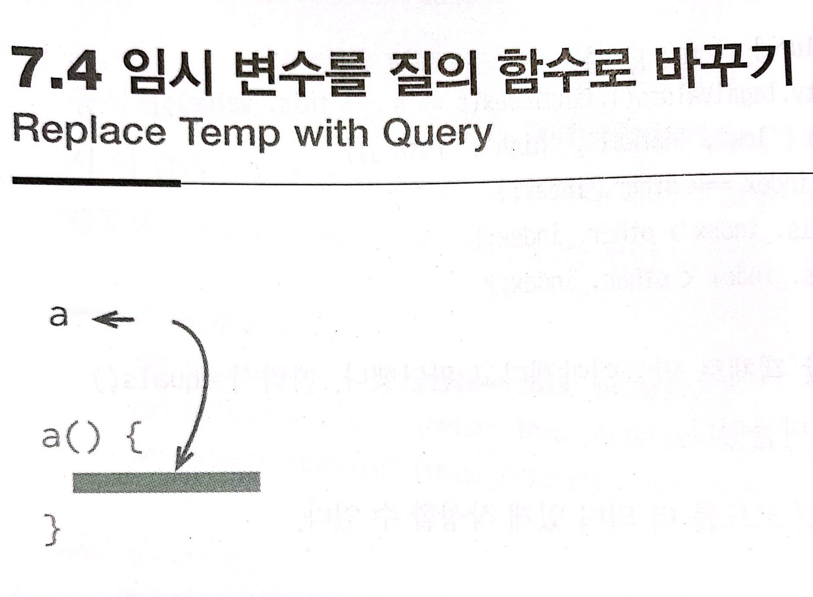

# :star: 7-4 임시 변수를 질의 함수로 바꾸기

<br>



<br>

```js
const basePrice = this._quantity * this._itemPrice;
if (basePrice > 1000)
  return basePrice * 0.95;
else
  return basePrice * 0.98;
```

<br>

```js
get basePrice() {this._quantity *this._itemPrice;}
...
if (this.basePrice > 1000)
  return this.basePrice * 0.95;
else
  return this.basePrice * 0.98;
```

<br>

### 배경

함수 안에서 어떤 코드의 결괏값을 뒤에서 다시 참조할 목적으로 임시 변수를 쓰기도 합니다. 임시 변수를 사용하면 값을 계산하는 코드가 반복되는 걸 줄이고 (변수 이름을 통해) 값의 의미를 설명할 수도 있어서 유용합니다. 그런데 한 걸음 더 나아가 아예 함수로 만들어 사용하는 편이 나을 때가 많습니다.

<br>

긴 함수의 한 부분을 별도 함수로 추출하고자 할 때 먼저 변수들을 각각의 함수로 만들면 일이 수월해집니다. 추출한 함수에 변수를 따로 전달할 필요가 없어지기 때문입니다. 또한 이 덕분에 추출한 함수와 원래 함수의 경계가 더 분명해지기도 하는데, 그러면 부자연스러운 의존 관계나 부수효과를 찾고 제거하는 데 도움이 됩니다.

<br>

변수 대신 함수로 만들어주면 비슷한 계산을 수행하는 다른 함수에서도 사용할 수 있어 코드 중복이 줄어듭니다. 그래서 저는 여러 곳에서 똑같은 방식으로 계산되는 변수를 발견할 때마다 함수로 바꿀 수 있는지 살펴봅니다.

<br>

이번 리팩터링은 클래스 안에서 적용할 때 효고가 가장 큽니다. 클래스는 추출할 메서드들에 공유 컨텍스트를 제공하기 때문입니다. 클래스 바깥의 최상위 함수로 추출하면 매개변수가 너무 많아져서 함수를 사용하는 장점이 줄어듭니다. 중첩 함수를 사용하면 이런 문제는 없지만 관련 함수들과 로직을 널리 공유하는 데 한계가 있습니다.

<br>

임시 변수를 질의 함수로 바꾼다고 다 좋아지는 건 아닙니다. 자고로 변수는 값을 한 번만 계산하고, 그 뒤로는 읽기만 해야 합니다. 가장 단순한 예로, 변수에 값을 한 번 대입한 뒤 더 복잡한 코드 덩어리에서 여러 차례 다시 대입하는 경우는 모두 질의 함수로 추출해야 합니다. 또한 이 계산 로직은 변수가 다음번에 사용될 때 수행해도 똑같은 결과를 내야 합니다. 그래서 '옛날 주소'처럼 스냅숏 용도로 쓰이는 변수에는 이 리팩터링을 적용하면 안 됩니다.

<br>

### 절차

(1) 변숙가 사용되기 전에 값이 확실히 결정되는지, 변수를 사용할 때마다 계산 로직이 매번 다른 결과를 내지는 않는지 확인한다.

<br>

(2) 읽기전용으로 만들 수 있는 변수는 읽기전용으로 만든다.

<br>

(3) 테스트한다.

<br>

(4) 변수 대입문을 함수로 추출한다.
- 변수와 함수가 같은 이름을 가질 수 없다면 함수 이름을 임시로 짓습니다. 또한, 추출한 함수가 부수효과를 일으키지는 않는지 확인합니다. 부수효과가 있다면 `질의 함수와 변경함수 분리하기`로 대처합니다.

<br>

(5) 테스트한다.

<br>

(6) [`변수 인라인하기`](https://github.com/Esoolgnah/Summary_of_Refactoring_2nd_Edition/blob/main/Notes/06_기본적인_리팩터링/06_04_변수_인라인하기.md)
로 임시 변수를 제거한다.

<br>

### 예시

간단한 주문(order) 클래스를 준비했습니다.

```js
// Order 클래스...
constructor(quantity, item) {
  this._quantity = quantity;
  this._item = item;
}

get price() {
  var basePrice = this._quantity * this._item.price;
  var discountFactor = 0.98;
  
  if (basePrice > 1000) discounter -= 0.03;
  return basePrice * discountFactor;
}
```

<br>

여기서 임시 변수인 `basePrice`와 `discountFactor`를 메서드로 바꿔봅시다.

<br>

(2) 먼저 `basePrice`에 const를 붙여 읽기전용으로 만들고 (3) 테스트해봅니다. 이렇게 하면 못 보고 지나친 재대입 코드를 찾을 수 있습니다(컴파일 에러가 납니다). 지금처럼 코드가 간단할 때는 그럴 일이 없겠지만, 코드가 길면 흔히 벌어지는 일입니다.

<br>

```js
// Order 클래스...
constructor(quantity, item) {
  this._quantity = quantity;
  this._item = item;
}

get price() {
  const basePrice = this._quantity * this._item.price;
  var discountFactor = 0.98;
  if (basePrice > 1000) discountFactor -= 0.03;
  return basePrice * discountFactor;
}
```

<br>

(4) 그런 다음 대입문의 우변을 게터로 추출합니다.

<br>

```js
// Order 클래스...
get price() {
  const basePrice = this.basePrice; //
  var discountFactor = 0.98;
  if (basePrice > 1000) discountFactor -= 0.03;
  return basePrice * discountFactor;
}
get basePrice() { //
  return this._quantity * this._item.price;
}
```

<br>

(5) 테스트한 다음 (6) [`변수를 인라인`](https://github.com/Esoolgnah/Summary_of_Refactoring_2nd_Edition/blob/main/Notes/06_기본적인_리팩터링/06_04_변수_인라인하기.md)합니다.

<br>

```js
// Order 클래스...
get price() {
  // const basePrice = this.basePrice; X
  var discountFactor = 0.98;
  if (this.basePrice > 1000) discountFactor -= 0.03;
  return this.basePrice * discountFactor;
}
```

<br>

`discountFactor` 변수도 같은 순서로 처리합니다. (4) [`먼저 함수 추출하기`](https://github.com/Esoolgnah/Summary_of_Refactoring_2nd_Edition/blob/main/Notes/06_기본적인_리팩터링/06_01_함수_추출하기.md)
입니다.

<br>

```js
// Order 클래스...
get price() {
  const discountFactor = this.discountFactor; //
  return this.basePrice * discountFactor;
}

get discountFactor() { //
  var discountFactor = 0.98;
  if (this.basePrice > 1000) discountFactor -= 0.03;
  return discountFactor;
}
```

<br>

이번에는 `discountFactor`에 값을 대입하는 문장이 둘인데, 모두 추출한 함수에 넣어야 합니다. (2) 원본 변수는 마찬가지로 const로 만듭니다.

<br>

(6) 마지막으로 변수 인라인 차례입니다.

<br>

```js
// Order 클래스...
get price() {
  return this.basePrice * this.discountFactor; //
}
```

<br>

<br>

## 다음 챕터

- [7.5 - 클래스 추출하기](https://github.com/Esoolgnah/Summary_of_Refactoring_2nd_Edition/blob/main/Notes/07_캡슐화/07_05_클래스_추출하기.md)

<br>

## 이전 챕터

- [7.3 - 기본형을 객체로 바꾸기](https://github.com/Esoolgnah/Summary_of_Refactoring_2nd_Edition/blob/main/Notes/07_캡슐화/07_03_기본형을_객체로_바꾸기.md)

<br>

## 목록으로

- [목록](https://github.com/Esoolgnah/Summary_of_Refactoring_2nd_Edition/blob/main/Notes/07_캡슐화/07_00_캡슐화.md)
