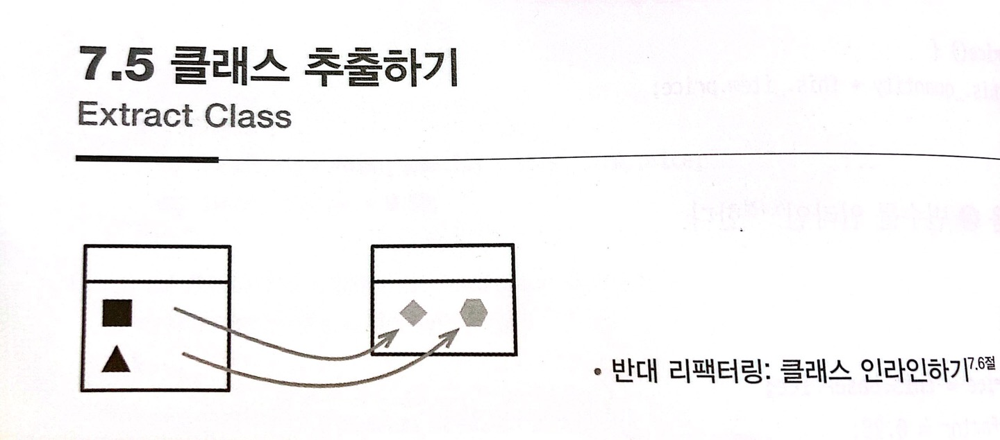

# :star: 7-5 클래스 추출하기

<br>



- 반대 리팩터링: [`클래스 인라인하기`](https://github.com/Esoolgnah/Summary_of_Refactoring_2nd_Edition/blob/main/Notes/07_캡슐화/07_06_클래스_인라인하기.md)

<br>

```js
class Person {
  get officeAreaCode() {
    return this._officeAreaCode;
  }
  get officeNumber() {
    return officeNumber;
  }
}
```

<br>

```js
class Person {
  get officeAreaCode() {
    return this._telephoneNumber.areaCode;
  }
  get officeNumber() {
    return this._telephoneNumber.number;
  }
}
class TelephoneNumber {
  get areaCode() {
    return this._areaCode;
  }
  get number() {
    return this._number;
  }
}
```

<br>

### 배경

클래스는 반드시 명확하게 추상화하고 소수의 주어진 역할만 처리해야 한다는 가이드라인을 들어봤을 것입니다. 하지만 실무에서는 몇 가지 연산을 추가하고 데이터도 보강하면서 클래스가 점점 비대해지곤 합니다. 기존 클래스를 굳이 쪼갤 필요까지는 없다고 생각하여 새로운 역할을 덧씌우기 쉬운데, 역할이 갈수록 많아지고 새끼를 치면서 클래스가 굉장히 복잡해집니다. 그러다 보면 어느새 전자레인지로 바짝 익힌 음식처럼 딱딱해지고 맙니다.

<br>

메서드와 데이터가 너무 많은 클래스는 이해하기가 쉽지 않으니 잘 살펴보고 적절히 분리하는 것이 좋습니다. 특히 일부 데이터와 메서드를 따로 묶을 수 있다면 어서 분리하라는 신호입니다. 함께 변경되는 일이 많거나 서로 의존하는 데이터들도 분리합니다. 특정 데이터나 메서드 일부를 제거하면 어떤 일이 일어나는지 자문해보면 판단에 도움이 됩니다. 제거해도 다른 필드나 메서드들이 논리적으로 문제가 없다면 분리할 수 있다는 뜻입니다.

<br>

개발 후반으로 접어들면 서브클래스가 만들어지는 방식에서 왕왕 징후가 나타나기도 합니다. 예컨대 작은 일부의 기능만을 위해 서브클래스를 만들거나, 확장해야 할 기능이 무엇이냐에 따라 서브클래스를 만드는 방식도 달라진다면 클래스를 나눠야 한다는 신호입니다.

<br>

### 절차

1️⃣ 클래스의 역할을 분리할 방법을 정한다.

<br>

2️⃣ 분리할 역할을 담당할 클래스를 새로 만든다.

- 원래 클래스에 남은 역할과 클래스 이름이 어울리지 않는다면 적절히 바꿉니다.

<br>

3️⃣ 원래 클래스의 생성자에서 새로운 클래스의 인스턴스를 생성하여 필드에 저장해둔다.

<br>

4️⃣ 분리될 역할에 필요한 필드들을 새 클래스로 옮긴다(`필드 옮기기`), 하나씩 옮길 때마다 테스트한다.

<br>

5️⃣ 메서드들도 새 클래스로 옮긴다(`함수 옮기기`), 이때 저수준 메서드, 즉 다른 메서드를 호출하기보다는 호출을 당하는 일이 많은 메서드부터 옮긴다. 하나씩 옮길 때마다 테스트한다.

<br>

6️⃣ 양쪽 클래스와 인터페이스를 살펴보면서 불필요한 메서드를 제거하고, 이름도 새로운 환경에 맞게 바꾼다.

<br>

7️⃣ 새 클래스를 외부로 노출할지 정한다. 노출하려거든 새 클래스에 `참조를 값으로 바꾸기`를 적용할지 고민해본다.

<br>

### 예시

단순한 `Person` 클래스를 예로 준비했습니다.

```js
// Person 클래스...
get name() {return this._name;}
set name(arg) {this._name = arg;}
get telephoneNumber() {return `(${this.officeAreaCode}) ${tihs.officeNumber}`;}
get officeAreaCode() {return this._officeAreaCode;}
set officeAreaCode(arg) {this._officeAreaCode = arg;}
get officeNumber() {return this._officeNumber;}
set officeNumber(arg) {this._officeNumber = arg;}
```

<br>

1️⃣ 여기서 전화번호 관련 동작을 별도 클래스로 뽑아봅시다. 2️⃣ 먼저 빈 전화번호를 표현하는 `TelephoneNumber` 클래스를 정의합니다.

<br>

```js
class TelephoneNumber {}
```

<br>

간단합니다. 3️⃣ 다음으로 `Person` 클래스의 인스턴스를 생성할 때 전화번호 인스턴스도 함께 생성해 저장해둡니다.

<br>

```js
// Person 클래스...
constructor() {
  this._telephoneNumber = new TelephoneNumber();
}
```

<br>

```js
// TelephoneNumber 클래스...
get officeAreaCode() {return this._officeAreaCode;} //
set officeAreaCode(arg) {this._officeAreaCode = arg;} //
```

<br>

4️⃣ 그런 다음 `필드들을 하나씩 새 클래스로 옮깁니다.`(필드 옮기기)

<br>

```js
// Person 클래스...
get officeAreaCode() {return this._telephoneNumber.officeAreaCode;} //
set officeAreaCode(arg) {this._telephoneNumber.officeAreaCode = arg;} //
```

<br>

테스트해서 문제없으면 다음 필드로 넘어갑니다.

<br>

```js
// TelephoneNumber 클래스...
get officeNumber() {return this._officeNumber;} //
set officeNumber() {this._officeNumber = arg;} //
```

<br>

```js
// Person 클래스...
get officeNumber {return this._telephoneNumber.officeNumber;} //
set officeNumber(arg) {return._telephoneNumber.officeNumber = arg;} //
```

<br>

다시 테스트해보고, 5️⃣ 이어서 `telephoneNumber()` 메서드를 옮깁니다.

<br>

```js
// TelephoneNumber 클래스...
get telephoneNumber() {return `(${this.officeAreaCode}) ${this.officeNumber}`;} //
```

<br>

```js
// Person 클래스...
get telephoneNumber() {return this._telephoneNumber.telephoneNumber;} //
```

<br>

6️⃣ 이제 정리할 차례입니다. 새로 만든 클래스는 순수한 전화번호를 뜻하므로 사무실(office)이란 단어를 쓸 이유가 없습니다. 마찬가지로 전화번호라는 뜻도 메서드 이름에서 다시 강조할 이유가 없습니다. 그러니 메서드들의 이름을 적절히 바꿔줍시다([`함수 선언 바꾸기`](https://github.com/Esoolgnah/Summary_of_Refactoring_2nd_Edition/blob/main/Notes/06_기본적인_리팩터링/06_05_함수_선언_바꾸기.md))

<br>

```js
// TelephoneNumber 클래스...
get areaCode() {return this._areaCode;} //
set areaCode(arg) {this._areaCode = arg;} //
get number() {return this._number;} //
set number(arg) {this._number = arg;} //
```

<br>

```js
// Person 클래스...
get officeAreaCode() {return this._telephoneNumber.areaCode;} //
set officeAreaCode(arg) {this._telephoneNumber.areaCode = arg;} //
get officeNumber() {return this._telephoneNumber.number;} //
set officeNumber(arg) {this._telephoneNumber.number = arg;} //
```

<br>

마지막으로 전화번호를 사람이 읽기 좋은 포맷으로 출력하는 역할도 전화번호 클래스에 맡깁니다.

<br>

```js
// TelephoneNumber 클래스...
toString() {return `(${this.areaCode}) ${this.number}`;} //
```

<br>

```js
// Person 클래스...
get telephoneNumber() {return this._telephoneNumber.toString();}
```

<br>

7️⃣ 전화번호는 여러모로 쓸모가 많으니 이 클래스는 클라이언트에게 공개하는 것이 좋겠습니다. 그러면 "office"로 시작하는 메서드들을 없애고 `TelephoneNumber`의 접근자를 바로 사용하도록 바꿀 수 있습니다. 그런데 기왕 이렇게 쓸 거라면 전화번호를 값 객체로 만드는 게 나으니 참조를 값으로 바꾸기부터 적용합니다(자세한 방법은 9.4절의 예시부터 소개합니다).

<br>

<br>

## 다음 챕터

- [7.6 - 클래스 인라인하기](https://github.com/Esoolgnah/Summary_of_Refactoring_2nd_Edition/blob/main/Notes/07_캡슐화/07_06_클래스_인라인하기.md)

<br>

## 이전 챕터

- [7.4 - 임시 변수를 질의 함수로 바꾸기](https://github.com/Esoolgnah/Summary_of_Refactoring_2nd_Edition/blob/main/Notes/07_캡슐화/07_04_임시_변수를_질의_함수로_바꾸기.md)

<br>

## 목록으로

- [목록](https://github.com/Esoolgnah/Summary_of_Refactoring_2nd_Edition/blob/main/Notes/07_캡슐화/07_00_캡슐화.md)
