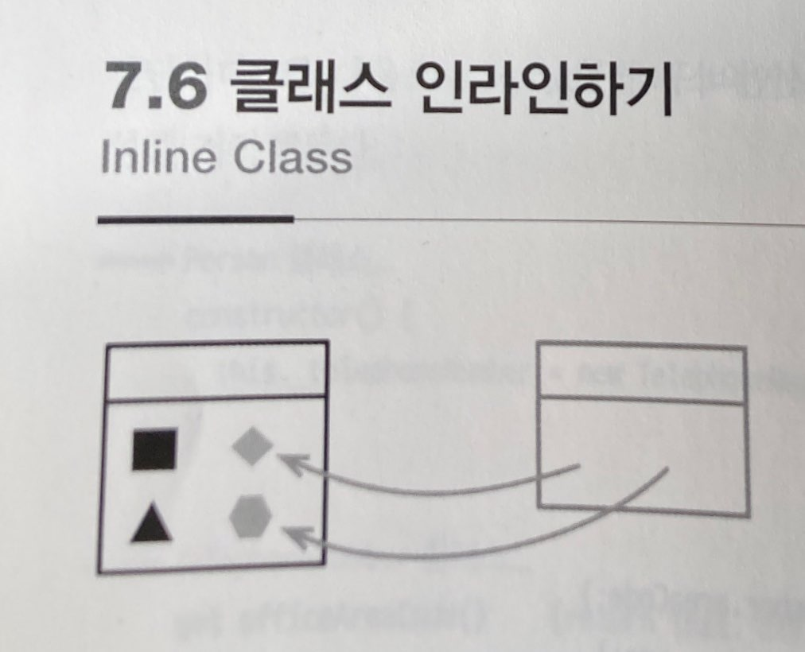

# :star: 7-6 클래스 인라인하기

<br>



- 반대 리팩터링: [`클래스 추출하기`](https://github.com/Esoolgnah/Summary_of_Refactoring_2nd_Edition/blob/main/Notes/07_캡슐화/07_05_클래스_추출하기.md)

<br>

```js

```

<br>

```js

```

<br>

### 배경

<br>

<br>

## 다음 챕터

- [7.7 - 위임 숨기기](https://github.com/Esoolgnah/Summary_of_Refactoring_2nd_Edition/blob/main/Notes/07_캡슐화/07_07_위임_숨기기.md)

<br>

## 이전 챕터

- [7.5 - 클래스 추출하기](https://github.com/Esoolgnah/Summary_of_Refactoring_2nd_Edition/blob/main/Notes/07_캡슐화/07_05_클래스_추출하기.md)

<br>

## 목록으로

- [목록](https://github.com/Esoolgnah/Summary_of_Refactoring_2nd_Edition/blob/main/Notes/07_캡슐화/07_00_캡슐화.md)
