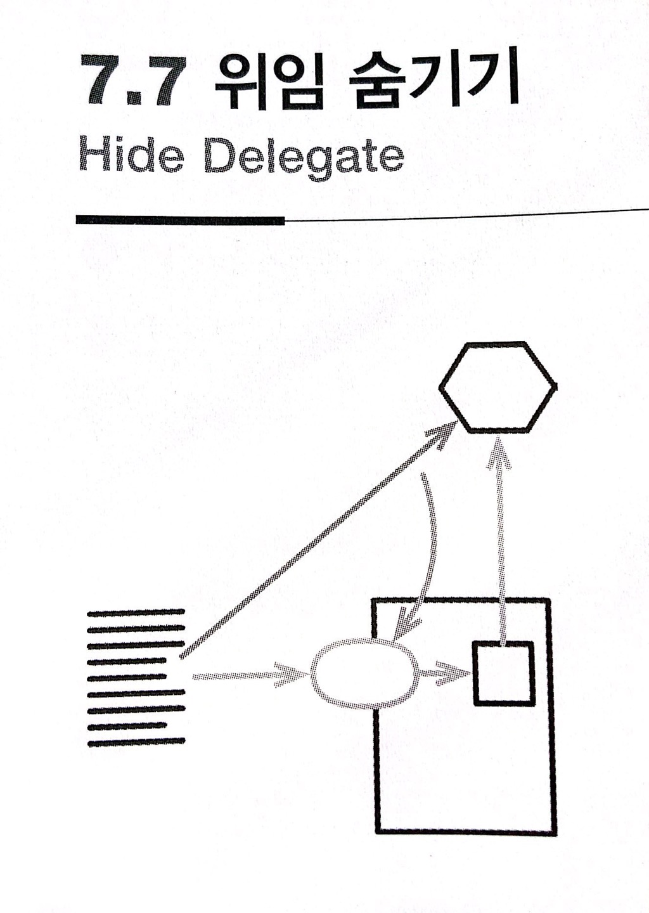

# :star: 7-7 위임 숨기기

<br>



- 반대 리팩터링: [`중개자 제거하기`](https://github.com/Esoolgnah/Summary_of_Refactoring_2nd_Edition/blob/main/Notes/07_캡슐화/07_08_중개자_제거하기.md)

<br>

```js
manager = aPerson.department.manager;
```

<br>

```js
manager = aPerson.manager;

class Person {
  get manager() {
    return this.department.manager;
  }
}
```

<br>

### 배경

모듈화 설계를 제대로 하는 핵심은 캡슐화입니다. 어쩌면 가장 중요한 요소일 수도 있습니다. 캡슐화는 모듈들이 시스템의 다른 부분에 대해 알아야 할 내용을 줄여줍니다. 캡슐화가 잘 되어 있다면 무언가를 변경해야 할 때 함께 고려해야 할 모듈 수가 적어져서 코드를 변경하기가 훨씬 쉬워집니다.

<br>

객체 지향을 처음 배울 때는 캡슐화란 필드를 숨기는 것이라고 배웁니다. 그러다 경험이 쌓이면서 캡슐화의 역할이 그보다 많다는 사실을 깨닫습니다.

<br>

예컨대 서버 객체의 필드가 가리키는 객체(위임 객체, delegate)의 메서드를 호출하려면 클라이언트는 이 위임 객체를 알아야 합니다. 위임 객체의 인터페이스가 바뀌면 이 인터페이스를 사용하는 모든 클라이언트가 코드를 수정해야 합니다. 이러한 의존성을 없애려면 서버 자체에 위임 메서드를 만들어서 위임 객체의 존재를 숨기면 됩니다. 그러면 위임 객체가 수정되더라도 서버 코드만 고치면 되며, 클라이언트는 아무런 영향을 받지 않습니다.

<br>


<br>

### 절차

1️⃣ 위임 객체의 각 메서드에 해당하는 위임 메서드를 서버에 생성한다.

<br>

2️⃣ 클라이언트가 위임 객체 대신 서버를 호출하도록 수정한다. 하나씩 바꿀 때마다 테스트한다.

<br>

3️⃣ 모두 수정했다면, 서버로부터 위임 객체를 얻는 접근자를 제거한다.

<br>

4️⃣ 테스트한다.

<br>

### 예시

사람(person)과 사람이 속한 부서(department)를 다음처럼 정의했습니다.

<br>

```js
// Person 클래스...
constructor(name) {
  this._name = name;
}
get name() {return this._name;}
get department() {return this._department;}
set department(arg) {this._department = arg;}
```

<br>

```js
// Department 클래스...
get chargeCode() {return this._chargeCode;}
set chargeCode(arg) {this._chargeCode = arg;}
get manager() {return this._manager;}
set manager(arg) {this._manager = arg;}
```

<br>

클라이언트에서 어떤 사람이 속한 부서의 관리자를 알고 싶다고 합시다. 그러기 위해서는 부서 객체부터 얻어와야 합니다.

<br>

```js
// 클라이언트...
manager = aPerson.department.manager;
```

<br>

보시다시피 클라이언트는 부서 클래스의 작동 방식, 다시 말해 부서 클래스가 관리자 정보를 제공한다는 사실을 알아야 합니다. 1️⃣ 이러한 의존성을 줄이려면 클라이언트가 부서 클래스를 볼 수 없게 숨기고, 대신 사람 클래스에 간단한 위임 메서드를 만들면 됩니다.

<br>

```js
// Person 클래스...
get manager() {return this._department.manager;}
```

<br>

2️⃣ 이제 모든 클라이언트가 이 메서드를 사용하도록 고칩니다.

<br>

```js
// 클라이언트...
manager = aPerson.manager;
//manager = aPerson.department.manager; => department ❌
```

<br>

3️⃣ 클라이언트 코드를 다 고쳤다면 사람 클래스의 `department()` 접근자를 삭제합니다.

<br>

<br>

## 다음 챕터

- [7.8 - 중개자 제거하기](https://github.com/Esoolgnah/Summary_of_Refactoring_2nd_Edition/blob/main/Notes/07_캡슐화/07_08_중개자_제거하기.md)

<br>

## 이전 챕터

- [7.6 - 클래스 인라인하기](https://github.com/Esoolgnah/Summary_of_Refactoring_2nd_Edition/blob/main/Notes/07_캡슐화/07_06_클래스_인라인하기.md)

<br>

## 목록으로

- [목록](https://github.com/Esoolgnah/Summary_of_Refactoring_2nd_Edition/blob/main/Notes/07_캡슐화/07_00_캡슐화.md)
