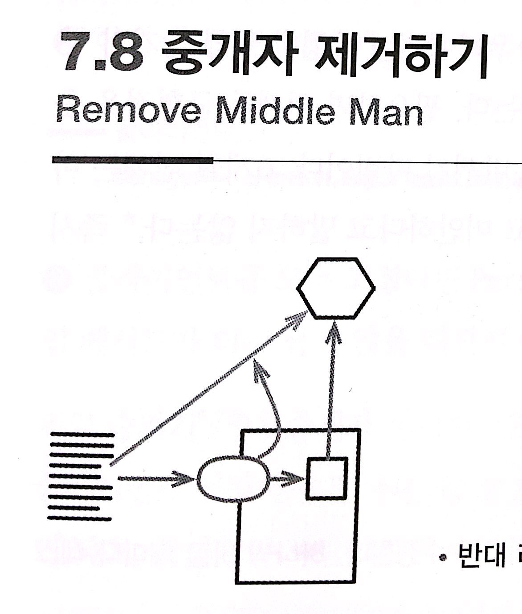

# :star: 7-8 중개자 제거하기

<br>



- 반대 리팩터링: [`위임 숨기기`](https://github.com/Esoolgnah/Summary_of_Refactoring_2nd_Edition/blob/main/Notes/07_캡슐화/07_07_위임_숨기기.md)

<br>

```js
manager = aPerson.manager;

class Person {
  get manager() {
    return this.department.manager;
  }
}
```

<br>

```js
manager = aPerson.department.manager;
```

<br>

### 배경

[`위임 숨기기`](https://github.com/Esoolgnah/Summary_of_Refactoring_2nd_Edition/blob/main/Notes/07_캡슐화/07_07_위임_숨기기.md)의 '배경' 절에서 위임 객체를 캡슐화하는 이점을 설명했습니다. 하지만 그 이점이 거저 주어지는 건 아닙니다. 클라이언트가 위임 객체의 또 다른 기능을 사용하고 싶을 때마다 서버에 위임 메서드를 추가해야 하는데, 이렇게 기능을 추가하다 보면 단순히 전달만 하는 위임 메서드들이 점점 성가셔ㅣㅂ니다. 그러면 서버 클래스는 그저 중개자(middle man) 역할로 전락하여, 차라리 클라이언트가 위임 객체를 직접 호출하는 게 나을 수 있습니다.

<br>

---

> 이 냄새는 데메테르 법칙(Law of Demeter)을 너무 신봉할 때 자주 나타납니다. 저는 이 법칙을 '이따금 유용한 데메테르의 제안' 정도로 부르는 게 훨씬 낫다고 생각합니다.

---

<br>

어느 정도까지 숨겨야 적절한지를 판단하기란 쉽지 않지만, 우리에게는 다행히 [`위임 숨기기`](https://github.com/Esoolgnah/Summary_of_Refactoring_2nd_Edition/blob/main/Notes/07_캡슐화/07_07_위임_숨기기.md)와 [`중개자 제거하기`](https://github.com/Esoolgnah/Summary_of_Refactoring_2nd_Edition/blob/main/Notes/07_캡슐화/07_08_중개자_제거하기.md) 리팩터링이 있으니 크게 문제되지는 않습니다. 필요하면 언제든 균형점을 옮길 수 있으니 말입니다. 시스템이 바뀌면 '적절하다'의 기준도 바뀌기 마련입니다. 6개월 전에는 바람직했던 캡슐화가 이제는 어색할 수 있습니다. 리팩터링은 결코 미안하다고 말하지 않습니다. 즉시 고칠 뿐입니다.

<br>

### 절차

1️⃣ 위임 객체를 얻는 게터를 만든다.

<br>

2️⃣ 위임 메서드를 호출하는 클라이언트가 모두 이 게터를 거치도록 수정한다. 하나씩 바꿀 때마다 테스트한다.

<br>

3️⃣ 모두 수정했다면 위임 메서드를 삭제한다.

- 자동 리팩터링 도구를 사용할 때는 위임 [`필드를 캡슐화`](https://github.com/Esoolgnah/Summary_of_Refactoring_2nd_Edition/blob/main/Notes/06_기본적인_리팩터링/06_06_변수_캡슐화하기.md)한 다음, 이를 사용하는 모든 [`메서드를 인라인`](https://github.com/Esoolgnah/Summary_of_Refactoring_2nd_Edition/blob/main/Notes/06_기본적인_리팩터링/06_02_함수_인라인하기.md)

<br>

### 예시

자신이 속한 부서(department) 객체를 통해 관리자(manager)를 찾는 사람(person) 클래스를 살펴봅시다(이 책을 차례대로 읽고 있다면 굉장히 친숙한 예일 것입니다).

<br>

```js
// 클라이언트...
manager = aPerson.manager;
```

<br>

```js
// Person 클래스...
get manager() {return this._department.manager;}
```

<br>

```js
// Department 클래스...
get manager() {return this._manager;}
```

<br>

사용하기 쉽고 부서는 캡슐화되어 있습니다. 하지만 이런 위임 메서드가 많아지면 사람 클래스의 상당 부분이 그저 위임하는 데만 쓰일 것입니다. 그럴 떄는 중개자를 제거하는 편이 낫습니다. 1️⃣ 먼저 위임 객체(부서)를 얻는 게터를 만듭시다.

<br>

```js
// Person 클래스...
get department() {return this._department;}
```

<br>

2️⃣ 이제 각 클라이언트가 부서 객체를 직접 사용하도록 고칩니다.

<br>

```js
manager = aPerson.department.manager;
```

<br>

3️⃣ 클라이언트를 모두 고쳤다면 `Person`의 manager() 메서드를 삭제합니다. `Person`에 단순한 위임 메서드가 더는 남지 않을 때까지 이 작업을 반복합니다.

<br>

위임 숨기기나 [`중개자 제거하기`](https://github.com/Esoolgnah/Summary_of_Refactoring_2nd_Edition/blob/main/Notes/07_캡슐화/07_08_중개자_제거하기.md)를 적당히 섞어도 됩니다. 자주 쓰는 위임은 그대로 두는 편이 클라이언트 입장에서 편합니다. 둘 중 하나를 반드시 해야 한다는 법은 없습니다. 상황에 맞게 처리하면 되고, 합리적인 사람이라면 어떻게 해야 가장 효과적인지 판단할 수 있을 것입니다.

<br>

---

> ### 자동 리팩터링을 사용한다면
>
> 자동 리팩터링을 사용한다면 다른 방식도 생각해볼 수 있습니다. 먼저 부서 [`필드를 캡슐화`](https://github.com/Esoolgnah/Summary_of_Refactoring_2nd_Edition/blob/main/Notes/06_기본적인_리팩터링/06_06_변수_캡슐화하기.md)합니다. 그러면 관리자 게터에서 부서의 public 게터를 사용할 수 있습니다.
>
> ```js
> get manager() {return this.department.manager;}
> ```
>
> 자바스크립트에서는 이 변화가 잘 드러나지 않지만, department 앞의 밑줄(\_)을 빼면, 더 이상 필드를 직접 접근하지 않고 새로 만든 게터를 사용한다는 뜻입니다. 그런 다음 `manager()` 메서드를 인라인하여 모든 호출자를 한 번에 교체합니다.

---

<br>

<br>

## 다음 챕터

- [7.9 - 알고리즘 교체하기](https://github.com/Esoolgnah/Summary_of_Refactoring_2nd_Edition/blob/main/Notes/07_캡슐화/07_09_알고리즘_교체하기.md)

<br>

## 이전 챕터

- [7.7 - 위임 숨기기](https://github.com/Esoolgnah/Summary_of_Refactoring_2nd_Edition/blob/main/Notes/07_캡슐화/07_07_위임_숨기기.md)

<br>

## 목록으로

- [목록](https://github.com/Esoolgnah/Summary_of_Refactoring_2nd_Edition/blob/main/Notes/07_캡슐화/07_00_캡슐화.md)
