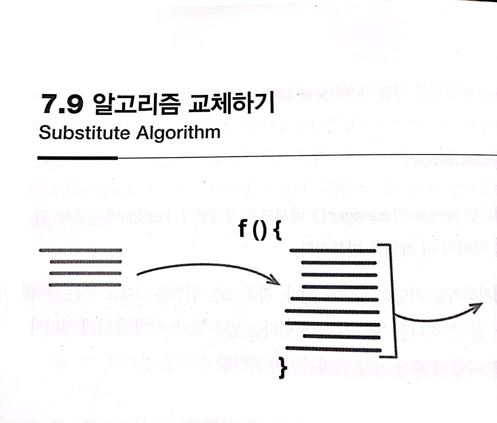

# :star: 7-9 알고리즘 교체하기

<br>



<br>

```js

```

<br>

```js

```

<br>

### 배경

<br>

<br>

## 다음 챕터

- [8장 목록](https://github.com/Esoolgnah/Summary_of_Refactoring_2nd_Edition/blob/main/Notes/08_기능_이동/08_00_캡슐화.md)

<br>

## 이전 챕터

- [7.8 - 중개자 제거하기](https://github.com/Esoolgnah/Summary_of_Refactoring_2nd_Edition/blob/main/Notes/07_캡슐화/07_08_중개자_제거하기.md)

<br>

## 목록으로

- [목록](https://github.com/Esoolgnah/Summary_of_Refactoring_2nd_Edition/blob/main/Notes/07_캡슐화/07_00_캡슐화.md)
