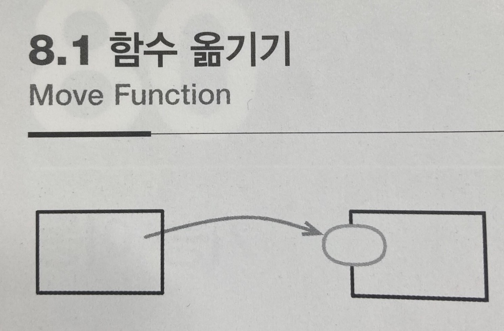

# :star: 8-1 함수 옮기기

<br>



- 1판에서의 이름: 메서드 이동

<br>

```js

```

<br>

```js

```

<br>

### 배경

<br>

<br>

## 다음 챕터

- [8.2 - 필드 옮기기](https://github.com/Esoolgnah/Summary_of_Refactoring_2nd_Edition/blob/main/Notes/08_기능_이동/08_02_필드_옮기기.md)

<br>

## 목록으로

- [목록](https://github.com/Esoolgnah/Summary_of_Refactoring_2nd_Edition/blob/main/Notes/08_기능_이동/08_00_기능_이동.md)
