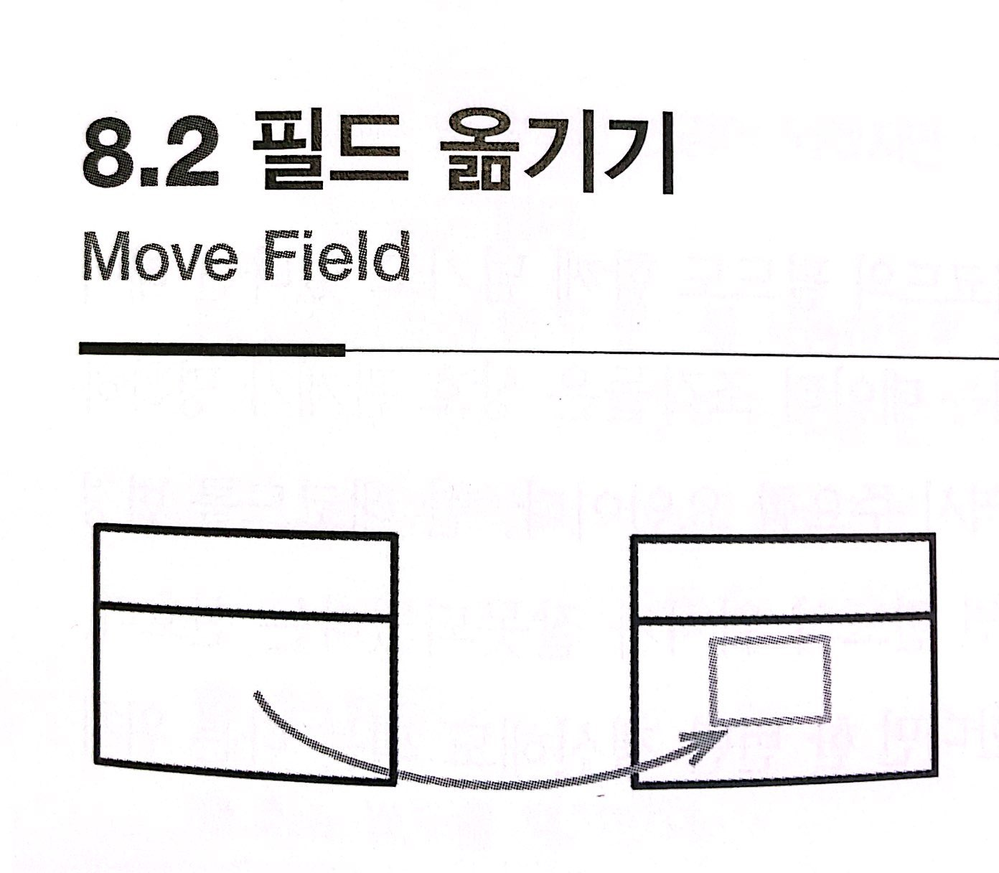

# :star: 8-2 필드 옮기기

<br>



<br>

```js
class Customer {
  get plan() {
    return this._plan;
  }
  get discountRate() {
    return this._discountRate;
  }
}
```

<br>

```js
class Customer {
  get plan() {
    return this._plan;
  }
  get discountRate() {
    return this.plan.discountRate;
  }
}
```

<br>

### 배경

프로그램의 상당 부분이 동작을 구현하는 코드로 이뤄지지만 프로그램의 진짜 힘은 데이터 구조에서 나옵니다. 주어진 문제에 적합한 데이터 구조를 활용하면 동작 코드는 자연스럽게 단순하고 직관적으로 짜여집니다. 반면 데이터 구조를 잘못 선택하면 아귀가 맞지 않는 데이터를 다루기 위한 코드로 범벅이 됩니다. 이해하기 어려운 코드가 만들어지는 데서 끝나지 않고, 데이터 구조 자체도 그 프로그램이 어떤 일을 하는지 파악하기 어렵게 합니다.

<br>

그래서 데이터 구조가 중요합니다. 하지만 훌륭한 프로그램이 갖춰야 할 다른 요인들과 마찬가지로, 제대로 하기가 어렵습니다. 가장 적합한 데이터 구조를 알아내고자 프로젝트 초기에 분석을 해본 결과, 경험과 도메인 주도 설계 같은 기술이 제 능력을 개선해줌을 알아냈습니다. 하지만 저의 모든 기술과 경험에도 불구하고 초기 설계에서는 실수가 빈번했습니다. 프로젝트를 진행할수록 우리는 문제 도메인과 데이터 구조에 대해 더 많은 것을 배우게 됩니다. 그래서 오늘까지는 합리적이고 올바랐던 설계가 다음 주가 되면 잘못된 것으로 판명나곤 합니다.

<br>

현재 데이터 구조가 적절치 않음을 깨닫게 되면 곧바로 수정해야 합니다. 고치지 않고 데이터 구조에 남겨진 흠들은 우리 머릿속을 혼란스럽게 하고 훗날 작성하게 될 코드를 더욱 복잡하게 만들어버립니다.

<br>

예컨대 함수에 어떤 레코드를 넘길 때마다 또 다른 레코드의 필드도 함께 넘기고 있다면 데이터 위치를 옮겨야 할 것입니다. 함수에 항상 함께 건네지는 데이터 조각들은 상호 관계가 명확하게 드러나도록 한 레코드에 담는 게 가장 좋습니다. 변경 역시 주요한 요인입니다. 한 레코드를 변경하려 할 때 다른 레코드의 필드까지 변경해야 한다면 필드의 위치가 잘못되었다는 신호입니다. 구조체 여러 개에 정의된 똑같은 필드들을 갱신해야 한다면 한 번만 갱신해도 되는 다른 위치로 옮기라는 신호입니다.

<br>

필드 옮기기 리팩터링은 대체로 더 큰 변경의 일환으로 수행됩니다. 예컨대 필드 하나를 잘 옮기면, 그 필드를 사용하던 많은 코드가 원래 위치보다 옮겨진 위치에서 사용하는 게 더 수월할 수 있습니다. 그렇다면 리팩터링을 마저 진행하여 호출 코드들까지 모두 변경합니다. 비슷하게, 옮기려는 데이터가 쓰이는 패턴 때문에 당장은 필드를 옮길 수 없을 때도 있습니다. 이럴 땐 사용 패턴을 먼저 리팩터링한 다음에 필드를 옮겨줍니다.

<br>

지금까지의 설명에서 레코드라는 용어를 썼지만, 레코드 대신 클래스나 객체가 와도 똑같습니다. 레코드 대신 클래스나 객체가 와도 똑같습니다. 클래스는 함수가 곁들여진 레코드라 할 수 있으며, 다른 데이터와 마찬가지로 건강하게 관리돼야 합니다. 클래스의 데이터들은 접근자 메서드들 뒤에 감춰져(캡슐화되어) 있으므로 클래스에 곁들여진 함수(메서드)들은 데이터를 이리저리 옮기는 작업을 쉽게 해줍니다. 데이터의 위치를 옮기더라도 접근자만 그에 맞게 수정하면 클라이언트 코드들은 아무 수정 없이도 동작할 것입니다. 따라서 클래스를 사용하면 이 리팩터링을 수행하기가 더 쉬워지며, 그래서 이어지는 설명엥서는 클래스를 사용한다고 가정합니다. 캡슐화되지 않는 날(bare) 레코드를 사용해도 똑같이 변경할 수는 있지만, 더 까다로울 것입니다.

<br>

### 절차

1️⃣ 소스 필드가 캡슐화되어 있지 않다면 캡슐화한다.

<br>

2️⃣ 테스트한다.

<br>

3️⃣ 타깃 객체에 필드(와 접근자 메서드들)를 생성한다.

<br>

4️⃣ 정적 검사를 수행한다.

<br>

5️⃣ 소스 객체에서 타깃 객체를 참조할 수 있는지 확인한다.

- 기존 필드나 메서드 중 타깃 객체를 넘겨주는 게 있을지 모릅니다. 없다면 이런 기능의 메서드를 쉽게 만들 수 있는지 살펴봅니다. 간단치 않다면 타깃 객체를 저장할 새 필드를 소스 객체에 생성합시다. 이는 영구적인 변경이 되겠지만, 더 넓은 맥락에서 리팩터링을 충분히 하고 나면 다시 없앨 수 있을 때도 많습니다.

<br>

6️⃣ 접근자들이 타깃 필드를 사용하도록 수정한다.

- 여러 소스에서 같은 타깃을 공유한다면, 먼저 세터를 수정하여 타깃 필드와 소스 필드 모두를 갱신하게 하고, 이어서 일관성을 깨뜨리는 갱신을 검출할 수 있도록 `어서션을 추가`합시다. 모든 게 잘 마무리되었다면 접근자들이 타깃 필드를 사용하도록 수정합니다.

<br>

7️⃣ 테스트한다.

<br>

8️⃣ 소스 필드를 제거한다.

<br>

9️⃣ 테스트한다.

<br>

### 예시

다음의 고객 클래스(`Customer`)와 계약 클래스(`CustomerContract`)에서 시작합시다.

<br>

```js
// Customer 클래스...
constructor(name, discountRate) {
  this._name = name;
  this._discountRate = discountRate;
  this._contract = new CustomerContract(dateToday());
}

get discountRate() {return this._discountRate;}
becomePreferred() {

}
```

<br>

<br>

<br>

## 다음 챕터

- [8.3 - 문장을 함수로 옮기기](https://github.com/Esoolgnah/Summary_of_Refactoring_2nd_Edition/blob/main/Notes/08_기능_이동/08_03_문장을_함수로_옮기기.md)

<br>

## 이전 챕터

- [8.1 - 함수 옮기기](https://github.com/Esoolgnah/Summary_of_Refactoring_2nd_Edition/blob/main/Notes/08_기능_이동/08_01_함수_옮기기.md)

<br>

## 목록으로

- [목록](https://github.com/Esoolgnah/Summary_of_Refactoring_2nd_Edition/blob/main/Notes/08_기능_이동/08_00_기능_이동.md)
